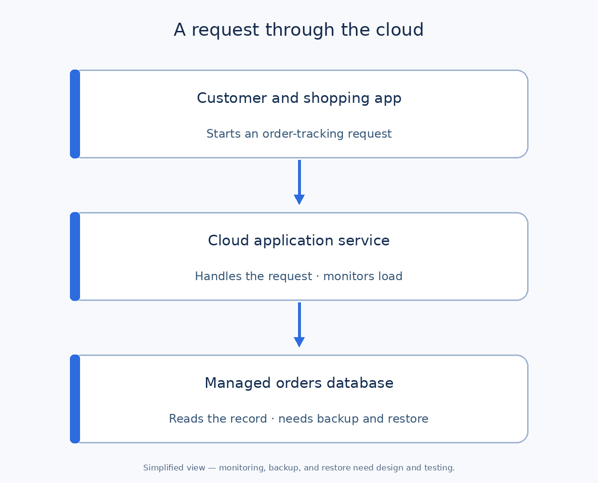

# Cloud Computing: A Practical Tutorial for Business Analysts

**Cloud computing** means using computing resources—such as servers, databases, storage, and software—over a network, often with capacity that can be increased or reduced as needed and usage that can be measured. A retailer can run its shopping app on a cloud provider's infrastructure instead of owning all the physical equipment.

For a business analyst (BA), the key question is **what the business expects from those services**: how the app behaves during busy periods, what happens during an outage, where data may be stored, who can access it, and how costs are controlled. You do not need to configure servers to define these needs.

## A few concepts first

| Term | Meaning for a BA |
| --- | --- |
| Compute | Processing capacity that runs application code. |
| Storage | Space for files such as product images and backups. |
| Managed database | A database service where the provider handles some operations; the team still owns its data and usage rules. |
| Scaling | Adjusting capacity as demand changes; it does not automatically fix every performance bottleneck. |
| Region | A provider's geographic area for hosting services; the choice can affect latency, data location, and recovery plans. |
| Availability | Whether a service can be used when needed, measured over an agreed period and scope. |
| Backup | A recoverable copy of data; a backup needs a tested restore procedure. |

Cloud services can be **public**, **private**, or **hybrid**. These describe deployment approaches, while the following labels describe **what the provider supplies**:

| Model | Plain explanation | Illustrative shopping-project use | BA's question |
| --- | --- | --- | --- |
| Infrastructure as a Service (**IaaS**) | Rent infrastructure such as virtual machines; your team manages more of the software stack. | Run a custom order service on virtual machines. | Who patches the operating system and monitors it? |
| Platform as a Service (**PaaS**) | Use a managed platform to run your application; the provider manages more of the underlying platform. | Run the custom app and managed database. | What does the team still configure, secure, and back up? |
| Software as a Service (**SaaS**) | Use a ready-made application delivered as a service. | Use a hosted support-ticket system. | Does it meet workflow, integration, access, and data requirements? |

These are categories, not a ranking. The actual division of responsibility depends on the particular service and contract.

## Practical example: an online shopping app

**Illustrative assumptions:** A retailer has an app where customers browse, place orders, and track deliveries. An external payment provider processes payments. The team is considering a managed application service and managed order database in the cloud. During a promotion, demand may be much higher than on a normal day. All figures and decisions below are proposals for learning, not project facts.



The app service handles requests and may add capacity as traffic grows. The order database stores order records. Backups and monitoring support recovery and investigation. The payment provider is a separate integration and is outside this simplified diagram.

### Turn “the app must handle sales” into requirements

| Business situation | Example question | Candidate measurable requirement |
| --- | --- | --- |
| Promotion increases demand | What load should checkout handle, and for how long? | Validate checkout with **2,000 simultaneous active shoppers** during a **two-hour** promotion; define a realistic test journey and pass threshold with engineering. |
| Checkout slows down | Which step matters most to customers? | Set a target for the **95th-percentile** checkout response time under that agreed load; choose the value after baseline testing. |
| Orders service fails | How long can checkout be unavailable? | Proposed recovery time objective (**RTO**): restore checkout within **2 hours** after a qualifying outage. |
| Order data is lost | How much recent order data can the business tolerate re-creating? | Proposed recovery point objective (**RPO**): no more than **15 minutes** of order data loss for a recoverable incident. |
| Costs rise after promotion | Who sees unexpected spending? | Show monthly costs by environment and alert the named owner when a budget threshold is exceeded. |

**RTO is a target for time to restore; RPO is a target for maximum data loss measured in time.** Neither is a promise that a backup exists or that every outage will meet the target. Confirm whether restoring the database alone is enough for checkout to work, and test the complete recovery flow. “2,000 active shoppers” is not the same metric as “2,000 requests per second”; define how a load test models user behavior.

### Availability and the customer experience

A provider's service-level agreement (**SLA**) may cover one specific cloud service, not the entire shopping journey. A product-level **service level objective (SLO)** needs a precise measurement: for example, “the checkout journey succeeds for an agreed percentage of valid attempts in each calendar month,” with exclusions and monitoring agreed by the team. If you use **99.9%** as an illustrative monthly target, that allows about **43.2 minutes** of unavailability in a 30-day month (`0.1% × 30 × 24 × 60`); the real calculation depends on the measurement rules. Agree separately on what the app tells customers during an outage and how duplicate order attempts are handled.

## Security and ownership

In the **shared responsibility model**, the cloud provider manages parts of the underlying cloud, while the customer team remains responsible for its data, identities, access settings, and application choices to an extent that varies by service. “Hosted in the cloud” does not mean the provider owns every security task.

For the shopping app, ask who approves staff access, who can read customer orders, where backups are stored, who tests restoration, and what happens to data when a contract ends. Confirm data-location and retention requirements with the relevant privacy, legal, and security owners; do not infer a legal requirement solely from a region name.

## What the BA documents

1. **Business outcome and workload:** Which journeys must work? What are normal and peak volumes, measured how?
2. **Availability and recovery:** Which journeys are critical? Set and approve RTO, RPO, SLO, escalation owner, and a restore-test plan.
3. **Data and integrations:** Which systems own orders and payments? What data crosses the boundary with the provider?
4. **Access and privacy:** Which people and services need access, for what purpose, and for how long?
5. **Costs and decisions:** Which usage drives cost? Who sees estimates, budgets, and alerts? Compare choices using the same assumptions.

### Reusable BA cloud requirements template

```text
Business journey and criticality:
Users and traffic: normal / peak / measurement period:
Performance target and how it is measured:
Availability target and measurement scope:
RTO / RPO and incident types covered:
Data owners, locations, retention, and access:
Integrations and external dependencies:
Responsibilities: provider / internal team / vendor:
Backup, restore test, monitoring, and escalation:
Budget owner, cost drivers, and alerts:
Open decisions and acceptance tests:
```

### Common mistakes

- Assuming cloud scaling makes a poorly designed checkout or database query fast.
- Treating a provider's SLA as proof that the whole customer journey meets its target.
- Asking for “zero downtime” or “no data loss” without defining scope, cost, and recovery design.
- Assuming a backup is useful without testing a restore.
- Picking a region before checking latency, data rules, integrations, and recovery needs.
- Comparing provider prices without agreeing on traffic, storage, support, and environments.

**Quick exercise:** A promotion doubles traffic and customers report that payment succeeded but the app shows no order. Identify three investigations: Is the payment provider's confirmation reaching the app? Was an order recorded in the order database? What does the customer see if a response is delayed? Decide which team owns each check before proposing more cloud capacity.

## Further reading

- [NIST: Definition of Cloud Computing](https://www.nist.gov/publications/nist-definition-cloud-computing)
- [Microsoft Learn: Shared responsibility in the cloud](https://learn.microsoft.com/en-us/azure/security/fundamentals/shared-responsibility)
- [AWS Well-Architected: Define recovery objectives](https://docs.aws.amazon.com/wellarchitected/latest/framework/rel_planning_for_recovery_objective_defined_recovery.html)
