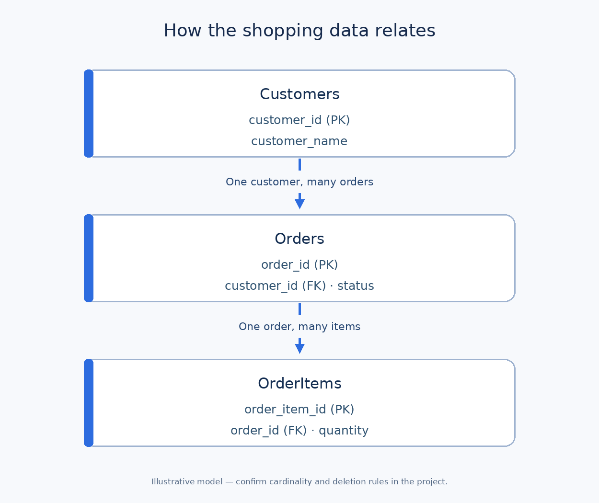

# Databases: A Practical Tutorial for Business Analysts

A **database** stores data so a system can find, update, and use it reliably. A shopping app might keep customers, orders, and the products in each order in a database. A **database management system (DBMS)** is the software that manages the data; PostgreSQL is one example.

For a business analyst (BA), the goal is to understand **what each piece of data means, how records connect, and which business rules must hold**. You do not need to administer a database to ask useful questions about its design.

## The ideas you need first

This tutorial uses a **relational database**, where data is organized into tables. Other database types exist; choose a design with the technical team based on the use case.

| Term | Plain meaning | Shopping example |
| --- | --- | --- |
| Table | A set of records about one kind of thing | `Orders` |
| Row / record | One instance in a table | Order `O501` |
| Column / field | One property of each record | `status` |
| Primary key (PK) | Value that uniquely identifies a row | `Orders.order_id` |
| Foreign key (FK) | Field that points to a record in another table | `Orders.customer_id` → `Customers.customer_id` |
| Relationship | How two kinds of records connect | One customer can have many orders |
| Constraint | A rule enforced on stored data | An order needs a valid customer ID |
| NULL | Missing or unknown value, if allowed | Delivery date not known yet |
| Query | An instruction to retrieve or change data | “Find Mona's orders” |

**Important distinction:** `NULL` is not the number `0` or an empty string. Whether an empty delivery date is allowed is a business rule, not just a technical setting. A primary key uniquely identifies a row; a business-facing order number may be a separate field in a real system.

## Practical example: an online shopping app

**Illustrative assumptions:** Customers place orders, and each order contains one or more order items. Every order belongs to one customer. IDs, names, amounts, and rules below are teaching examples; validate them with the real business and engineering teams.



The marks `1` and `many` describe **cardinality**: a customer may have several orders; an order may have several items. In this proposed flow, an order must have at least one item when it is submitted. Decide separately whether a draft order may have none.

### A tiny set of records

**Customers**

| customer_id (PK) | customer_name |
| --- | --- |
| C101 | Mona |
| C102 | Omar |

**Orders** — `customer_id` is an FK to `Customers`.

| order_id (PK) | customer_id (FK) | status | order_total_egp |
| --- | --- | --- | ---: |
| O501 | C101 | SHIPPED | 120.00 |
| O502 | C102 | PLACED | 75.00 |

**OrderItems** — `order_id` is an FK to `Orders`. The unit price is the price charged for that item at the time of purchase, as an illustrative requirement.

| order_item_id (PK) | order_id (FK) | product_code | quantity | unit_price_egp |
| --- | --- | --- | ---: | ---: |
| I1 | O501 | P10 | 2 | 40.00 |
| I2 | O501 | P11 | 1 | 40.00 |
| I3 | O502 | P12 | 1 | 75.00 |

For this simplified example, O501's total is `2 × 40 + 1 × 40 = 120 EGP`; O502's is `1 × 75 = 75 EGP`. Real totals may also include discounts, tax, shipping, and refunds. Specify whether `order_total_egp` is stored, calculated, or sourced elsewhere, and which amount each report should use.

### What keys and relationships prevent

If an order contains `customer_id = C999` but no customer `C999` exists, a foreign-key rule can reject it. A primary key prevents two rows in `Orders` from sharing the same `order_id`. These constraints protect some data integrity, but **they do not define every business rule**: a database constraint alone does not explain whether `SHIPPED` may change back to `PLACED`.

## Reading a small SQL query

**Structured Query Language (SQL)** is commonly used to work with relational data. This read-only example combines the `Customers` and `Orders` tables using their shared customer ID:

```sql
SELECT c.customer_name, o.order_id, o.status
FROM Customers AS c
JOIN Orders AS o ON o.customer_id = c.customer_id
WHERE c.customer_id = 'C101';
```

| customer_name | order_id | status |
| --- | --- | --- |
| Mona | O501 | SHIPPED |

`SELECT` lists the output fields; `FROM` starts with customers; `JOIN ... ON` matches the two tables; `WHERE` narrows the result to C101. An **inner JOIN** includes only matching rows. A **LEFT JOIN** could also show a customer with no orders, with NULL values for order columns. Ask which population a report is supposed to include.

**Watch the counting level (grain):** If you join `Orders` to `OrderItems`, O501 appears twice because it has two items. Counting joined rows or summing `order_total_egp` there can double-count orders. Define whether the metric counts orders, items, customers, or something else before writing a report.

## The BA's job: turn data needs into rules

Use the example to ask practical questions:

1. **Definitions:** What counts as an “order”? Is a draft included in order reports? What does each status mean?
2. **Ownership:** Which system is the source of truth for customer identity, order status, and charged prices?
3. **Relationships:** Can one order have several customers? Can an order item exist without an order? What happens if a customer requests deletion?
4. **Validity:** Must `quantity` be positive? Can `estimated_delivery_date` be NULL? Which statuses and transitions are allowed?
5. **History:** Should changed addresses or product prices overwrite old values, or should past orders retain the values used at purchase?
6. **Access and retention:** Who may see personal data? How long is it kept, and what should reports use when records are removed or anonymized?

### A worked data requirement

| Field or rule | Proposed definition | Example acceptance check |
| --- | --- | --- |
| `Orders.customer_id` | Required reference to an existing customer | Reject an order for unknown `C999`. |
| `OrderItems.quantity` | Positive whole number | Reject `0` and `-1`. |
| `Orders.status` | Agreed set of order states | Reject an undefined value such as `READYISH`. |
| `OrderItems.unit_price_egp` | Charged item price at purchase time | Later catalog price change does not alter the historical order item. |
| Order total | Sum of item price × quantity in this simplified case | O501 displays `120.00 EGP`. |

These are **proposals**, not confirmed project facts. Engineering may implement a rule in the database, application, or both. Agree on its behavior first; then decide how it is enforced and tested.

### Common mistakes

- Calling two fields the same thing when they mean different things, such as current catalog price versus charged price.
- Treating a missing value as zero, or assuming every row has a value for every optional field.
- Reporting from a many-side join without checking duplicated orders.
- Assuming a screen, API response, report, and database table all contain the same fields.
- Running write queries or copying real personal data just to explore a schema; use approved read-only access and safe sample data.

## Reusable BA data checklist

```text
Business question / report or feature:
Entity and definition of one record (grain):
Fields, meanings, types, and allowed values:
Unique identifier and relationships:
Required fields and valid ranges:
Source of truth and update timing:
History and deletion behavior:
Access, privacy, and retention:
Example rows and edge cases:
Acceptance checks and open decisions:
```

**Quick exercise:** A report says there were three orders in the example, although the `Orders` table has two rows. What likely happened? It may have counted the three `OrderItems` rows after a join. Ask for the query and confirm whether the metric is “number of orders” (`O501`, `O502`) or “number of items” (`I1`, `I2`, `I3`).

## Further reading

- [PostgreSQL tutorial: relational concepts and SQL](https://www.postgresql.org/docs/current/tutorial.html)
- [PostgreSQL: primary keys, foreign keys, and constraints](https://www.postgresql.org/docs/current/ddl-constraints.html)
- [PostgreSQL: joins between tables](https://www.postgresql.org/docs/current/tutorial-join.html)
