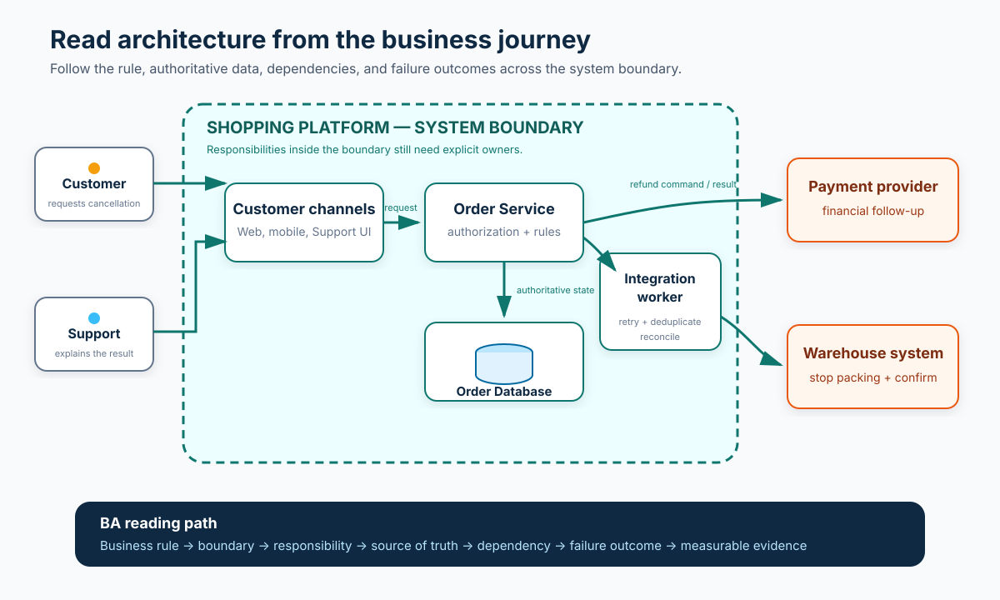

# Software Architecture for Business Analysts

**Software architecture** describes the important parts of a software system, how they interact, the constraints around them, and the decisions that shape their behavior. It is more than a technology diagram. Architecture affects whether a requirement is feasible, where data is owned, which team must change, what can fail, and which trade-offs the business is accepting.

A Business Analyst (BA) does not need to select frameworks or design every component. The BA needs enough architectural literacy to ask: Where is the boundary? Which systems participate in this journey? Who owns each rule and data item? What happens when a dependency is slow or unavailable? Which quality expectations drive the design?

This beginner tutorial follows one illustrative change in an online shopping platform: **allow an authenticated customer to cancel a paid order before warehouse packing starts**. Every rule, system name, response target, and ownership assignment in the example is a teaching assumption that real stakeholders must confirm.

## 1. Start with the business outcome, not a box diagram

Architecture is a set of consequential choices, not a collection of rectangles. Begin with the outcome and constraints that make those choices meaningful.

For the cancellation feature, the intended outcome is to stop eligible orders before avoidable packing work begins while giving the customer a truthful result. The initial illustrative rule is:

> An authenticated customer may cancel an order while its current status is `PAID`; cancellation is rejected once the status is `PACKING`.

That sentence immediately creates architecture questions:

- Which system is the source of truth for order status?
- Does the customer application read the status directly or through an API?
- How does the warehouse learn that an order was cancelled?
- Does cancellation also start a refund?
- What happens if packing begins during the request?
- Which evidence lets Support explain the result?

The BA records the outcome, confirmed rules, assumptions, constraints, and open decisions before discussing a preferred solution. Otherwise, a polished diagram can make an unconfirmed design look like an agreed requirement.

## 2. Draw the system context and boundary

A **system context diagram** is a zoomed-out view of one software system, its users, and the external systems it interacts with. The C4 model recommends it as a starting point that both technical and non-technical stakeholders can discuss.

For our example, the system in scope is the **Shopping Platform**. Direct participants include the customer and Support agent. External dependencies include the payment provider and warehouse system.

| Element | Inside or outside our boundary? | Illustrative owner | BA question |
|---|---|---|---|
| Customer app and order capability | Inside | Shopping product team | Which user journeys and rules can this team change? |
| Order data | Inside | Order team | Which record is authoritative for status? |
| Payment provider | Outside | External provider plus finance owner | What request, response, timeout, and reconciliation rules apply? |
| Warehouse system | Outside | Fulfilment team or vendor | How and when does it accept a cancellation? |
| Support console | Confirm | Customer operations team | Is this part of the platform or another integrated system? |

**Boundary is not the same as importance.** An external system can be critical even when your team cannot control it. Mark ownership and control explicitly instead of assuming that every connected box can change with the feature.

## 3. Zoom in only as far as the decision needs

Architecture diagrams can show different levels of detail. The C4 model names four common zoom levels: system context, containers, components, and code. Most BA conversations need the first two, with selective component detail when it resolves a requirement or risk.

| View | What it answers | Useful BA use |
|---|---|---|
| **System context** | Who uses the system, and which other systems interact with it? | Confirm scope, stakeholders, external dependencies, and ownership |
| **Container** | Which applications or data stores run inside the system boundary? | Trace journeys, responsibilities, data, and deployment impact |
| **Component** | Which major responsibilities exist inside one container? | Clarify a complex rule, interface, or owner when needed |
| **Code** | How implementation classes or functions are structured | Usually unnecessary for business analysis |

In this tutorial, “container” means an application or data store—not necessarily a Docker container. The Shopping Platform might contain a web/mobile application, Order Service, Order Database, and an integration worker. Those are illustrative logical responsibilities; the real team may deploy them together or separately.

Do not request maximum detail by default. A diagram that shows every technical object can hide the decisions stakeholders actually need to make.

## 4. Trace one journey across the architecture

A static diagram shows structure. A **dynamic flow** explains what happens in a particular scenario and in what order. Walk the cancellation journey from the customer's action to the final evidence:

1. The customer app sends a cancellation request with the order identifier and authenticated identity.
2. The Order Service checks customer authorization and reads the current authoritative status.
3. If the status is eligible, the service changes the order to `CANCELLED` using a control that prevents a conflicting packing update.
4. The platform asks the payment capability to begin the appropriate financial follow-up.
5. The platform tells the warehouse not to pack the order.
6. The customer and Support receive a result that reflects the state actually reached.
7. Audit and monitoring evidence records the outcome without exposing prohibited data.

Now add failure paths:

| Failure or exception | Question the architecture must answer | Requirement impact |
|---|---|---|
| Packing starts during cancellation | Which update wins, and how is the conflict detected? | Define an atomic rule or conflict response; never show false success |
| Payment provider times out | Is the order cancellation committed, pending, or reversed? | Define customer wording, retry, reconciliation, and ownership |
| Warehouse message is duplicated | Can the receiver process the same instruction safely? | Require an idempotency or duplicate-handling rule |
| Support opens stale data | How fresh must status be before an agent advises the customer? | Define source, refresh behavior, and visible timestamp |
| Notification fails | Does notification failure undo cancellation? | Separate the business transaction from communication handling |

**BA action:** create at least one sequence for the happy path and one for the highest-risk exception. A box connected by an arrow does not explain timing, partial success, retries, or compensation.

## 5. Identify responsibility and data ownership

Architecture becomes easier to reason about when each responsibility has a clear owner and each important fact has an authoritative source.

| Information or rule | Proposed source of truth | Readers or consumers | Open question |
|---|---|---|---|
| Current order status | Order Database through Order Service | Customer app, Support, warehouse integration | Can any other system update status directly? |
| Cancellation eligibility | Order domain rules | Customer app, Support, automated tests | Is eligibility based only on status? |
| Payment follow-up status | Payment capability | Finance, Support, customer communications | What does “refund started” mean exactly? |
| Warehouse acknowledgement | Warehouse integration record | Operations, Support, incident response | How long do we wait before escalation? |
| Customer-facing message | Experience/content rules | Customer app and notifications | Which result codes map to which message? |

Watch for two warning signs:

- **Shared ownership:** several systems can change the same business fact without one conflict rule.
- **Copied data treated as current:** a screen, report, or cache shows an old copy as though it were authoritative.

The BA should document the meaning, owner, allowed writers, consumers, freshness need, retention need, and reconciliation rule for critical data. The database diagram alone will not reveal all of those decisions.

## 6. Turn quality expectations into architecture drivers

Functional requirements describe what the system does. **Quality attributes**, often included in non-functional requirements, describe how well it must do it. They influence architecture only when they are specific enough to guide and test a decision.

| Quality attribute | Weak wording | Better illustrative expectation | Architecture question |
|---|---|---|---|
| Performance | “Cancellation is fast” | A customer receives a confirmed, rejected, or pending result within an agreed percentile and load profile | Which calls sit on the response path? |
| Availability | “Always available” | Define the required service window, allowed downtime, and degraded behavior | Can the platform accept requests when a dependency is unavailable? |
| Reliability | “No orders are lost” | Every accepted request reaches a traceable final state or a visible recovery queue | Where are retries, duplicates, and partial results handled? |
| Security | “Secure cancellation” | Only an authorized customer or permitted agent can cancel; attempts are auditable without leaking sensitive data | Where are identity and permission decisions enforced? |
| Scalability | “Supports growth” | State the forecast volume, peak pattern, and review threshold | Which component becomes the bottleneck first? |
| Recoverability | “Rollback if needed” | Define acceptable data loss, recovery time, reconciliation, and owner | Can an old version understand data written by the new one? |
| Maintainability | “Easy to change” | Eligibility rules have one documented owner and can be tested without duplicating logic across channels | Is the rule centralized or copied? |

Do not invent numbers to make a requirement look complete. Mark the metric, workload, measurement point, owner, and target as open decisions until authorized stakeholders confirm them.

## 7. Discuss options as trade-offs, not trends

Terms such as layered architecture, microservices, event-driven architecture, and serverless describe useful patterns or styles. None is automatically “modern enough” or correct for every problem.

For the warehouse update, the team might compare:

| Option | Potential benefit | Cost or risk | BA evidence needed |
|---|---|---|---|
| Call the warehouse synchronously | Immediate response may simplify the customer result | Customer request now depends on warehouse speed and availability | Required response behavior, timeout, and outage impact |
| Send an asynchronous event | The order flow can continue while the warehouse processes later | Status may be temporarily inconsistent; duplicates and delays need handling | Acceptable delay, pending state, retry, duplicate, and reconciliation rules |
| Use a scheduled batch | Simple for a legacy warehouse | Cancellation may arrive too late to stop packing | Cut-off times, volume, operational procedure, and customer promise |

The BA does not choose alone. The BA makes the business consequences visible so architects, engineers, operations, security, product, and business owners can choose deliberately.

Ask for the decision record: What problem are we solving? Which options were considered? Which quality attributes and constraints mattered? What consequence are we accepting? When should the decision be reviewed?

## 8. Read an architecture diagram critically

When a diagram appears in a workshop, use this checklist:

1. **Purpose:** What question is this diagram meant to answer?
2. **Scope:** What is inside the system boundary, and what is deliberately omitted?
3. **Legend:** What do shapes, colors, lines, and arrow directions mean?
4. **Responsibilities:** Does every major element have a short purpose rather than only a product name?
5. **Interactions:** Are labels clear about data, command, event, or user action?
6. **Ownership:** Who owns each system, interface, rule, and critical dataset?
7. **Trust boundaries:** Where do identity, permissions, sensitive data, or third parties cross boundaries?
8. **Failure:** What happens if a dependency is slow, unavailable, or returns an uncertain result?
9. **Time:** Is this the current state, target state, or a transition step—and what date or version does it represent?
10. **Evidence:** Which requirements, decisions, interface contracts, and operational measures support it?

A useful diagram is a communication model, not proof that the system behaves correctly. Validate it against scenarios, interface contracts, data definitions, tests, and production evidence.

## 9. Completed Architecture Discovery Brief

Use this artifact before a solution workshop or architecture review.

| Field | Completed cancellation example |
|---|---|
| **Business outcome** | Stop eligible paid orders before packing and give customers a truthful result |
| **Scope and boundary** | Shopping Platform change; payment and warehouse remain external dependencies |
| **Actors** | Authenticated customer, Support agent, operations responder |
| **Confirmed rule** | None yet; `PAID` eligible and `PACKING` ineligible are illustrative assumptions awaiting owners |
| **Key responsibilities** | Present action, authorize request, decide eligibility, update order, coordinate payment and warehouse, communicate result |
| **Source of truth** | Proposed: Order Service controls order status; payment and warehouse own their local processing states |
| **Critical flow** | Request → authorize → re-read status → change state → notify dependencies → show and record result |
| **Important exceptions** | Concurrent packing, payment timeout, duplicate warehouse message, stale Support view, notification failure |
| **Quality drivers** | Truthful response, authorized access, traceability, bounded response time, recoverable partial failure |
| **External constraints** | Provider contracts, warehouse integration capability, privacy and retention policy |
| **Options to assess** | Synchronous warehouse call versus event; immediate final result versus visible pending state |
| **Evidence needed** | Context and sequence diagrams, API/event contracts, data ownership, acceptance examples, monitoring and reconciliation plan |
| **Open decisions and owners** | Eligibility owner, refund semantics, response target, retry window, escalation owner, retention period |

This brief is not a substitute for an architect's design or an engineering specification. It makes sure the design conversation starts with business meaning and exposes unresolved decisions.

## 10. Reusable Architecture Discovery Brief

Copy this structure for another feature:

| Field | Your notes |
|---|---|
| Business outcome and affected journey | |
| System in scope and explicit boundary | |
| Users, roles, and external systems | |
| Confirmed rules, assumptions, constraints, and open decisions | |
| Major responsibilities or containers | |
| Critical data and source of truth | |
| Happy-path interaction sequence | |
| Failure, timeout, duplicate, and partial-success paths | |
| Security and trust boundaries | |
| Performance, availability, reliability, scale, and recovery expectations | |
| Architecture options and business trade-offs | |
| Owners of systems, rules, data, and decisions | |
| Evidence required for validation and operation | |
| Diagram date/version and review trigger | |

## 11. Practice exercise

Extend the scenario so the customer can cancel **one item from a multi-item order** while the other items continue to packing.

1. Redraw the boundary if fulfilment happens in more than one warehouse.
2. Identify the source of truth for item-level and order-level status.
3. Write a happy path and one partial-failure sequence.
4. Define one measurable reliability expectation without inventing its target value.
5. Compare a synchronous update with an asynchronous event and state one business trade-off.
6. Add the decision owner and evidence needed before release.

If the team cannot explain who owns the rule, where the authoritative state lives, what crosses the boundary, and what happens when a dependency fails, the architecture is not yet clear enough for the requirement.

## Further reading

- [C4 model: System context diagram](https://c4model.com/diagrams/system-context)
- [C4 model: Diagram levels](https://c4model.com/diagrams)
- [Microsoft Azure Architecture Center: Build for business](https://learn.microsoft.com/en-us/azure/architecture/guide/design-principles/build-for-business)
- [Microsoft Azure Architecture Center: Architecture styles](https://learn.microsoft.com/en-us/azure/architecture/guide/architecture-styles/)
- [ISO/IEC/IEEE 42010:2022 — Architecture description](https://www.iso.org/standard/74393.html)
- [AWS Well-Architected Framework: Definitions and trade-offs](https://docs.aws.amazon.com/wellarchitected/latest/framework/definitions.html)
