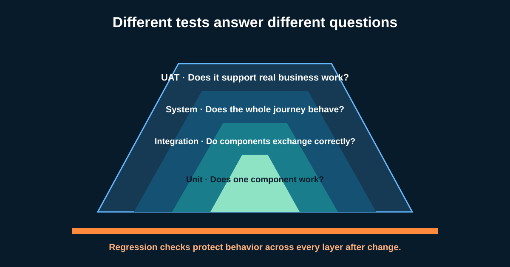

# Software Testing, Defects, and UAT for Business Analysts

Testing is not one activity at the end of delivery. Different tests provide different evidence: a function behaves correctly, components exchange data, the whole journey works, and real users can complete the intended business process.

A Business Analyst (BA) helps connect requirements, examples, business risks, data, roles, and outcomes to the test approach. The BA often coordinates **User Acceptance Testing (UAT)**, but business acceptance remains a stakeholder decision—not a checkbox the BA owns alone.



## 1. Ask what question each test level answers

Using the illustrative self-service return journey:

| Test level | Main question | Returns example | Typical ownership |
|---|---|---|---|
| **Unit / component** | Does one small component work in isolation? | Eligibility calculation rejects day 31 for a 30-day rule | Developers; often automated |
| **Integration** | Do components or systems exchange correctly? | Order status and courier response map to the expected fields | Technical team with BA examples |
| **System / end-to-end** | Does the complete solution behavior work? | Customer confirms and receives one reference; audit and error states work | Testing/delivery team |
| **UAT** | Can representative users perform real business work and accept the outcome? | Customer-service and operations users handle success and courier failure | Business representatives, supported by BA and team |

The labels and ownership vary by organization. The key is the evidence and risk covered. UAT should not be the first time components are tested.

## 2. Verify the specification and validate the need

- **Verification:** did the solution meet its specified requirements and design?
- **Validation:** does the solution satisfy stakeholder needs in its intended environment?

A screen may match every acceptance criterion yet confuse users about whether a refund is guaranteed. That is a validation problem. Conversely, users may like the screen while duplicate requests violate a confirmed rule; that is a verification failure too.

The BA keeps both visible: requirement-to-test traceability and realistic business scenarios.

## 3. Plan UAT before the build finishes

### UAT readiness checklist

| Area | Returns decision |
|---|---|
| Scope | Single-item domestic return plus defined exception paths |
| Testers | Customer-service agent, returns operator, policy owner; customer usability handled separately if needed |
| Environment | Integrated UAT environment with controlled courier behavior |
| Data | Synthetic orders at day 29, 30, and 31; returnable and excluded categories |
| Access | Customer, support, and operations roles with least necessary permission |
| Entry criteria | Critical system tests passed; known issues shared; build and rules version recorded |
| Exit criteria | Critical scenarios passed; accepted residual risks documented; named business approver decides |
| Evidence | Scenario result, screenshots/log reference where appropriate, tester, date, build |

Do not use real personal or payment data unless approved controls explicitly permit it. Prepare safe representative data and reset instructions.

## 4. Design scenarios around business risk

| ID | Scenario | Expected business result | Priority |
|---|---|---|---|
| UAT-01 | Eligible item, courier available | One request and one reference | Critical |
| UAT-02 | Day 31 of 30-day window | No request; accurate reason and support route | Critical |
| UAT-03 | Double confirmation | No duplicate request or charge | Critical |
| UAT-04 | Courier timeout after confirmation | Request state and next step remain clear; operations can recover | High |
| UAT-05 | Arabic keyboard and screen reader journey | Content order, labels, focus, and errors are understandable | High |
| UAT-06 | Existing support agent views the new request | Correct data and audit history appear | High |

UAT is not free-form clicking. It should allow observation and exploration, but each critical business rule and operational handoff needs expected evidence.

## 5. Write a defect report someone can reproduce

```text
Title: Duplicate return request created after confirmation retry
Build / environment: 2026.09.27-rc2 / UAT
Role and test data: Customer C101 / order O501 / item I1
Precondition: Eligible item; courier response delayed 20 seconds
Steps: Confirm return; wait; refresh; confirm again
Expected: One request exists and its reference is shown
Actual: Two requests R901 and R902 exist
Evidence: Request IDs and timestamp; no personal data attached
Business impact: Duplicate courier collection and refund risk
Severity proposal: High
Requirement / scenario: STORY-RET-01 / UAT-03
```

**Severity** describes impact; **priority** describes when the team should address it. A wording issue may be low severity but high priority before a regulated disclosure. The responsible team decides using evidence.

## 6. Understand the ticket lifecycle

A common lifecycle is:

```text
New/Open → Triaged → In progress → Ready for retest → Verified → Closed
                          ↘ Rejected / Duplicate / Deferred
```

Names vary. Define who may move each state and what evidence is required. “Cannot reproduce” should trigger a data, environment, build, timing, and logging check—not blame.

When fixed, perform **confirmation testing** on the original failure. Then perform **regression testing** to detect unintended effects elsewhere.

## 7. Plan regression by impact and risk

A one-line change to the eligibility rule might affect:

- web and mobile return journeys;
- support-agent screens;
- courier and refund integrations;
- reporting and audit extracts;
- existing open returns; and
- localization and policy messages.

Use a change-impact map:

| Changed item | Direct checks | Regression checks |
|---|---|---|
| Return window from 30 to 45 days | Days 44, 45, 46 | Existing request, duplicate prevention, reports, support view |
| Courier timeout handling | Retry and saved state | No duplicate booking, operations queue, customer message |
| Arabic error copy | Correct meaning and RTL layout | Focus order, screen reader label, English unaffected |

Automate stable, repeatable checks when worthwhile, but keep human exploration for new risks and usability. Automation is a test execution capability, not a substitute for deciding what matters.

## 8. Reusable UAT plan

```text
Business outcome and UAT scope:
Business approver and decision date:
Representative roles / testers:
Environment, build, and configuration:
Safe test data and reset process:
Entry criteria:
Critical end-to-end and exception scenarios:
Accessibility, security, reporting, and operational checks:
Defect severity / priority rules and triage cadence:
Regression impact areas:
Exit criteria and accepted residual risks:
Evidence location and final decision:
```

### Quick exercise

The return window changes from 30 to 45 days. Write three boundary tests, two integration checks, two UAT scenarios, and four regression areas. Identify who accepts the remaining business risk.

## Further reading

- [ISTQB Certified Tester Foundation Level](https://www.istqb.org/certifications/certified-tester-foundation-level-ctfl-v4-0/)
- [NASA Systems Engineering Handbook: verification and validation](https://www.nasa.gov/reference/systems-engineering-handbook/)
- [Cucumber: Gherkin reference](https://cucumber.io/docs/gherkin/reference/)

*The environment, roles, severity, and acceptance rules are illustrative. Use the test governance and risk authority defined by your organization.*
