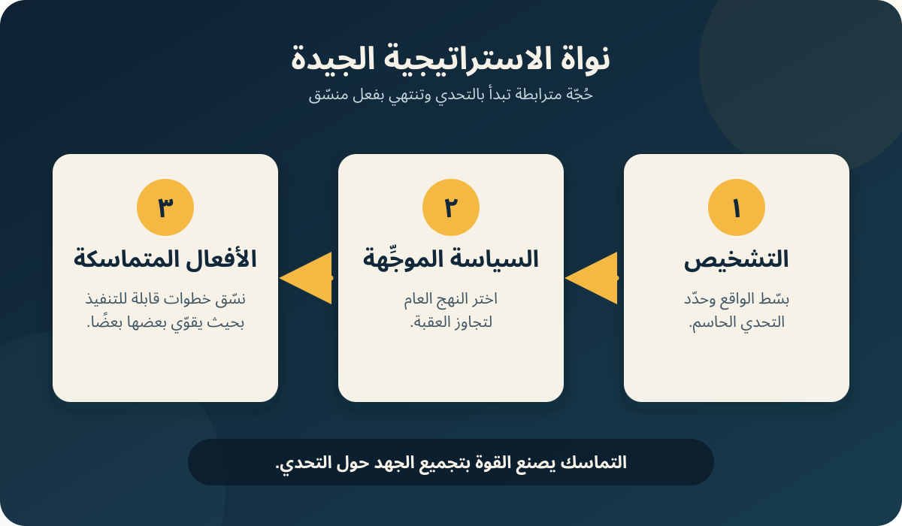

كتاب *Good Strategy/Bad Strategy: The Difference and Why It Matters* لـRichard P. Rumelt بيقول إن الاستراتيجية مش طموح، ولا كلام ملهم، ولا أهداف مالية، ولا خطة طويلة مليانة بنود. الاستراتيجية هي استجابة متماسكة لتحدٍّ مهم: افهم إيه اللي بيحصل، اختار نهج يركّز الجهد، ونسّق أفعال تنفّذ النهج ده. الكتاب بيبني حجته من حالات عسكرية وتجارية وحكومية وتنظيمية، وبعدها بيقدّم طرق لتحسين الحكم الاستراتيجي. [صفحات العنوان وحقوق النشر؛ المقدمة]

*رسم توضيحي من BAC9 مولّد فقط من العناصر الثلاثة اللي Rumelt عرّفها في الفصل الخامس: التشخيص، والسياسة الموجِّهة، والأفعال المتماسكة. الرسم مش موجود في الكتاب.*

## 1. الاستراتيجية بتبدأ بتحدٍّ له وزن

Rumelt بيفتتح بمعركة Trafalgar. الأميرال Nelson كان أقل عددًا، فمقلّدش تكتيك صفوف السفن المعتاد. قسّم أسطوله لعمودين، وقَبِل مخاطرة مركزة على السفن المتقدمة، وكسر تماسك أسطول خصمه، واعتمد على خبرة القادة البريطانيين في الاشتباك القريب الناتج. المثال بيحدد نمط الكتاب كله: اعرف العامل الحاسم في الموقف، وبعدها ركّز عليه جهدًا منسقًا. [المقدمة]

علشان كده Rumelt بيفصل الاستراتيجية عن حاجات مهمة لكنها مختلفة. الطموح بيدي الدافع، والإصرار بيدي الاستمرارية، والابتكار بيخلق إمكانيات جديدة، والقيادة ممكن تحفّز التضحية، والتخطيط بينظم العمل. الاستراتيجية هي اللي بتحدد **فين وليه وإزاي** القدرات دي تتستخدم. الهدف بيوصف النتيجة المرغوبة؛ الاستراتيجية بتشرح طريقًا معقولًا لتجاوز العقبات بين الواقع والنتيجة. لذلك الأفعال الفورية والقابلة للتنفيذ جزء من الاستراتيجية، مش مرحلة ثانوية اسمها «التنفيذ». [المقدمة]

الكتاب متقسم لثلاثة أجزاء:

1. **الاستراتيجية الجيدة والسيئة:** إزاي تميّز بينهم وتفهم النواة.
2. **مصادر القوة:** إزاي الرافعة، والأهداف القريبة، والتصميم، والتركيز، والميزة، وديناميكيات التغيير، وحالة المنظمة يضاعفوا الفعل أو يضعفوه.
3. **التفكير كاستراتيجي:** إزاي تتعامل مع الاستراتيجية كفرضية، وتقاوم القفلة السريعة، وتحافظ على حكم مستقل.

## 2. ليه الاستراتيجية الجيدة بتكون غير متوقعة

الاستراتيجية الجيدة كثيرًا ما بتفاجئ؛ لأن وجود استراتيجية متماسكة أصلًا مش شائع. منظمات كتير بتجمع أهداف ومبادرات من غير ما تخليهم يقووا بعض. التماسك بيخلق قوة لأنه بيصفّ السياسات والموارد والأفعال حول غاية مهمة. والبصيرة ممكن تخلق قوة إضافية لما تغيّر الإطار اللي بنفهم من خلاله موقفًا مألوفًا. [الفصلان 1–2]

### Apple: التركيز قبل النمو

لما Steve Jobs رجع لـApple سنة 1997، ماقدّمش رؤية ضخمة للنمو. قلّل محفظة منتجات مشوشة لعدد صغير، وخفّض التكلفة، ووقف أعمالًا جانبية. الفكرة مش إن كل شركة تقلّد الخطوات دي؛ التشخيص كان إن تحدي Apple الفوري هو البقاء داخل مساحة ما زال فيها عملاء أوفياء ومنتج مختلف. السياسة كانت التبسيط والتركيز لحد ما يبقى فيه قلب صالح للحياة يمكن التحرك منه. القوة جت من مواجهة وضع الشركة وتحديد اللي مش هيتعمل. [الفصل 1]

### Desert Storm: التصميم المتماسك ممكن يكون ظاهر ومش متشاف

خطة حرب الخليج جمعت حملة جوية، وحشدًا بريًا ظاهرًا، وخداعًا، والتفافًا واسعًا من اليسار عبر صحراء دفاعها ضعيف. الالتفاف مناورة كلاسيكية، لكن القوات العراقية وكثير من المراقبين توقعوا هجومًا مباشرًا داخل الكويت. Rumelt بيستخدم الحالة علشان يوضح إن الاستراتيجية الجيدة ممكن تكون بسيطة في فكرتها ومع ذلك غير متوقعة؛ لأن الخصم متعلق بتفسير مألوف وبالنشاط الظاهر قدامه. [الفصل 1]

### Wal-Mart: غيّر وحدة المنافسة

Sam Walton ماعملش بس متاجر خصم في مدن صغيرة. المتجر الواحد ماكانش يقدر يحقق الحجم اللي محتاجاه اقتصاديات تجارة التجزئة. Wal-Mart تعاملت مع **شبكة إقليمية** من المتاجر متصلة بمركز توزيع وبيانات ولوجستيات وروتين إدارة مشترك باعتبارها وحدة التشغيل. بيانات الباركود كان ليها قيمة لأنها مكملة للنظام كله. منافس ينسخ الماسح أو السعر المنخفض بس مش هينسخ الميزة. الاكتشاف كان تغيير زاوية النظر: الشبكة، مش المتجر الفردي، هي اللي صنعت الحجم والتنسيق. [الفصل 2]

نفس المنطق ظاهر في تحليل Andy Marshall وJames Roche للمنافسة مع الاتحاد السوفيتي. بدل مطابقة عدد الأسلحة، اقترحوا استخدام التفوق التكنولوجي الأمريكي لإجبار الخصم على وسائل دفاع مكلفة بشكل غير متناسب. كده اتغيّر إطار المنافسة من موازنة المخزون إلى فرض تكلفة غير متماثلة. [الفصل 2]

## 3. العلامات الأربع للاستراتيجية السيئة

الاستراتيجية السيئة مش هي أي استراتيجية تفشل بعدين. الاستراتيجية الجيدة نفسها حكم تحت عدم يقين وممكن تطلع غلط. لكن الاستراتيجية السيئة لها عيوب تقدر تشوفها قبل النتائج. Rumelt بيحدد أربع علامات. [الفصل 3]

| العلامة | شكلها | ليه بتفشل |
|---|---|---|
| **الحشو Fluff** | إعادة البديهيات بلغة منفوخة ومصطلحات رائجة. | بيدي شكل الخبرة من غير تحدٍّ واضح أو منطق سببي. |
| **عدم مواجهة التحدي** | تجنّب العقبة الحاسمة أو تغطيتها. | من غير تحدٍّ محدد مش هتقدر تقيّم الاستجابة أو تحسّنها. |
| **اعتبار الهدف استراتيجية** | تقديم النمو أو الريادة أو الحصة السوقية أو رقم أداء على إنه الاستراتيجية. | الرغبة مش بتشرح إزاي العقبات هتتجاوز. |
| **أهداف استراتيجية سيئة** | قائمة مشتتة من الأولويات، أو هدف بعيد بلا طريق ممكن. | الموارد بتتوزع، والأهداف تتعارض، والقيادة بتهرب من الاختيار. |

حالة International Harvester بتوضح عدم مواجهة التحدي: الإدارة طاردت برامج عامة للكفاءة والأداء وهي بتتجنب تكلفة العمالة وقواعد العمل المؤذية. وخطة 20/20 المذكورة في الكتاب بتوضح تحويل الأرقام المستهدفة لبديل عن طريقة الوصول. قوائم رغبات الإدارات تبقى أهدافًا سيئة لما تتحط تحت عنوان استراتيجي من غير ما تعالج مشكلة محورية واحدة. [الفصل 3]

### ليه الاستراتيجية السيئة منتشرة؟

Rumelt بيقدّم ثلاثة أسباب أساسية. الأول هو عدم الرغبة أو عدم القدرة على الاختيار. الاستراتيجية بتركّز الموارد، وبالتالي بتحرم أغراضًا أخرى منها. قادة Digital Equipment Corporation ماقدروش يختاروا بين شركة أنظمة، أو حلول للعملاء، أو أشباه موصلات؛ فالإجماع طلع بجملة مقبولة لكن من غير اتجاه. خروج Intel من شرائح الذاكرة بيعرض العكس: حتى بعدما القادة عرفوا إيه اللي مدير جديد غالبًا هيعمله، التخلي عن هوية الشركة والتزاماتها المتراكمة كان مؤلمًا. [الفصل 4]

السبب الثاني هو التخطيط بالقوالب. الرؤية والرسالة والقيم والأهداف ممكن يساعدوا في التواصل القيادي، لكن ملء الخانات مش تشخيصًا ولا تصميم استجابة. السبب الثالث هو الاعتقاد إن التفكير الإيجابي أو الرغبة الجريئة أو الالتزام الكافي يغني عن التحليل والاختيار. التحفيز ممكن يسند الاستراتيجية، لكنه ماينشئهاش لوحده. [الفصل 4]

## 4. نواة الاستراتيجية الجيدة

النواة هي أقل بناء منطقي لازم يكون موجود في الاستراتيجية. هي حُجّة بتوصل ثلاثة عناصر ببعض. [الفصل 5]

### 4.1 التشخيص

التشخيص بيجاوب: «إيه اللي بيحصل هنا؟» هو بيختصر واقعًا معقدًا في حكاية أبسط عن العامل الحاسم. ولأن المواقف الصعبة غير مرتبة، فالتشخيص حكم، مش نتيجة ميكانيكية مؤكدة. التشخيص المفيد كمان بيحدد مجالًا نقدر نؤثر فيه. تفسير أداء المدارس بالكامل بالظروف الاجتماعية يمكن يشرح جزءًا كبيرًا من الفروق، لكن تشخيص المشكلة كتنظيم ممكن يكون أكثر فائدة استراتيجيًا لأن التنظيم قابل للتغيير. [الفصل 5]

Lou Gerstner غيّر تشخيص IBM في التسعينيات. الرأي السائد كان إن صناعة الكمبيوتر المتجزئة تفرض تقسيم IBM. Gerstner شاف إن اتساع خبرة IBM شيء فريد، وإن المشكلة هي فشل الشركة في دمج المعرفة دي حول احتياجات العميل. التشخيص الجديد فتح مسارًا مختلفًا: حلول وخدمات تستخدم الخبرة كاملة، حتى لو استخدمت تقنية من خارج IBM عند الحاجة. [الفصل 5]

### 4.2 السياسة الموجِّهة

السياسة الموجِّهة بتحدد الطريقة العامة للتعامل مع العقبة اللي كشفها التشخيص. هي بتقيد اتجاه الفعل من غير ما تحدد كل خطوة مستقبلية. وبتختلف عن الرؤية لأنها بتقول منهجًا، مش صورة نهاية مرغوبة. ممكن تخلق ميزة بتقليل الغموض، أو توقع ردود الفعل، أو تركيز الجهد على نقطة ارتكاز، أو جعل السياسات تدعم بعض. [الفصل 5]

مثال متجر البقالة يوضح الفرق. «زود الربح» مابيقولش لصاحبة المتجر تعمل إيه وسط آلاف القرارات. تشخيص المنافسة مع سوبرماركت أرخص وأكبر، ثم اختيار خدمة المهنيين المشغولين اللي ماعندهمش وقت للطبخ، بينظم قرارات الطعام الجاهز، والعمالة، والدفع، والركن، ومواعيد الفتح. السياسة بتبسّط مساحة اختيار معقدة وبتظهر أفعالًا متوافقة. [الفصل 5]

### 4.3 الأفعال المتماسكة

السياسة ماتتحولش لاستراتيجية إلا لما تتحدد أفعال قابلة للتنفيذ تكفي لتنزيلها على الأرض. التماسك يعني إن الموارد والسياسات والتحركات تدعم بعض بدل ما تتصادم أو تعيش جنب بعض من غير رابط. سعي Ford لعلامات فاخرة مميزة وفي نفس الوقت منصات سيارات مشتركة كان ممكن يضعف الهدفين. وقائمة فيها نقل مصنع وإعلانات أكتر وبرنامج تقييم 360 درجة قد تحتوي أفكارًا سليمة، لكنها مش استراتيجية ما لم تعالج معًا تحديًا محددًا. [الفصل 5]

التنسيق نفسه ممكن يكون مصدر ميزة، لكنه له تكلفة. التنسيق الزائد بيعطل التخصص والاستجابة المحلية. الهدف مش ربط كل حاجة بكل حاجة؛ الهدف فرض القدر الضروري من التنسيق للتحدي الموجود. [الفصل 5]

## 5. مصادر القوة الاستراتيجية

الجزء الثاني بيشرح إزاي الاستراتيجية تستخرج أثرًا أكبر من الموارد المتاحة. المصادر دي مش قائمة لازم تحط منها بند في كل خطة؛ كل مصدر مفيد فقط لما التشخيص يقول إن منطقه مناسب للموقف.

### 5.1 الرافعة: التوقع ونقطة الارتكاز والتركيز

الرافعة بتجمع توقع ما سيحدث، وفهم نقطة محورية، وتركيز الجهد عليها. التوقع مش تنجيم؛ غالبًا بييجي من نتائج مترتبة على أحداث حصلت، أو روتين ثابت، أو قيود وردود فعل متوقعة. شغل السيناريوهات في Shell تتبع ضغوطًا داخل الدول المنتجة للنفط واستجابة المعروض لاحقًا، بدل رسم ثلاثة خطوط «عالي ومتوسط ومنخفض». [الفصل 6]

نقطة الارتكاز هي اختلال يخلي تدخلًا محدودًا ينتج أثرًا أكبر. 7-Eleven Japan استخدمت معرفة محلية دقيقة، وتطويرًا سريعًا، وعلاقات تصنيع، وتغييرًا متكررًا للتشكيلة علشان تستجيب لحب المستهلك الياباني للتجديد. والتركيز مهم لما يكون فيه حد أدنى لازم تتخطاه علشان يحصل أثر؛ توزيع الجهد تحت الحد ده يضيعه. Getty Trust اختار تغيير دراسة الفن وحفظه بدل مجرد المنافسة على شراء أعمال أكتر، فكان الهدف متناسبًا مع موارده ويعمل فرقًا واضحًا. [الفصل 6]

### 5.2 الأهداف القريبة Proximate Objectives

الهدف القريب ممكن تحقيقه بالقدرات الحالية أو اللي نقدر نبنيها. هدف Kennedy بالوصول للقمر كان جريئًا للجمهور لكنه قريب للمهندسين: التقنيات الأساسية موجودة، والخطوات الوسيطة ممكنة، والهدف اختير جزئيًا لأن الطرفين محتاجين قفزة جديدة. الهدف نسّق الموارد وامتص جزءًا كبيرًا من الغموض. [الفصل 7]

*صورة تاريخية من الإنترنت: Neil Armstrong في موقع هبوط Apollo 11، تصوير Buzz Aldrin. المصدر: NASA. [صفحة الصورة](https://science.nasa.gov/image-detail/7876057948-122e87948b-o-neil-armstrong-on-the-moon/) · [إرشادات استخدام وسائط NASA](https://www.nasa.gov/nasa-brand-center/images-and-media/). الصورة بتوضح حالة الوصول للقمر في الكتاب، لكنها مش موجودة في ملف الـMarkdown المرفق.*

في JPL، Phyllis Buwalda كتبت نموذجًا عمليًا لسطح القمر علشان مهندسي Surveyor يقدروا يصمموا مركبة هبوط. النموذج ماادعاش إنه ألغى عدم اليقين؛ لكنه حوّل مشكلة غامضة لمشكلة قابلة للحل. في البيئات المتقلبة، المنطق ده يفضّل أهدافًا أقرب تقوّي الوضع وتفتح اختيارات، بدل تنبؤ بعيد مفصل. واللي يُعد قريبًا لمنظمة ممكن يكون بعيدًا لغيرها؛ الطيار يقدر يركّز على هبوط صعب فقط بعد ما التحكم الأساسي يبقى تلقائيًا. [الفصل 7]

### 5.3 أنظمة الحلقة الأضعف Chain-Link

في نظام مترابط كالسلسلة، الأداء بيتحدد بأضعف حلقة. تحسين جزء واحد ممكن مايعملش فايدة طول ما باقي الأجزاء ضعيفة، وبالتالي المدير المحلي مايبقاش عنده حافز يستثمر والنظام يعلق. حالة شركة الآلات في الكتاب حسّنت الجودة، ثم قدرة البيع، ثم التكلفة في تسلسل موجّه مركزيًا. القيادة تحملت الخسائر المؤقتة لأن العائد ماكانش هيظهر إلا بعد معالجة العيوب المترابطة. [الفصل 8]

نفس المنطق ممكن يحمي التفوق. متاجر IKEA وكتالوجاتها وتصميم الـflat-pack وتحميل العميل للمشتريات والتصميم والتصنيع الخارجي واللوجستيات كلها بتقوّي بعض. نسخ نشاط واحد لا يكفي؛ المنافس محتاج يعيد بناء نظام كامل غريب على نشاطه وربما ينافس عمله الحالي. لذلك منطق السلسلة بيفسر الرداءة المستمرة والتفوق صعب التقليد معًا. [الفصل 8]

### 5.4 التصميم

استراتيجيات كتير بتتصمم بدل ما تتختار من بدائل جاهزة. انتصار Hannibal في Cannae جمع التفكير المسبق، وتوقع سلوك الرومان، وتحركات منسقة في الوقت والمكان. في الأعمال، المقابل هو الضبط المتبادل بين المنتج والعميل والتكلفة والقدرة والتوزيع ورد المنافس. تحسين جزء وحده ممكن يضر الكل. [الفصل 9]

Rumelt بيشرح مبادلة بين الموارد والتكامل المحكم. لما الموارد قليلة أو التحدي شديد، النجاح يحتاج تكوينًا أذكى وأكثر تماسكًا. الموارد القوية تقلل الحاجة دي، لكن التصميم المحكم أضيق وأقل مرونة. والموارد القوية تحمل خطرًا: الربح السهل يسمح بالترهل وفقدان انضباط التصميم. Paccar مثال لوضع متماسك في الشاحنات الثقيلة الراقية، حيث المنتج والوكلاء والهندسة ومعرفة العميل يخدموا نفس الهدف. [الفصل 9]

### 5.5 التركيز

للتركيز معنيان: السياسات تتناسق لتخلق قوة إضافية، والقوة دي تتوجه للهدف المناسب. Crown Cork & Seal بدت متخصصة في عبوات صعبة، لكن التحليل كشف نظامًا يخدم التشغيلات القصيرة والعملاء الأصغر والطلبات العاجلة والمساعدة الفنية والاستجابة السريعة. السياسات دي رفعت تكلفة الوحدة لكنها غيّرت قوة التفاوض: بدل مصنع أسير لمشترٍ ضخم، كل مصنع خدم عدة عملاء يقدّروا المرونة. [الفصل 10]

الحالة كمان بتعلّم إزاي تكتشف الاستراتيجية: ماتقفش عند كلام المدير أو المحلل. اكتب السياسات المختلفة عن عُرف الصناعة، وحدد الهدف اللي كل سياسة بتخدمه، وبعدها دور على غرض مشترك يفسر توافقهم. [الفصل 10]

### 5.6 النمو نتيجة، مش استراتيجية

Crown بعد كده طاردت الحجم بالاستحواذات وسابت أساس ميزتها القديمة. الشركة كبرت والعوائد انخفضت. النمو في سلعة ممكن يبدو مربحًا أثناء توسع الطلب، لكن طاقة إنتاجية جديدة بتدخل، والهامش يختفي، والمنافس العادي يكتشف إن معظم الربح الظاهر اتصرف لمجرد مواصلة السباق. الاستحواذ يخلق قيمة فقط لو المشتري دفع أقل من قيمة الأصل أو عنده قدرة خاصة تضيف قيمة لا يقدر عليها ملاك آخرون. [الفصل 11]

النمو الصحي نتيجة طلب متزايد على قدرة مميزة، أو توسيع القدرة دي، أو منتجات أفضل، أو ابتكار، أو كفاءة، أو إبداع. عادة يظهر مع ربح قوي أو حصة سوقية أعلى؛ قول «انمُ» مش بيوفر سبب النمو. [الفصل 11]

### 5.7 الميزة لازم تكون محددة وقابلة للتطوير

الميزة ناتجة من عدم التماثل. عندك ميزة تنافسية لو تقدر تنتج بتكلفة أقل أو تقدم قيمة مدركة أعلى أو تجمع الاثنين—لكن لمنتجات وعملاء وظروف محددة. الاستدامة تحتاج آلية عزل تجعل المورد الأساسي صعب التقليد: براءة، سمعة، علاقات، تأثير شبكة، حجم، أو خبرة ضمنية. شيء متاح لكل المنافسين بنفس الشروط مش ميزة. [الفصل 12]

Rumelt بيفصل بين امتلاك ميزة وزيادة الثروة. الميزة تبقى «مثيرة للاهتمام» استراتيجيًا لما تقدر تزود قيمتها. ويذكر أربع طرق:

- **تعميق الميزة:** توسيع الفرق بين قيمة العميل والتكلفة بإعادة تصميم المنتج أو العمل.
- **توسيع نطاقها:** نقل المهارة أو المورد الأساسي لمجال تظل فيه مرتبطة فعلًا بالنجاح.
- **زيادة الطلب:** تنمية الطلب على منتجات تعتمد على مورد نادر ومميز.
- **تقوية العزل:** تأخير التقليد، ومنها التحسين المستمر اللي يخلي الهدف متحركًا.

علشان كده شراء أصل مميز بسعر يعكس قيمته كاملة لا يصنع ربحًا إضافيًا تلقائيًا. القيمة بتزيد لما الميزة نفسها أو الطلب على أساسها النادر يزيد. [الفصل 12]

### 5.8 اركب موجات التغيير

التغيرات الخارجية في التقنية والتكلفة والقوانين وسلوك المشتري والمنافسة ممكن تمسح مواقع قوة قديمة وتخلق أخرى. الاستراتيجية مش تنبؤًا بعيدًا؛ هي فهم القوى اللي شغالة بالفعل، وتأثيراتها من الدرجة الثانية، والبنية اللي الصناعة بتنجذب ناحيتها. Rumelt يستخدم المعالج الدقيق لشرح إزاي البرمجيات ومهارة الفرق الصغيرة أزاحت بعض مزايا الحجم الهندسي الضخم، وCisco فهمت النقلة قبل شركات أكبر. [الفصل 13]

فيه خمس علامات مفيدة أثناء التحول: ارتفاع التكلفة الثابتة بما يدفع للاندماج؛ رفع التنظيم اللي يكشف الدعم المخفي والتكلفة الحقيقية؛ تحيزات التوقع؛ استجابة الشركات القائمة وجمودها؛ و**حالة الجذب Attractor State**، أي طريقة أكثر كفاءة ممكن الصناعة تشتغل بها. حالة الجذب تختلف عن رؤية الشركة؛ لأنها مبنية على كفاءة النظام، مش رغبة شركة واحدة في حصة أكبر. [الفصل 13]

### 5.9 الجمود والإنتروبيا

الجمود هو مقاومة الظروف الجديدة. Rumelt بيفصل جمود الروتين، وجمود الثقافة، والجمود بالوكالة. الروتين القديم بيفسر المعلومات الجديدة بافتراضات منتهية؛ الثقافة بتحفظ معايير عمل تمنع القدرة المطلوبة؛ والجمود بالوكالة يحصل لما شركة تحمي عمدًا ربحًا قديمًا لأن عملاءها بطيئون في التغيير. المنافس لازم يميّز الحالات دي؛ لأن شركة بتستغل جمود العميل ممكن ترد فجأة. [الفصل 14]

الإنتروبيا مختلفة: المنظمة ضعيفة الإدارة بتفقد النظام حتى لو البيئة ثابتة. خطوط المنتجات تتداخل، والدعم الداخلي يزيد، والتنازلات تتراكم. «منحنى الحدبة» عند Rumelt يكشف وحدات منفصلة خسائرها تسحب إجمالي الربح لأسفل. وGeneral Motors بتوضح تحلل بنية منتجات كانت متماسكة لما الأقسام بدأت تدخل على نطاقات أسعار بعض. لذلك الاستراتيجية تحتاج تجديدًا وصيانة، مش ابتكارًا دراميًا فقط. [الفصل 14]

### 5.10 Nvidia تجمع المصادر معًا

بعد فشل أول منتج لـNvidia، القيادة شخّصت الفرصة في رسوميات 3-D عالية الأداء للكمبيوتر الشخصي، مش multimedia عامة. السياسة الموجِّهة كانت ركوب الطلب المتصاعد بدورة منتج أسرع كثيرًا من عرف صناعة الشرائح. أفعال متماسكة خلت ده ممكنًا: ثلاثة فرق تطوير متداخلة، ومحاكاة واختبار مبكر، وتطوير drivers مبكرًا، وبنية driver موحدة، وتصنيع خارجي، وتبنّي DirectX الصاعد، وتغيير القناة لتقليل الاعتماد على مصنّعي البطاقات. [الفصل 15]

الحالة بتجمع التوقع والتركيز والتصميم والديناميكيات وجمود المنافس. ميزة Nvidia ماجتش من شعار السرعة؛ جت من إعادة تصميم التطوير علشان إصدار مهم يخرج كل ستة شهور. المنافسون كانوا مقيدين بروتين أبطأ أو أولويات متعارضة أو أهداف نمو منفصلة عن التحدي. والكتاب يذكر أخطاء Nvidia وعدم يقين خطواتها التالية، علشان يوضح إن تماسك الماضي مش ضمانًا دائمًا. [الفصل 15]

## 6. التفكير كاستراتيجي

### الاستراتيجية فرضية

الاستراتيجية فرضية متعلمة عما قد ينجح عند الحد بين المعرفة وعدم اليقين. التنفيذ تجربة، والنتائج بتنتج معرفة وظيفية خاصة بالمنظمة ومجالها، والمفروض المعرفة دي تعدّل الاستراتيجية. طلب استراتيجية مضمونة يشبه طلب فرضية علمية مضمونة قبل اختبارها. [الفصل 16]

التفكير العلمي كمان بيدور على الشذوذ—حقيقة لا تناسب التفسير المقبول. ملاحظة Howard Schultz إن القهوة عالية الجودة تجربة اجتماعية جماهيرية في Milan لكنها منتج محدود في أمريكا تحدت الافتراضات. الرد المفيد ماكانش تقليدًا أعمى؛ كان فرضية واختبارًا وتعلمًا وتعديلًا. الاستراتيجية تحتاج معرفة عامة، لكن المعرفة الحاسمة غالبًا تأتي من تجربة محلية منضبطة. [الفصل 16]

### استخدم عقلك: قاوم القفلة السريعة

الناس عادة تمسك أول تشخيص أو فعل معقول يطلع في ذهنها. ده فعال في الحياة الروتينية لكنه خطر في الاستراتيجية؛ لأن المسائل مهمة وصعبة معًا. نقاش TiVo في الكتاب بيكشف إن مديرين خبراء ركزوا على جوانب مختلفة من نفس الحقائق ثم وقف كل واحد عند أول توصية. التفكير الاستراتيجي يحتاج تحكمًا مقصودًا في الانتباه واستعدادًا لمهاجمة حكمك أنت. [الفصل 17]

### حافظ على هدوئك: استخدم النظرة الخارجية

الفصل الأخير بيدرس Global Crossing وأزمة 2008. المستثمرون اعتبروا صعود أسعار السوق دليلًا إن طاقة الألياف والهياكل المالية شديدة المديونية سليمة، فتكوّنت دوائر مغلقة استبدلت التحليل المستقل لاقتصاديات الصناعة بإشارة السعر. التقليد الاجتماعي شجع الناس يقلدوا ناسًا هم نفسهم بيتبعوا الجمهور. و**النظرة الداخلية** شجعت ادعاء إن شركتنا أو بلدنا أو عصرنا مختلف رغم وجود سوابق تاريخية قريبة. [الفصل 18]

التصحيح عند Rumelt مش مخالفة الجمهور لمجرد المخالفة؛ هو تقييم مستقل للأساسيات، ومقارنة بحالات مناسبة، والانتباه لبيانات تنفي رأينا، وفهم الحوافز اللي تكافئ المخاطرة وتنقل الخسارة لغير صاحب القرار. الحكم الجيد يشك في الجمهور من غير ما يسيب الدليل. [الفصل 18]

## 7. ممارسات ذكرها الكتاب صراحة

الكتاب مافيهوش مجموعة تمارين رسمية في نهاية الفصول ولا نموذج إجابة. الممارسات التالية تلخيص أمين لطرق Rumelt في الفصلين 16–17، من غير إضافة إطار جديد.

### الممارسة 1: قائمة المهم والقابل للفعل

اكتب أهم عشر حاجات تقدر تعملها، وابدأ بالرقم واحد. القيمة مش في الورقة وحدها؛ بناء القائمة بيجبرك تجمع بين المهم والقابل للتنفيذ، وترجع لغرضك الأكبر وسط المشتتات، وتختار أولوية. **المصدر مابيقدّمش إجابة واحدة صحيحة.** [الفصل 17، “Make a List”]

### الممارسة 2: كمّل النواة

اكتب الفكرة الأولية تحت العنصر اللي ظهرت فيه: تشخيص، أو سياسة موجِّهة، أو فعل. بعدين كمّل العنصرين الباقيين. اختبر هل النتيجة حُجّة واحدة متسقة من الحقائق للتحدي، للنهج، للفعل المنسق. **لا يوجد نموذج إجابة في المصدر.** [الفصل 17، “The Kernel”]

### الممارسة 3: ارجع من الحل للمشكلة

خد سياسة أو فعلًا مقترحًا واسأل: أي صعوبة المقترح ده بيحاول يتجاوزها؟ حدّد صيغًا أخرى للمشكلة وحلولًا أخرى تنافس المقترح. النقل من «إحنا بنعمل إيه؟» إلى «ليه بنعمله؟» بيكشف الافتراضات وممكن يغيّر مجموعة الاستراتيجيات المناسبة. **لا يوجد نموذج إجابة في المصدر.** [الفصل 17، “Problem-Solution”]

### الممارسة 4: أنشئ ثم اهدم

طوّر بديلًا جادًا من قراءة جديدة للحقائق، مش تعديلًا بسيطًا ولا «ندرس أكتر». حاول تهدم البديل المفضل بكشف تناقضاته وأدلته الناقصة وافتراضاته الضعيفة. استخدم لجنة خبراء ذهنية تعرف أحكام أصحابها كويس علشان تنتقد المقترح وتحرّك بديلًا آخر. **لا يوجد نموذج إجابة في المصدر.** [الفصل 17، “Create-Destroy”]

### الممارسة 5: سجّل حكمك قبل النتيجة

قبل اجتماع أو مناقشة أو قرار، اكتب إيه القضايا المهمة، ومين غالبًا هياخد أي موقف، وإيه التشخيص والفعل اللي بترجحه. قارن التسجيل بما حدث. الالتزام المسبق يمنعك بعد النتيجة من اعتبار كل شيء «كنت عارفه»، ويخلق فرصًا متكررة لمعايرة الحكم. **لا يوجد نموذج إجابة في المصدر.** [الفصل 17، “Practicing Judgment”]

### الممارسة 6: تعامل مع الاستراتيجية كفرضية قابلة للاختبار

اكتب ما تتوقع الاستراتيجية حدوثه، وما الدليل الذي ينفيها، وما الذي يمكن أن يتعلمه التنفيذ. اهتم خصوصًا بالحقائق الشاذة بدل اختراع مبررات لها، وعدّل الفرضية لما تظهر النتائج. **المصدر مابيقدّمش إجابة واحدة صحيحة.** [الفصل 16]

## 8. قائمة مراجعة مبنية على المصدر

القائمة دي بتعيد صياغة أسئلة موزعة في الكتاب، من غير ما تضيف نموذجًا جديدًا:

- إيه أهم تحدٍّ، وإيه الدليل وراء التشخيص؟
- هل «الاستراتيجية» بتشرح طريقة ولا مجرد نتيجة مرغوبة؟
- إيه اللي اخترناه، وإيه اللي استبعدناه؟
- أي سياسة بتوجّه الفعل وتستبعد البدائل غير المناسبة؟
- هل الأفعال القريبة بتقوّي بعض وتناسب قدراتنا؟
- فين التوقع ونقطة الارتكاز والتركيز ممكن يعملوا رافعة؟
- هل الهدف قريب بما يكفي لتنظيم حل مشكلة حقيقية؟
- هل حلقة ضعيفة بتقيّد النظام كله؟
- أي سياسات مختلفة تكشف التركيز الفعلي؟
- هل النمو مدعوم بميزة بتتقوى، ولا مستخدم كبديل عنها؟
- أي موجات تغيير وروتينات منافسين وحالات جذب بتشكّل المجال؟
- إيه الدليل اللي ممكن ينفي الاستراتيجية، وإزاي هنسجله؟
- أي اعتقاد جماعي أو نظرة داخلية محتاج مقارنة خارجية؟

## 9. الخلاصة المكثفة

طلب Rumelt الأساسي هو الصراحة الفكرية والعملية. واجه التحدي بدل ما تغطيه بالطموح. قلّل التعقيد بتشخيص مفيد. اختار سياسة موجِّهة تركّز بدل ما ترضي كل مصلحة. صمّم أفعالًا ممكنة تدعم بعضها. استخدم الرافعة والأهداف القريبة ومنطق السلسلة والتصميم والتركيز والميزة والديناميكيات وتجديد المنظمة فقط لما التشخيص يقول إنها مناسبة. وفي النهاية، عامل الاستراتيجية كفرضية: سجّل أحكامك، واختبرها أمام الواقع، وحافظ على استقلال كافٍ يخليك تتعلم لما الجمهور يكون غلط. [المقدمة؛ الفصول 5–18]
