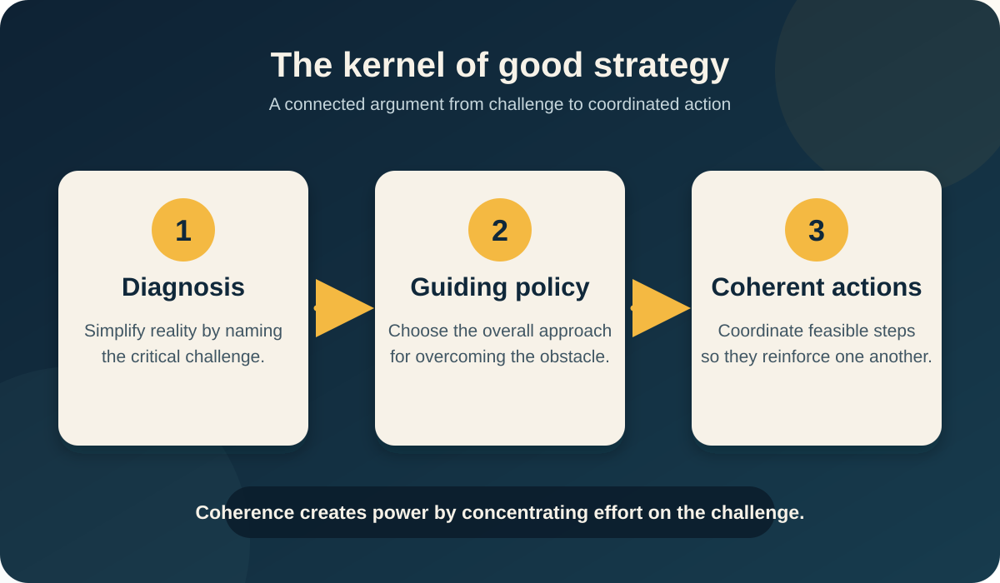

Richard P. Rumelt’s *Good Strategy/Bad Strategy: The Difference and Why It Matters* argues that strategy is neither ambition, inspirational language, financial targets, nor a thick plan. It is a coherent response to an important challenge: understand what is happening, choose an approach that concentrates effort, and coordinate actions that carry the approach into practice. The book develops this argument through military, commercial, public-policy, and organizational cases, then closes with methods for improving strategic judgment. [Title and copyright pages; Introduction]

*BAC9 explanatory diagram generated only from the three elements Rumelt defines in Chapter 5: diagnosis, guiding policy, and coherent actions. It is not a figure from the book.*

## 1. Strategy begins with a consequential challenge

Rumelt opens with Admiral Nelson at Trafalgar. Nelson was outnumbered, so he did not imitate the conventional line-of-battle tactic. He divided his fleet into two columns, accepted concentrated risk to the leading ships, broke the opposing fleet’s coherence, and trusted the greater experience of British captains in the resulting close combat. The example establishes the book’s governing pattern: identify the critical factor in a situation and concentrate coordinated effort on it. [Introduction]

This is why Rumelt separates strategy from several valuable but different things. Ambition supplies drive; determination supplies persistence; innovation creates new possibilities; leadership can motivate sacrifice; planning arranges work. Strategy selects **where, why, and how** those capacities should be applied. A goal describes a desired result. A strategy explains a plausible way through the obstacles standing between the present and that result. Immediate feasible actions are therefore part of strategy, not a secondary matter called “implementation.” [Introduction]

The book’s three parts move from distinction to construction to judgment:

1. **Good and bad strategy:** how to recognize the difference and understand the kernel.
2. **Sources of power:** how leverage, objectives, design, focus, advantage, dynamics, and organizational conditions magnify or weaken action.
3. **Thinking like a strategist:** how to treat strategy as a hypothesis, resist quick closure, and maintain independent judgment.

## 2. What makes good strategy unexpected

Good strategy is often surprising because coherent strategy is itself uncommon. Many organizations accumulate goals and initiatives without making them reinforce one another. Coherence creates strength: it aligns policies, resources, and actions around an important end. Insight can create further strength by changing the frame through which a familiar situation is understood. [Chapters 1–2]

### Apple: focus before growth

When Steve Jobs returned to Apple in 1997, he did not present a grand growth vision. He cut a confused product portfolio down to a small set, reduced costs, and stopped peripheral work. Rumelt’s point is not that every company should copy those moves. Jobs diagnosed Apple’s immediate challenge as survival in a niche where it still had loyal customers and a differentiated product. His policy was to simplify and concentrate until the company had a viable core from which it could move again. The power came from facing the condition of the company and choosing what not to do. [Chapter 1]

### Desert Storm: a coherent design can hide in plain sight

The Gulf War plan combined an air campaign, a visible ground buildup, deception, and a wide left hook through lightly defended desert. The broad envelopment was a classic maneuver, yet Iraqi forces and many observers expected a direct attack into Kuwait. Rumelt uses the case to show that good strategy may be conceptually simple while remaining unexpected because adversaries are anchored to familiar interpretations and visible activity. [Chapter 1]

### Wal-Mart: redefine the unit of competition

Sam Walton did more than place discount stores in small towns. A single small-town store could not achieve the scale that conventional retail economics required. Wal-Mart treated a **regional network** of stores—connected to a distribution hub, shared information, logistics, and management routines—as the operating unit. Bar-code data mattered because it complemented the rest of the system. A competitor copying only scanners or low prices would not reproduce the advantage. The discovery was a shift in viewpoint: the network, not the individual store, generated scale and coordination. [Chapter 2]

The same logic appears in Andy Marshall and James Roche’s Cold War analysis. Rather than merely matching Soviet weapons, they proposed using U.S. technological strengths to force the Soviet Union into disproportionately expensive counters. The strategy reframed competition from balancing inventories to imposing asymmetric costs. [Chapter 2]

## 3. The four hallmarks of bad strategy

Bad strategy is not simply a strategy that later fails. A good strategy is still a judgment under uncertainty and may be wrong. Bad strategy has recognizable defects before results arrive. Rumelt identifies four. [Chapter 3]

| Hallmark | What it looks like | Why it fails |
|---|---|---|
| **Fluff** | Restating the obvious with inflated language and fashionable terms. | It creates the appearance of expertise without identifying a challenge or causal logic. |
| **Failure to face the challenge** | Avoiding or obscuring the decisive obstacle. | Without a defined challenge, the quality of the response cannot be evaluated or improved. |
| **Mistaking goals for strategy** | Presenting growth, leadership, market share, or performance targets as the strategy. | Desire does not explain how obstacles will be overcome. |
| **Bad strategic objectives** | A long “dog’s dinner” of unrelated priorities, or distant objectives with no feasible route. | Resources scatter, objectives conflict, and leaders avoid choosing what matters now. |

International Harvester illustrates failure to face the challenge: leadership pursued general efficiency and performance programs while avoiding the company’s damaging labor costs and work rules. The 20/20 plan discussed in the book illustrates mistaking targets for a way to achieve them. Long lists of departmental wishes become bad objectives when they are collected under a strategic heading but do not address one pivotal problem. [Chapter 3]

### Why bad strategy is so common

Rumelt gives three main causes. First is the unwillingness or inability to choose. Strategy focuses resources, so it necessarily denies resources to other purposes. Digital Equipment Corporation’s leaders could not choose among becoming a systems company, a customer-solutions company, or a semiconductor company; consensus produced an agreeable statement but no direction. Intel’s exit from memory chips shows the opposite: even after leaders recognized what a new CEO would do, abandoning the company’s identity and accumulated commitments remained painful. [Chapter 4]

Second is template-style planning. A sequence of vision, mission, values, and goals can support leadership communication, but filling those boxes does not diagnose a problem or design a response. Third is “New Thought”: the belief that positive thinking, bold desire, or sufficient commitment can substitute for analysis and choice. Motivation can support a strategy; it cannot create one by itself. [Chapter 4]

## 4. The kernel of good strategy

The kernel is the minimum logical structure Rumelt expects in a strategy. It is an argument that connects three elements. [Chapter 5]

### 4.1 Diagnosis

A diagnosis answers, “What is going on here?” It reduces an overwhelming reality to a simpler account of what is critical. Because difficult situations are ill-structured, diagnosis is a judgment, not a mechanically proven result. A useful diagnosis also identifies a domain where action can affect outcomes. Explaining school performance entirely through social conditions may describe much of the variation, for example, but an organizational diagnosis can be strategically useful because organization is open to intervention. [Chapter 5]

Lou Gerstner changed IBM’s diagnosis in the 1990s. The dominant view held that a fragmented computer industry required IBM to break itself apart. Gerstner instead saw IBM’s breadth as unique and diagnosed the problem as failure to integrate that knowledge around customer needs. The changed diagnosis opened a different path: solutions and services using IBM’s full expertise, including outside technology when appropriate. [Chapter 5]

### 4.2 Guiding policy

A guiding policy defines the overall method for dealing with the diagnosed obstacle. It constrains action without specifying every later move. It differs from a vision because it states an approach. It can create advantage by reducing ambiguity, anticipating reactions, concentrating effort on a pivot point, or making policies reinforce one another. [Chapter 5]

Rumelt’s corner-grocery example makes the distinction concrete. “Maximize profit” gives the owner no useful guidance among thousands of possible decisions. Diagnosing competition with a larger, cheaper supermarket and choosing to serve busy professionals with little time to cook organizes decisions about prepared food, staffing, checkout capacity, parking, and opening hours. The policy simplifies a complex choice space and makes compatible actions visible. [Chapter 5]

### 4.3 Coherent actions

A policy becomes strategy only when enough feasible action is specified to bring it to earth. Coherence means that resource commitments, policies, and maneuvers support one another rather than conflict or merely coexist. Ford’s simultaneous pursuit of distinctive premium brands and shared platforms risked weakening both aims. A miscellaneous list—move a plant, advertise more, add a feedback program—may contain sensible actions but is not a strategy unless the actions jointly address a specific challenge. [Chapter 5]

Coordination itself can be a source of advantage, but it has costs. Excess coordination interrupts specialized work and slows local response. The aim is not to connect everything to everything; it is to impose the essential coordination needed for the challenge. [Chapter 5]

## 5. Sources of strategic power

Part II explains how a strategy gets more effect from available resources. These sources are not a menu to include in every plan. Each becomes useful when the diagnosis shows that its logic fits the situation.

### 5.1 Leverage: anticipation, pivot points, and concentration

Leverage combines an anticipation of what will happen, insight into a pivotal point, and concentrated effort there. Anticipation is not prophecy; it often follows from downstream consequences already set in motion, established routines, constraints, and likely reactions. Shell’s scenario work traced pressures inside oil-producing states and later supply responses rather than merely drawing high, medium, and low lines. [Chapter 6]

A pivot point is an imbalance where a limited intervention releases a larger effect. 7-Eleven Japan used detailed local knowledge, rapid product development, manufacturing relationships, and frequent assortment change to answer Japanese demand for variety. Concentration matters when thresholds exist: an effort spread below the level needed to change anything is wasted. The Getty Trust chose to transform research, conservation, and the study of art rather than merely compete to buy more objects; the objective was scaled so its resources could make a distinctive difference. [Chapter 6]

### 5.2 Proximate objectives

A proximate objective is close enough to be feasible with current or attainable capabilities. Kennedy’s Moon objective was bold to the public but proximate to engineers: the relevant technologies existed, a sequence of intermediate work could be described, and the target was chosen partly because both superpowers had to make a new leap. The objective coordinated resources while absorbing much of the ambiguity facing the organization. [Chapter 7]

*Internet-sourced historical image: Neil Armstrong at the Apollo 11 landing site, photographed by Buzz Aldrin. Credit: NASA. [Image source](https://science.nasa.gov/image-detail/7876057948-122e87948b-o-neil-armstrong-on-the-moon/) · [NASA media-use guidance](https://www.nasa.gov/nasa-brand-center/images-and-media/). The image illustrates the book’s Moon-landing case; it is not contained in the supplied Markdown.*

At JPL, Phyllis Buwalda specified a workable model of the Moon’s surface so Surveyor engineers could design a lander. The model did not pretend to eliminate uncertainty; it converted an ambiguous problem into one that could be solved. In volatile environments, this logic argues for nearer objectives that strengthen position and create options, not for more detailed long-range prediction. What counts as proximate depends on accumulated competence: a helicopter pilot can focus on a difficult landing only after routine control has become automatic. [Chapter 7]

### 5.3 Chain-link systems

In a chain-link system, performance is limited by the weakest link. Improving one component may create no benefit while the rest remain weak, so decentralized managers have little incentive to invest and the system becomes stuck. Rumelt’s machine-company case improved quality, then sales capability, then cost in a centrally directed sequence. Leadership absorbed the temporary losses because the payoff appeared only after the linked deficiencies were addressed. [Chapter 8]

The same logic can protect excellence. IKEA’s store format, catalogs, flat-pack designs, customer pickup, product design, outsourced manufacturing, and logistics reinforce one another. A rival gains little by copying a single activity; it would have to reproduce a whole unfamiliar configuration, often while undermining its existing business. Chain-link logic therefore explains both persistent mediocrity and difficult-to-copy excellence. [Chapter 8]

### 5.4 Design

Many strategies are designed rather than selected from ready-made alternatives. Hannibal’s victory at Cannae combined premeditation, anticipation of Roman behavior, and coordinated movements in time and space. In business, the parallel is the mutual adjustment of product, customer, cost, capability, distribution, and competitive response. Optimizing one part independently can damage the whole. [Chapter 9]

Rumelt describes a trade-off between resources and tight integration. When resources are scarce or the challenge is severe, success requires a cleverer, more tightly coordinated configuration. Powerful resources reduce that need, but tight designs are narrower and less flexible. Strong resources also create danger: easy returns can permit laxity, bloat, and loss of design discipline. Paccar’s high-end heavy-truck position illustrates a coherent design whose products, dealers, engineering, and customer knowledge fit the same target. [Chapter 9]

### 5.5 Focus

Focus has two meanings: policies coordinate to create extra power, and that power is applied to a target where it matters. Crown Cork & Seal appeared to specialize in difficult containers, but closer analysis revealed a system aimed at shorter production runs, smaller customers, rush orders, technical assistance, and rapid response. These policies raised Crown’s unit costs yet also shifted bargaining power: instead of a can plant being captive to one large buyer, each Crown plant served several customers who valued flexibility. [Chapter 10]

The case also demonstrates how to identify a strategy. Do not stop at what executives or analysts call it. List the policies that differ from industry practice, identify the target each policy serves, and look for a common purpose that explains their fit. [Chapter 10]

### 5.6 Growth is an outcome, not a strategy

Crown later pursued scale through acquisitions and left the basis of its earlier advantage behind. It became larger while returns fell. Growth in a commodity sector can look profitable while demand is expanding, but new capacity follows, margins disappear, and ordinary competitors discover that most apparent profit was reinvested merely to keep up. Acquisitions create value only when the buyer pays less than the asset is worth or possesses a special ability to add more value than other owners. [Chapter 11]

Healthy growth follows increasing demand for distinctive capabilities, expansion of those capabilities, superior products, innovation, efficiency, or creativity. It normally appears together with strong profitability or market-share gains; saying “grow” does not supply its cause. [Chapter 11]

### 5.7 Advantage must be particular and developable

Advantage comes from asymmetry. A business has a competitive advantage when it can produce at lower cost, deliver greater perceived value, or combine both—but only for particular products, customers, and conditions. Sustainability requires an isolating mechanism that makes the underlying resource costly to reproduce: patents, reputation, relationships, network effects, scale, or tacit experience. An advantage sold equally to every competitor is not an advantage. [Chapter 12]

Rumelt distinguishes possessing an advantage from increasing wealth. An advantage becomes strategically “interesting” when leaders can increase its value. He gives four routes:

- **Deepen it:** widen the gap between buyer value and cost by redesigning products or work.
- **Broaden it:** extend the underlying skill or resource into an arena where it remains genuinely relevant.
- **Increase demand:** grow demand for products that rely on a scarce, advantaged resource.
- **Strengthen isolation:** improve the mechanisms that delay imitation, including continual improvement that keeps the target moving.

These routes explain why simply buying an advantaged asset at full value does not automatically create gain. Value grows when the advantage or the demand for its scarce foundation grows. [Chapter 12]

### 5.8 Ride waves of change

Exogenous changes in technology, cost, regulation, buyer behavior, and competition can erase old high ground and create new positions. Strategy is not prediction at a distance; it is understanding forces already operating, their second-order effects, and the likely structure toward which an industry is pulled. Rumelt uses the microprocessor to show how software and small-team skill displaced some advantages of massive engineering scale. Cisco understood this shift earlier than larger incumbents. [Chapter 13]

Five guideposts help examine a transition: rising fixed costs that force consolidation; deregulation that removes hidden subsidies and exposes true costs; predictable forecasting biases; the likely response and inertia of incumbents; and an **attractor state**, a more efficient way the industry could operate. An attractor state differs from a company vision because it is based on system efficiency, not one firm’s desired share. [Chapter 13]

### 5.9 Inertia and entropy

Inertia is resistance to changed circumstances. Rumelt separates routine inertia, cultural inertia, and inertia by proxy. Old routines filter new information through obsolete assumptions; culture preserves work norms that may block required capabilities; inertia by proxy occurs when a firm deliberately protects an old profit stream because its customers are slow to move. A challenger must distinguish these cases because an incumbent exploiting customer inertia can respond suddenly. [Chapter 14]

Entropy is different: weakly managed organizations lose order even when the environment is stable. Product lines blur, internal subsidies grow, and compromises accumulate. Rumelt’s “hump chart” exposes separable units whose losses drag down the total. General Motors shows the longer decay of a once-coherent product architecture as divisions expanded into one another’s price ranges. Strategy must therefore include renewal and maintenance, not only dramatic innovation. [Chapter 14]

### 5.10 Nvidia puts the sources together

After Nvidia’s first product failed, leadership diagnosed the opportunity as high-performance 3-D graphics for PCs, not general multimedia. Its guiding policy was to ride rapidly increasing graphics demand with a product cycle much faster than the semiconductor industry norm. Coherent actions made that possible: three overlapping development teams, heavy simulation and emulation, early driver development, a unified driver architecture, fabless production, adoption of Microsoft’s emerging DirectX, and channel changes that reduced dependence on board makers. [Chapter 15]

The case combines anticipation, focus, design, dynamics, and rival inertia. Nvidia’s advantage did not come from announcing speed; it came from redesigning development so a meaningful product release could occur every six months. Rivals were constrained by slower routines, conflicting priorities, or growth goals disconnected from their challenge. Rumelt also notes Nvidia’s mistakes and the uncertainty of its next moves, reinforcing that past coherence does not guarantee permanent success. [Chapter 15]

## 6. Thinking like a strategist

### Strategy is a hypothesis

A strategy is an educated hypothesis about what will work at the edge between knowledge and uncertainty. Implementation is an experiment. Results create proprietary functional knowledge about the organization’s specific arena, and that learning should revise the strategy. Asking for a guaranteed strategy is therefore like asking for a scientific hypothesis guaranteed to be true before testing. [Chapter 16]

Scientific thinking also looks for anomalies—facts that do not fit accepted explanations. Howard Schultz’s observation that quality coffee was a mass social experience in Milan but a niche product in the United States challenged prevailing assumptions. The useful response was not blind imitation: it was to form a hypothesis, test a version of the experience, learn, and adjust. Strategy needs general knowledge, but decisive knowledge often comes from disciplined local experimentation. [Chapter 16]

### Use your head: resist quick closure

People usually seize the first plausible diagnosis or action that comes to mind. This is efficient in routine life but dangerous in strategy, where issues are both important and difficult. Rumelt’s TiVo discussion shows experienced managers focusing on different aspects of the same facts and then stopping at their first recommendation. Strategic thinking requires deliberate control over attention and a willingness to attack one’s own judgment. [Chapter 17]

### Keep your head: use an outside view

The final chapter examines Global Crossing and the 2008 financial crisis. Investors treated rising market prices as proof that fiber capacity and highly leveraged financial structures were sound, creating closed circles in which market signals replaced independent analysis of industry economics. Social herding encouraged people to copy others who were themselves copying the crowd. The **inside view** encouraged claims that the present organization, country, or era was special despite comparable historical evidence. [Chapter 18]

Rumelt’s corrective is not habitual contrarianism. It is an independent assessment of fundamentals, comparison with relevant cases, attention to disconfirming data, and awareness of incentives that reward risk while transferring losses to others. Good judgment means doubting the crowd without becoming detached from evidence. [Chapter 18]

## 7. Practice methods explicitly given in the book

The book does not contain a formal end-of-chapter exercise set or answer key. The following practices are faithful condensations of methods Rumelt explicitly prescribes in Chapters 16–17; no new framework has been added.

### Practice 1: Make the important-actionable list

List the ten most important things you can do, then begin with number one. The value is not the written list alone. Constructing it forces you to intersect what matters with what is actionable, recover larger purposes from immediate distractions, and choose priority. **The source provides no single correct answer.** [Chapter 17, “Make a List”]

### Practice 2: Complete the kernel

Write the current insight under whichever kernel element it first fits: diagnosis, guiding policy, or action. Then complete the other two elements. Test whether the result forms one consistent argument from facts, to the critical challenge, to an overall approach, to coordinated action. **The source provides no answer key.** [Chapter 17, “The Kernel”]

### Practice 3: Work backward from solution to problem

Take a proposed action or policy and ask which difficulty it is intended to overcome. Identify other ways the difficulty could be framed and other solutions already competing with the proposal. The shift from “What are we doing?” to “Why is this being done?” reveals assumptions and can change the relevant strategy set. **The source provides no answer key.** [Chapter 17, “Problem-Solution”]

### Practice 4: Create, then destroy

Develop a serious alternative from a fresh reading of the facts, not a slight variation or a generic “study more” option. Try to destroy the current favorite by exposing contradictions, missing evidence, and weak assumptions. Use a mental panel of experts whose distinctive judgments you know well to challenge the proposal and stimulate another. **The source provides no answer key.** [Chapter 17, “Create-Destroy”]

### Practice 5: Record judgments before outcomes

Before a meeting, case discussion, or decision, write which issues will matter, what positions people will take, and what diagnosis and action you favor. Compare the record with what later happens. Pre-commitment prevents hindsight from turning every outcome into something you “already knew” and creates repeated opportunities to calibrate judgment. **The source provides no answer key.** [Chapter 17, “Practicing Judgment”]

### Practice 6: Treat the strategy as a testable hypothesis

State what the strategy assumes will happen, what evidence would contradict it, and what implementation can teach the organization. Pay particular attention to anomalies rather than explaining them away. Update the hypothesis as results appear. **The source provides no single correct answer.** [Chapter 16]

## 8. A source-grounded strategic review checklist

This checklist restates questions embedded across the book without adding another model:

- What is the most important challenge, and what evidence supports that diagnosis?
- Does the stated “strategy” explain a method, or only a desired result?
- What is being chosen—and what is being set aside?
- Which policy guides action and rules out irrelevant alternatives?
- Do immediate actions reinforce one another and fit available capabilities?
- Where are anticipation, a pivot point, and concentration able to create leverage?
- Is the objective proximate enough to coordinate real problem solving?
- Does a weakest link limit the whole system?
- Which distinctive policies reveal the actual focus?
- Is growth supported by a strengthening advantage, or substituted for one?
- Which change forces, incumbent routines, and attractor states shape the field?
- What evidence could refute the strategy, and how will that evidence be captured?
- Which crowd belief or inside-view assumption needs an outside comparison?

## 9. Condensed takeaway

Rumelt’s central demand is intellectual and operational honesty. Face the challenge instead of covering it with ambition. Reduce complexity through a useful diagnosis. Choose a guiding policy that concentrates rather than accommodates every interest. Design feasible actions so they reinforce one another. Use leverage, proximate objectives, chain-link logic, design, focus, advantage, dynamics, and organizational renewal only where the diagnosis makes them relevant. Finally, treat the resulting strategy as a hypothesis: record judgments, test them against reality, and keep enough independence to learn when the crowd is wrong. [Introduction; Chapters 5–18]
