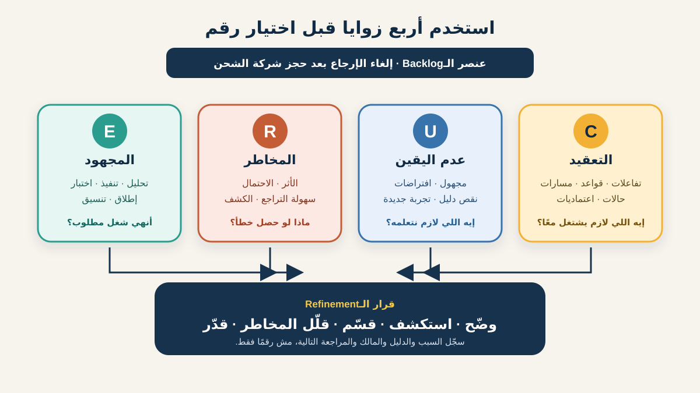

# إطار CURE لتنقيح الـBacklog

لما الفريق يقول إن عنصر الـBacklog «كبير»، ممكن كل شخص يقصد حاجة مختلفة. واحد شايف قواعد كثيرة بتتفاعل. شخص تاني ناقصه معلومات. ثالث خايف من فشل مكلف. وشخص رابع شايف حجم شغل كبير. لو ضغطنا كل المخاوف دي في رقم واحد بدري، هنضيّع أهم جزء في النقاش.

إطار **CURE** بيفصل أربع زوايا:

- **C — Complexity (التعقيد):** عدد الأجزاء والقواعد والمسارات والاعتماديات المتفاعلة؛
- **U — Uncertainty (عدم اليقين):** المعلومات اللي الفريق لسه مايعرفهاش أو مش واثق فيها؛
- **R — Risk (المخاطر):** اللي ممكن يحصل لو التغيير أو طريقة التسليم فشلوا؛
- **E — Effort (المجهود):** حجم الشغل المتوقع للتصميم والتنفيذ والاختبار والتوثيق والإطلاق.

CURE وسيلة تذكّر عملية ظهرت في محتوى ممارسين لتحسين نقاشات الـRefinement والتقدير. مش معيارًا من IIBA، ولا شرطًا في Scrum، ولا معادلة عالمية. الـScrum Guide الرسمي بيسمح إن تفاصيل زي الحجم تختلف حسب المجال، وبيجعل الناس اللي هتنفذ الشغل مسؤولة عن الـSizing. محلل الأعمال (BA) بيساهم بإظهار الاحتياج والقواعد والأمثلة والأدلة والافتراضات والنتائج، مش بفرض تقدير على الفريق.



هنستخدم عنصرًا افتراضيًا واحدًا لمتجر أونلاين: **السماح للعميل بإلغاء الإرجاع بعد حجز استلام شركة الشحن**. السياسات والأنظمة والتقييمات والقرارات هنا افتراضات تعليمية، مش قواعد عامة للبيع بالتجزئة.

## 1. ابدأ بأربع أسئلة منفصلة

مسودة عنصر الـBacklog بتقول:

> بصفتي عميلًا، أريد إلغاء الإرجاع علشان أحتفظ بالمنتج.

قبل التصويت على Story Points أو الوعد بتاريخ، اسأل أربع أسئلة مختلفة:

| الزاوية | السؤال الأساسي | إشارة في مثال إلغاء الإرجاع |
|---|---|---|
| Complexity | كام تفاعل ومسار لازم يشتغلوا مع بعض؟ | حالات الإرجاع والشحن والاسترداد والمخزون والإشعارات والـAudit بتتفاعل. |
| Uncertainty | أنهي معلومة مهمة ناقصة أو غير موثوقة؟ | الفريق لسه ماأكدش أنهي حالات عند شركة الشحن ينفع تتلغي. |
| Risk | إيه أثر السلوك الغلط؟ | العميل ممكن يستلم Refund ويحتفظ بالمنتج، أو المندوب يجمع إرجاعًا تم إلغاؤه. |
| Effort | أنهي شغل غالبًا مطلوب؟ | حالات UI وتغييرات Service وIntegration واختبارات وMonitoring وتعليمات للدعم وإطلاق. |

الأبعاد بتأثر في بعضها، لكنها مش مترادفات. الاستكشاف ممكن يقلل عدم اليقين من غير ما يغير عدد الأنظمة. تعديل Code صغير ممكن يحمل مخاطرة مالية عالية. وشغل متكرر كثير ممكن يحتاج مجهودًا من غير تعقيد هيكلي.

**إجراء للـBA:** سجّل جملة ودليلًا واحدًا لكل زاوية. لو الفريق مش قادر يقول غير «حاسين إنه كبير»، فالعنصر مش جاهز لقرار مفيد.

## 2. Complexity: ارسم التفاعلات، مش عدد المهام فقط

التعقيد بيزيد لما السلوك يعتمد على قواعد وحالات وتسليمات وأدوار وأنظمة متداخلة. هو شكل المشكلة وترابطها، مش طول قائمة المهام.

في عنصر الإلغاء، الـBA بيرسم تدفق حالات مبسطًا:

```text
تم طلب الإرجاع
  ← الشحن لم يُحجز: ألغِ داخل النظام
  ← الشحن اتُحجز: اطلب الإلغاء من شركة الشحن
      ← مقبول: ألغِ الإرجاع وامنع الاسترداد
      ← مرفوض / متأخر: أبقِ الإرجاع فعالًا واشرح الخطوة التالية
      ← Timeout: حافظ على الحالة وأعد المحاولة أو صعّد بأمان
```

أسئلة التعقيد المفيدة:

- مين مالك كل حالة في الأنظمة والفرق؟
- أنهي قواعد بتختلف حسب نوع المنتج أو البلد أو الدفع أو شركة الشحن؟
- هل الأحداث ممكن توصل مرتين أو بترتيب مختلف؟
- أنهي رحلات للعميل والدعم والمالية والمخزن هتتأثر؟
- إيه اللي لازم يفضل متسقًا في التطبيق والإيميل وشاشة الدعم والتقارير؟

الفريق يقيّم Complexity بأنها **Large** في المثال الافتراضي لأن عدة State Machines وحدود ملكية بتتفاعل.

**غلطة شائعة:** تعتبر عدد الشاشات أو Acceptance Criteria هو التعقيد. عشر قواعد بسيطة ومستقلة ممكن تكون أقل تعقيدًا من قاعدة واحدة بتنسق Refund وشحن ومخزون كوحدة واحدة.

## 3. Uncertainty: أظهر اللي مش معروف

عدم اليقين هو فجوة في الدليل. ممكن ييجي من سياسة غامضة أو تقنية غير مألوفة أو بيانات ناقصة أو Integration لم يُختبر أو نطاق متغير أو معرفة محصورة في شخص واحد.

اعمل سجلًا للمجهول بدل ما تخبّيه داخل التقدير:

| المعلومة المجهولة | ليه مهمة؟ | إزاي نقللها؟ | المالك |
|---|---|---|---|
| حالات شركة الشحن التي تسمح بالإلغاء | بتحدد الإجراءات المتاحة للعميل | راجع العقد واختبر ردود الـSandbox | Integration Lead |
| هل تفويض الاسترداد يبدأ قبل الاستلام؟ | ممكن يسبب تعويضًا مزدوجًا | امشِ في العملية الحالية وأحداث المالية | Finance SME |
| تصرف الدعم عند Timeout | بيأثر على التعافي ورسالة العميل | اتفق على Fallback تشغيلي | Support Lead |
| حجم طلبات الإلغاء | بيأثر على القيمة والـMonitoring | حلل Return Events | Product Analyst |

الفريق يقيّم Uncertainty بأنها **Medium**: الفجوات مؤثرة، لكن فيه أشخاص محددون يقدروا يجاوبوا من خلال استكشاف قصير.

عدم اليقين مش هو المخاطرة تلقائيًا. «مش عارفين هل الـAPI بيدعم الإلغاء» عدم يقين. «فشل الإلغاء ممكن يعمل Refund غلط» مخاطرة. الأول محتاج تعلّم، والثاني محتاج منعًا أو كشفًا أو استجابة أو قرار قبول واضحًا.

**إجراء للـBA:** حوّل «مش عارفين» لسؤال ومصدر دليل ومالك وموعد. الـSpike أو التجربة لازم يكون له Learning Outcome، مش مهمة تقنية مفتوحة بلا حدود.

## 4. Risk: وضّح النتيجة والاستجابة

المخاطرة حدث محتمل ونتيجته. استكشف مخاطر العمل والعميل والالتزام والتشغيل والأمان والبيانات والتسليم، مش الفشل التقني فقط.

| سيناريو المخاطرة | الأثر | المنع أو التقليل | الكشف والاستجابة |
|---|---|---|---|
| الاسترداد يكمل بعد إلغاء الإرجاع | خسارة مالية وشغل تسويات | مصدر واحد للحالة وأوامر آمنة عند التكرار | Alert على إرجاع ملغي معه Refund Event |
| المندوب يجمع المنتج رغم الإلغاء | ضرر للعميل واتصال بالدعم | اعرض الإلغاء Pending لحد التأكيد | نبّه الدعم لو التأكيد عمل Timeout |
| طلبا إلغاء يصلان معًا | Calls مكررة وحالة متعارضة | اجعل العملية آمنة للتكرار | سجّل Correlation ID والحالة النهائية |
| الإلغاء يخفي إجراء مخزن بدأ بالفعل | فقد تتبع المخزون | حدد آخر حالة تسمح بالإلغاء | Audit Event وException Queue |

الفريق يقيّم Risk بأنها **Large** لأن الحالة الغلط ممكن تأثر على الفلوس والمخزون والعميل ويصعب عكسها.

العنصر عالي المخاطرة مش بالضرورة قليل الأولوية. ممكن يكون عاجلًا وله قيمة، لكنه يحتاج ضوابط أو حد إصدار أصغر أو دليلًا أقوى أو قرارًا واعيًا من المالك المناسب.

**غلطة شائعة:** تزود التقدير وتعتبر المخاطرة اتحلت. الـPoints الإضافية مش هتمنع Refund مكرر. سجّل الضابط ومالكه ودليل الاختبار والـMonitoring وطريق التعافي.

## 5. Effort: سيب فريق التنفيذ يقدّر الشغل

المجهود هو حجم الشغل المتوقع في الطريق الكامل للوصول إلى Done. ممكن يشمل التحليل والتصميم والتنفيذ والاختبار والإتاحة وتغييرات البيانات ومراجعة الأمان والتوثيق والتدريب والنشر والـMonitoring والتنسيق.

الـBA بيساعد يكشف شغلًا ممكن يتنسي:

- رسائل الإلغاء المقبول والمرفوض والمعلّق والفاشل؛
- محتوى وترتيب عربي وإنجليزي؛
- إجراءات الدعم والعمليات؛
- Integration Tests للرد المكرر والمتأخر والـTimeout؛
- Audit وMonitoring وAnalytics وتسويات؛
- Feature Control وإطلاق وRollback.

الناس اللي هتنفذ الشغل هي اللي تحكم على المجهود حسب سياقها ومهاراتها وأدواتها وDefinition of Done والنظام الحالي. في المثال يقيّموا Effort بأنها **Medium** بعد مناقشة طريق التسليم كاملًا.

المجهود مش المدة الزمنية. انتظار قرار سياسة ثلاثة أيام يضيف تأخيرًا لكن مجهودًا مباشرًا قليلًا؛ تنفيذ يوم واحد من متخصصين ممكن يحتوي مجهودًا معتبرًا. ماتحوّلش Story Point لساعات مباشرة إلا لو الفريق اختار وراجع قاعدة محلية واضحة.

## 6. يسّر نقاش CURE

جلسة خفيفة ممكن تدخل داخل Backlog Refinement:

1. **ثبّت السياق.** أعد نتيجة المستخدم وحدود النطاق والدليل الحالي والقرارات المفتوحة.
2. **عرّف المقاييس المحلية.** اتفقوا على معنى Small وMedium وLarge لكل زاوية بأمثلة من نفس الفريق. ماتنسخش Scale من فريق تاني.
3. **قيّموا بشكل مستقل.** المطورون والاختبار والتصميم والعمليات والـPO والـBA يكتبوا C/U/R/E Profile قبل النقاش.
4. **اكشفوا معًا.** ناقشوا أكبر فروق الأول. الخلاف دليل مفيد إن الناس عندها Mental Models مختلفة.
5. **سمِّ السبب.** سجّل ليه كل زاوية مش Small وإيه اللي ممكن يغيرها.
6. **اختار الإجراء.** وضّح أو استكشف أو قسّم أو خفف مخاطرة أو قدّر أو أجّل أو ارفض. ماتحسبش متوسط التقييمات تلقائيًا.
7. **راجع عند تغير الدليل.** أعد التقييم بعد Spike أو قرار سياسة أو تقسيم أو تغيير معماري لو الـProfile اتغير فعليًا.

الـBA ييسّر الوضوح ويسجل القرارات. الـPO بيربط العنصر بالقيمة والترتيب. متخصصو التنفيذ يشرحوا المسارات التقنية ويمتلكوا الـSizing. ومالكو المخاطر أو المجال يحسموا القرارات داخل صلاحياتهم.

## 7. CURE Refinement Card مكتمل

```text
العنصر: إلغاء الإرجاع بعد حجز شركة الشحن
النتيجة: تمكين العميل من تصحيح قرار الإرجاع من غير أخطاء مالية
أو أخطاء مخزون أو دعم.

C — Complexity: LARGE
الدليل: حالات الإرجاع والشحن والاسترداد والمخزون والإشعارات والـAudit تتفاعل.
الإجراء: ارسم State Model واقسم قبل / بعد حجز الشحن.

U — Uncertainty: MEDIUM
الدليل: حالات إلغاء الشحن والـTimeout غير مؤكدة.
الإجراء: Sandbox Investigation محدد الوقت؛ Integration Lead يملك الإجابة.

R — Risk: LARGE
الدليل: Refund مكرر أو جمع المنتج بعد الإلغاء قد يضر العميل والعمل.
الإجراء: حدد مصدر الحالة وIdempotency وAlerts والتعافي اليدوي.

E — Effort: MEDIUM
الدليل: تغييرات في UI وService وIntegration Tests ورسائل وMonitoring ودعم.
الإجراء: فريق التنفيذ يقدّر بعد التقسيم وتقليل عدم اليقين.

القرار: غير جاهز كعنصر واحد
الجزء 1: الإلغاء قبل حجز شركة الشحن.
استكشاف: تأكيد عقد إلغاء الشحن وحالات الفشل.
الجزء 2: الإلغاء بعد الحجز مع Pending وRejected وTimeout وRecovery.
```

بعد التقسيم، الجزء الأول ممكن يبقى **C: Small وU: Small وR: Medium وE: Small**. الـProfile بيوضح ليه البدء به أكثر أمانًا، لكنه مش بيدعي دقة رياضية.

## 8. CURE Template قابل لإعادة الاستخدام

```text
العنصر ونتيجة المستخدم / العمل:
داخل / خارج النطاق:
الدليل المتاح حاليًا:

C — Complexity: Small / Medium / Large
التفاعلات والقواعد والمسارات والحالات والاعتماديات:
سبب التقييم:
إجراء التبسيط:

U — Uncertainty: Small / Medium / Large
المجهول والافتراضات:
الدليل المطلوب ومصدره ومالكه وموعده:

R — Risk: Small / Medium / Large
حدث المخاطرة وسببه ونتيجته:
المنع والكشف والاستجابة وصاحب القرار:

E — Effort: Small / Medium / Large
الشغل عبر التحليل والتصميم والتنفيذ والاختبار والإطلاق والتشغيل:
الأشخاص المنفذون المشاركون في التقدير:

الفروق التي تمت مناقشتها:
القرار: توضيح / استكشاف / تقسيم / تقليل مخاطرة / تقدير / تأجيل / رفض
مالك المتابعة وتاريخ المراجعة:
```

### تمرين سريع

طبّق CURE على العنصر ده: «اسمح للعميل بتغيير عنوان التوصيل بعد الدفع».

1. حدد إشارة Complexity مرتبطة بحالة المخزن أو شركة الشحن.
2. اكتب سؤالين Uncertainty وسمِّ مصادر الدليل.
3. صف مخاطرة احتيال أو تسليم غلط وضابطًا لها.
4. اكتب الـEffort الموجود وراء تعديل حقل العنوان.
5. قرر هل الخطوة التالية توضيح ولا استكشاف ولا تقسيم ولا تقليل مخاطرة ولا تقدير.

## مراجع للتوسع

- [Agile Ambition: What Is a Story Point—CURE the Debate](https://www.agileambition.com/Essays/What-Is-A-Story-Point)
- [Eric Biesterfeld: إطار CURE لتقسيم المهام](https://www.ebiester.com/advice/2025/10/03/CURE-framework.html)
- [The official Scrum Guide: Product Backlog refinement and sizing](https://scrumguides.org/scrum-guide.html#product-backlog)

*CURE أداة من خبرة الممارسين، مش معيارًا إلزاميًا ولا معادلة Forecasting مثبتة. السيناريو والتقييمات والسياسات والأنظمة والضوابط افتراضية. عدّل الأسئلة والـScale حسب فريقك ومجالك وحوكمتك ودليلك.*
