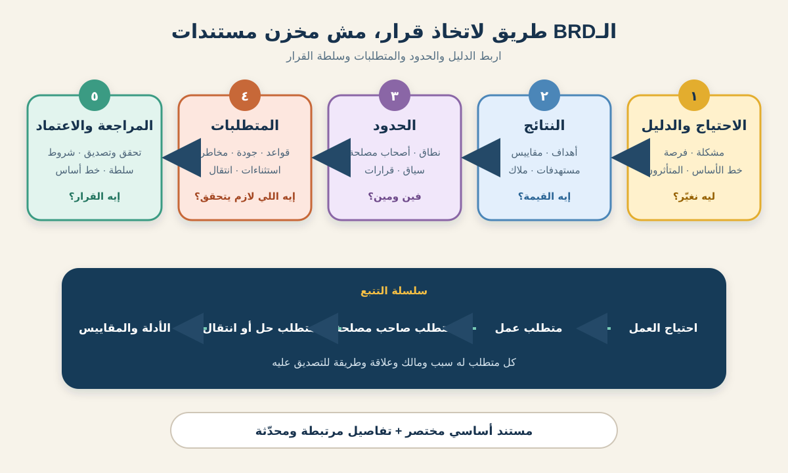

# إزاي تكتب BRD: دليل عملي لمحلل الأعمال

**مستند متطلبات العمل (Business Requirements Document أو BRD)** بينظم سبب التغيير من منظور العمل، والنتائج المطلوبة، والحدود اللي الناس بتوافق عليها، والمتطلبات والأدلة اللازمة لاتخاذ قرار. وظيفته مش إنه يبقى أكبر مستند في المشروع؛ وظيفته يبني فهمًا مشتركًا قابلًا للمراجعة.

مفيش شكل عالمي واحد للـBRD. مؤسسات بتستخدم مستندًا رسميًا عليه توقيعات، ومؤسسات تانية بتستخدم صفحات ونماذج وسجلات متطلبات مترابطة. المعهد الدولي لتحليل الأعمال (IIBA) بيتعامل مع المتطلبات كتمثيلات قابلة للاستخدام للاحتياجات، وممكن تظهر في مستند أو Matrix أو رسم أو Artifact تاني. قبل الكتابة، أكد الـTemplate المحلي وصاحب الاعتماد ومستوى التفاصيل المطلوب.



هنستخدم سيناريو افتراضيًا واحدًا: متجر بقالة عايز يقدم **الطلب أونلاين والاستلام من الفرع (Click-and-Collect)** في فروع مختارة. البيانات والقواعد والأهداف والأدوار والقيود هنا افتراضات تعليمية، مش حقائق عامة للبيع بالتجزئة.

## 1. حدد قرار الـBRD وجمهورها

ماتبدأش بملء كل عنوان في الـTemplate. الأول اكتب القرار اللي المستند لازم يدعمه.

```text
القرار: اعتماد أو رفض أو تعديل أول إصدار من Click-and-Collect لثلاثة فروع تجريبية.
القراء الأساسيون: الراعي والعمليات والتجارة الإلكترونية ومديرو الفروع والمالية والمخاطر وفريق التنفيذ.
سلطة الاعتماد: الراعي يعتمد نطاق العمل والتمويل؛ العمليات تعتمد Process الفروع وقواعد السعة.
مالك المستند: محلل الأعمال.
نقطة المراجعة: قبل اختيار Solution Option وتخطيط التنفيذ.
```

اسأل قبل المسودة:

- هل الـBRD بتطلب اعتماد المشكلة ولا الاستثمار ولا النطاق ولا مجموعة Business Requirements ولا كل دول؟
- أنهي قرارات مكانها Artifact تاني، زي Architecture أو UI Design أو Procurement أو Release Planning؟
- هل مطلوب مستند واحد، ولا ينفع التفاصيل تبقى Models وسجلات مرتبطة بنواة مختصرة؟
- مين بيراجع، ومين بيوصي، ومين عنده سلطة الاعتماد؟
- أنهي قواعد Versioning وChange Control تطبق بعد الاعتماد؟

**غلطة شائعة:** تكتب «لكل أصحاب المصلحة». القراء محتاجين أعماقًا مختلفة. خلّي القرار المركزي ظاهرًا واربط التفاصيل الداعمة بدل ما تحشر كل جمهور في سرد طويل.

## 2. اكتب الـExecutive Summary في الآخر، لكن اكتشفه من الأول

الملخص التنفيذي يشرح المبادرة في صفحة أو أقل. اكتب حقائقه بدري، لكن خلّص صياغته بعد ما التحليل يبقى متماسكًا.

### مثال ملخص تنفيذي

> العملاء في ثلاث مناطق تجريبية بيعتمدوا حاليًا على التوصيل للبيت. Baseline افتراضي بيوضح إن محاولات التوصيل الفاشلة وضيق المواعيد بيعملوا اتصالات دعم وإعادة توصيل كان ممكن نتجنبها. التغيير المقترح هيسمح للعميل المؤهل يطلب بقالة مدفوعة أونلاين ويستلمها من فرع تجريبي مختار داخل ميعاد متفق عليه. الإصدار الأول يستبعد الدفع النقدي والطلب داخل الفرع والاستلام من فروع غير تجريبية. النجاح هيتقاس بالاستخدام والجاهزية في الميعاد والطلبات غير المستلمة واتصالات الدعم ورأي العملاء. المطلوب دلوقتي اعتماد نطاق العمل والـOperating Model للنسخة التجريبية واكتشاف خيارات الحل، مش اعتماد تصميم واجهة نهائي.

الملخص المفيد يجاوب:

1. إيه المشكلة أو الفرصة؟
2. إيه الدليل؟
3. مين بيتأثر؟
4. إيه النتيجة والقدرة المطلوبة؟
5. إيه داخل وخارج القرار؟
6. إيه الاعتماد المطلوب دلوقتي؟

ماتكتبش «العملاء محتاجين ده» من غير مصدر. افصل الملاحظة المبنية على دليل عن رأي Stakeholder والافتراض والهدف المقترح.

## 3. حوّل المشكلة لأهداف ومقاييس

الهدف بيصف نتيجة العمل، مش الـFeature. «إطلاق شاشة استلام» مخرج. «توفير بديل موثوق للتوصيل المنزلي» أقرب لنتيجة.

| الهدف | المقياس | Baseline افتراضي | هدف تجريبي افتراضي | المصدر والمالك |
|---|---|---:|---:|---|
| توفير بديل قابل للاستخدام | نسبة الطلبات المؤهلة اللي اختارت الاستلام | 0% | 8% على الأقل بعد 12 أسبوعًا | Order Analytics؛ Product Analyst |
| حماية موثوقية التنفيذ | الطلبات الجاهزة عند بداية ميعاد الاستلام | غير متاح | 95% على الأقل | أحداث عمليات الفرع؛ Operations Lead |
| تقليل الهدر التشغيلي | الطلبات غير المستلمة بعد المهلة | غير متاح | أقل من 4% | تقرير حالة الاستلام؛ Store Manager |
| تقليل المساعدة الممكن تجنبها | اتصالات الاستلام لكل 100 طلب استلام | غير متاح | نحدد Baseline ثم نقلل 15% | Support Tags؛ Support Lead |

راجع قابلية الأهداف للتحقيق وملكية القياس. لو مفيش Baseline، الـBRD ممكن تطلب القياس قبل ما توعد بتحسن.

**إجراء للـBA:** اربط كل هدف بمتطلب واحد على الأقل، وكل مقياس بمصدر بيانات وتكرار قياس ومالك.

## 4. ارسم حدود النطاق

النطاق يبقى أوضح لما يوصف القدرات ومراحل العملية والمواقع والمستخدمين والاستبعادات، مش قائمة Features فقط.

| البعد | داخل النطاق التجريبي | خارج النطاق / لاحقًا |
|---|---|---|
| العملاء | عملاء مسجلون في المناطق المؤهلة | Guest Checkout وحسابات الشركات |
| المواقع | ثلاثة فروع تجريبية محددة | باقي الفروع ونقاط استلام طرف ثالث |
| الطلبات | طلبات بقالة مدفوعة من الكتالوج الحالي | الدفع عند الاستلام والطلب داخل الفرع |
| العملية | اختيار الفرع والميعاد، حجز السعة، التجهيز، الإشعار، التحقق، التسليم، إغلاق الطلب | تعديلات التوصيل للبيت والنقل بين الفروع |
| التشغيل | سعة الفرع وPicking Queue والاستثناءات والطلبات غير المستلمة | تصميم شبكة مخازن جديدة |
| الوقت | التحضير للتجربة وقياس 12 أسبوعًا | التوسع على مستوى الدولة |

ضيف Context View صغيرًا:

```text
تطبيق / موقع العميل
        |
        v
الطلب أونلاين ---- خدمة الدفع
        |
        v
سعة الفرع ---- قائمة التجهيز ---- مكتب الاستلام
        |
        v
الإشعارات والتقارير التشغيلية
```

الرسم يكشف Interfaces وملاكًا من غير فرض Technical Architecture. لو الاقتراح بعدين ضاف توصيلًا سريعًا من الفرع، عامله كتغيير نطاق، مش تفصيلة مستخبية في الـBRD.

## 5. حدد أصحاب المصلحة والقرارات والتعارضات

قائمة أسماء مش كفاية. سجّل مساهمة كل طرف والقرار اللي يملكه.

| صاحب المصلحة | الاحتياج أو القلق | المساهمة | سلطة القرار |
|---|---|---|---|
| الراعي | القيمة والتكلفة والمخاطرة والاتساق الاستراتيجي | حدود التمويل والنتائج المطلوبة | الاستثمار ونطاق العمل |
| عمليات الفروع | السعة وحجم الشغل والسلامة والاستثناءات | الوضع الحالي وقواعد تشغيل قابلة للتنفيذ | Process الفرع وسياسة العمالة |
| العملاء | أهلية واضحة وجاهزية موثوقة واستلام متاح | بحث وتجارب Usability | مفيش اعتماد رسمي؛ لازم نمثل ونصدق احتياجاتهم |
| المالية | الدفع والاسترداد والفقد والتسويات | الضوابط المالية والتقارير | قبول الضوابط المالية |
| المخاطر / Compliance | الهوية والخصوصية وتداول الطعام والـAudit | الالتزامات والأدلة المطلوبة | الاعتماد داخل صلاحيات السياسة |
| فريق التنفيذ | الجدوى والاعتماديات وقيود الجودة | خيارات الحل وأدلة التنفيذ | التقدير التقني وطريقة التنفيذ |

اظهر التعارض بدل ما تاخد متوسطه. العمليات ممكن تطلب Cutoff مبكرًا، والعميل محتاج مرونة، والـProduct محتاج استخدامًا. سجّل الـTrade-off والدليل والمالك والقرار.

## 6. اوصف الوضع الحالي والقدرة المستقبلية

الـBRD لازم توضح إيه اللي هيتغير في العمل، مش Software هيظهر وخلاص.

### مشكلة الوضع الحالي

- كل الطلبات المؤهلة أونلاين مضبوطة على التوصيل للبيت؛
- الفروع مابتنشرش سعة استلام؛
- الموظفون مالهمش Collection Queue أو حالة تسليم موحّدة؛
- الدعم بيتعامل يدويًا مع طلبات بدائل التوصيل؛ و
- التقارير مابتفصلش طلب الاستلام عن الجاهزية وفشل التسليم.

### القدرة المستقبلية

العميل يختار فرعًا وميعادًا مؤهلين. العمل يحجز السعة ويجهز الطلب ويبعت الجاهزية ويتحقق من المستلم ويسجل التسليم ويتعامل مع انتهاء المهلة أو الفشل ويقيس التجربة.

ارسم المسار الطبيعي والبديل والفشل:

```text
اختيار الفرع والميعاد
  -> حجز السعة
  -> تفويض الدفع
  -> تجهيز الطلب
  -> إشعار الجاهزية
  -> التحقق من المستلم
  -> التسليم وإغلاق الطلب

بدائل / فشل:
  لا توجد سعة | فشل الدفع | منتج غير متاح | تأخر التجهيز
  تعذر التحقق من المستلم | العميل لم يستلم | النظام غير متاح
```

**غلطة شائعة:** توثق Happy Path وتسيب الاستثناء «للـBusiness». الاستثناء جزء من التغيير وغالبًا بيعمل متطلبات وأدوارًا وتدريبًا وتكلفة.

## 7. اكتب متطلبات قابلة للتتبع بالمستوى المناسب

الـBRD عادة بتركز على Business وStakeholder Requirements. حسب الممارسة المحلية، ممكن تلخص Solution وTransition Requirements عالية المستوى أو تربطها في مكان تاني. خلّي التصنيفات واضحة.

| ID | النوع | المتطلب | السبب / التتبع |
|---|---|---|---|
| BR-01 | Business | التجربة توفر اختيار الاستلام من الفرع لطلبات البقالة المؤهلة أونلاين في الفروع الثلاثة المعتمدة. | يدعم هدف بديل التنفيذ |
| BR-02 | Business | التجربة تنتج دليلًا على الاستخدام والجاهزية والطلبات غير المستلمة وطلب الدعم ورأي العميل. | يدعم قرار ما بعد 12 أسبوعًا |
| STK-01 | Stakeholder | العميل محتاج يعرف هل الفرع والميعاد ما زالا متاحين قبل تأكيد الطلب. | يمنع التزامًا غير صحيح وإعادة العمل |
| STK-02 | Stakeholder | موظفو الفرع محتاجين Queue مرتبة حسب الطلبات المطلوبة لكل ميعاد. | يدعم هدف الجاهزية |
| SOL-01 | High-level solution | الحل يمنع التأكيد لما سعة الفرع ماتبقاش متاحة. | مشتق من STK-01 وقيد السعة |
| QLT-01 | Quality | رحلة الاستلام تحقق معايير المؤسسة المتفق عليها للإتاحة وزمن الاستجابة. | يدعم الاستخدام؛ التفاصيل مرتبطة منفصلة |
| TRN-01 | Transition | موظفو الفروع التجريبية يكملوا تدريبًا حسب الدور قبل الإطلاق. | يمكّن الانتقال الآمن للوضع المستقبلي |

المتطلب الجيد ضروري وقابل للتنفيذ وغير ملتبس بما يناسب غرضه ومتسق وقابل للاختبار بالمستوى المناسب وقابل للتتبع للاحتياج. ماتخبيش عدة التزامات في جملة واحدة.

ابعد عن التصميم المبكر:

- ضعيف: «ضيف زر استلام أخضر جنب التوصيل».
- احتياج أفضل: «العميل محتاج يقارن خيارات التنفيذ المؤهلة قبل تأكيد الطلب».
- سؤال تصميم مرتبط: «هل Tabs ولا Cards ولا Control تاني يخلي الخيارات أسهل للفهم؟»

الجملة الأفضل بتحمي الاحتياج وتسيب التصميم للاختبار.

## 8. سجّل القواعد والجودة والانتقال وعدم اليقين

Business Requirements وحدها نادرًا ما تخلي التغيير قابلًا للتشغيل. ضيف أو اربط المعلومات اللي بتقيدها.

### Business Rules افتراضية

- BRULE-01: الفروع التجريبية اللي عندها سعة استلام باقية فقط هي اللي تظهر؛
- BRULE-02: حجز السعة ينتهي لو تفويض الدفع ماكملش خلال مدة الحجز المحددة؛
- BRULE-03: المستلم يحقق سياسة التحقق من الهوية المعتمدة قبل التسليم؛ و
- BRULE-04: الطلب غير المستلم يتبع Process سلامة الطعام والاسترداد والتصرف في المخزون المعتمدة.

مدة الحجز وطريقة الهوية **قرارات مفتوحة** لحد اعتماد الملاك. ماتخترعش رقمًا أو Control علشان المستند يبان كاملًا.

### سجل RAID والقرارات

| النوع | المثال | المالك | الاستجابة أو تاريخ القرار |
|---|---|---|---|
| Risk | الطلب على الاستلام ممكن يضغط Picking Queue وقت الذروة | Operations Lead | محاكاة السعة وحدود التجربة قبل الاعتماد |
| Assumption | تفويض الدفع الحالي يقدر يدعم حجز السعة | Finance Product Owner | تأكيد بـService Walkthrough قبل 9 أكتوبر |
| Issue | الفرع 2 مافيهوش منطقة انتظار آمنة | Store Manager | اقتراح Layout أو إخراج الفرع قبل 11 أكتوبر |
| Dependency | خدمة الإشعارات تدعم رسائل الجاهزية والانتهاء بالعربية والإنجليزية | Messaging Owner | تأكيد القدرة والمدة قبل 8 أكتوبر |
| Open decision | التحقق بكود الطلب ولا الهوية ولا الاتنين؟ | Risk Owner | قرار بعد مراجعة الاحتيال والإتاحة قبل 10 أكتوبر |

راجع كمان الأمان والخصوصية والإتاحة والأداء والـAudit والتقارير واللغات والدعم والتدريب ونقل البيانات واستمرارية العمل والـMonitoring. ماتكتبش «غير منطبق» إلا بعد المراجعة.

## 9. اعمل Verification وValidation واعتماد وتحديث

قبل الاعتماد، اعمل فحصين مختلفين:

- **Verification:** هل الـBRD واضحة ومتسقة وكاملة بما يكفي لغرضها ومنظمة وقابلة للتتبع؟
- **Validation:** هل الأهداف والحدود والمتطلبات بتمثل احتياجات العمل وأصحاب المصلحة فعلًا وبتدعم القيمة؟

اختار مراجعين محددين. العملاء أو دليل البحث يعملوا Validation للرحلة؛ العمليات للـProcess؛ المالية للضوابط؛ فريق التنفيذ للجدوى؛ والراعي لاتساق الاستثمار.

سجّل النتيجة بوضوح:

| نقطة المراجعة | الدليل | القرار | المالك / المتابعة |
|---|---|---|---|
| نطاق التجربة | Workshop للسعة وContext Model | تعديل: الفرع 2 يخرج لو مشكلة المنطقة الآمنة ماتحلتش | العمليات؛ 11 أكتوبر |
| أهلية العميل | أمثلة السياسة وPrototype Feedback | معتمد للعملاء المسجلين فقط | Product Owner |
| مقاييس النجاح | مراجعة Analytics Fields | معتمدة مع Ready Event جديد | Product Analyst |
| قاعدة الطلب غير المستلم | مراجعة المالية وسلامة الطعام | مفتوحة | المالية وCompliance؛ 10 أكتوبر |

الاعتماد مش بيوقف التعلم؛ بيعمل Baseline معروفًا. بعده صنّف المعلومة الجديدة: توضيح أو تصحيح افتراض أو تغيير متطلب أو تصحيح عيب أو قرار تصميم، وطبّق Process الأثر والاعتماد المتفق عليه.

## 10. ملخص BRD مكتمل في صفحة

```text
العنوان: BRD تجربة Click-and-Collect
القرار المطلوب: اعتماد نطاق العمل والـOperating Model لتجربة من ثلاثة فروع.

المشكلة والدليل:
التوصيل للبيت هو خيار التنفيذ الوحيد في المناطق التجريبية. بيانات افتراضية للدعم
والتوصيل بتشير لمحاولات فاشلة واتصالات وإعادة توصيل كان ممكن نتجنبها.

النتيجة:
العميل المؤهل يستلم طلب بقالة مدفوعًا بشكل موثوق من فرع معتمد.

المقاييس:
الاستخدام؛ الجاهزية في الميعاد؛ الطلبات غير المستلمة؛ اتصالات لكل 100 طلب؛
رأي العميل. الـBaselines والملاك موجودون في Measurement Plan.

داخل النطاق:
عملاء مسجلون، الكتالوج الحالي، طلبات مدفوعة، ثلاثة فروع مرشحة، حجز السعة،
التجهيز، الإشعارات، التحقق، التسليم، الاستثناءات، التدريب، المراقبة، وقياس 12 أسبوعًا.

خارج النطاق:
الدفع النقدي، Guest Checkout، المواقع غير التجريبية، نقاط الطرف الثالث،
التوسع العام، وتعديل مسارات التوصيل للبيت.

المتطلبات الأساسية:
BR-01 قدرة الاستلام؛ BR-02 دليل التجربة؛ STK-01 ظهور التوفر؛ STK-02 Queue الفرع؛
SOL-01 حماية السعة؛ QLT-01 الجودة؛ TRN-01 التدريب.

المخاطر / القرارات المفتوحة:
ضغط الذروة؛ المنطقة الآمنة في الفرع 2؛ توافق الدفع؛ طريقة الهوية؛ سياسة الطلب
غير المستلم؛ مدة الرسائل ثنائية اللغة.

التوصية:
اعتماد الفرعين 1 و3 لتحليل خيارات الحل، والفرع 2 يفضل مشروطًا. لا تعتمد الإطلاق
قبل ما قاعدة الطلب غير المستلم وضابط الهوية وأحداث القياس يبقى لهم ملاك ودليل مقبول.
```

## 11. BRD Template قابل لإعادة الاستخدام

```text
عنوان المستند ورقمه ومالكه وإصداره وحالته وتاريخه:
القرار المطلوب وسلطة الاعتماد:
الجمهور والأدوات المرتبطة:

1. الملخص التنفيذي
2. المشكلة / الفرصة والدليل
3. سياق العمل والوضع الحالي
4. الأهداف والنتائج والـBaselines والـTargets ومصادر البيانات والملاك
5. النطاق: داخل / خارج / الحدود / Context Diagram
6. أصحاب المصلحة والاحتياجات والمخاوف وحقوق القرار
7. القدرة والـProcess المستقبلية بما فيها الاستثناءات
8. Business Requirements
9. Stakeholder Requirements
10. Functional وQuality Requirements عالية المستوى أو روابطها
11. Business Rules والقيود
12. البيانات والتكامل والتقارير والـAudit والأمان والخصوصية والإتاحة واللغات
13. الانتقال والتشغيل والدعم والتدريب والاستمرارية
14. الافتراضات والمخاطر والمشكلات والاعتماديات والقرارات المفتوحة
15. التتبع للأهداف والمقاييس والنماذج وأدلة الـValidation
16. الخيارات والتوصية
17. نتائج المراجعة والاعتمادات والشروط ومسار Change Control
18. المصطلحات والمراجع والملاحق وسجل التعديلات
```

احذف الأقسام اللي مش بتخدم القرار، لكن سجّل ليه النقاط المهمة غير منطبقة أو متدارة في مكان تاني. BRD مختصرة بروابط متحدثة أقوى من مستند شكله شامل وفيه نسخ قديمة.

### تمرين سريع

وسّع BRD الاستلام علشان تسمح **لشخص تاني يستلم الطلب**. اكتب أثرًا واحدًا على الهدف، وقرار نطاق، واحتياجين لأصحاب المصلحة، وقاعدتي عمل، ومخاطرة خصوصية أو احتيال، ومسار استثناء، والدليل المطلوب للاعتماد. بعد كده حدد أنهي تفاصيل مكانها الـBRD وأنهي تفاصيل تتربط بـSolution أو Design Artifact لاحقًا.

## مراجع للتوسع

- [IIBA: فهم المتطلبات والتصميمات](https://www.iiba.org/knowledgehub/the-business-analysis-standard/4-implementing-business-analysis/4-4-understanding-requirements-and-designs/)
- [IIBA: BRD Template مجاني](https://go.iiba.org/free-download-business-requirement-document-BRD-template)
- [IIBA: BABOK Glossary](https://www.iiba.org/career-resources/a-business-analysis-professionals-foundation-for-success/babok/glossary/)
- [PMI: إدارة المتطلبات باحتراف](https://www.pmi.org/learning/library/project-requirements-management-process-groups-6599)

*الـBaselines والـTargets والسياسات والتواريخ والأدوار والفروع والمتطلبات في المثال افتراضية. اتبع مصطلحات مؤسستك وضبط المستند والالتزامات التنظيمية ومسار الاعتماد عندك.*
