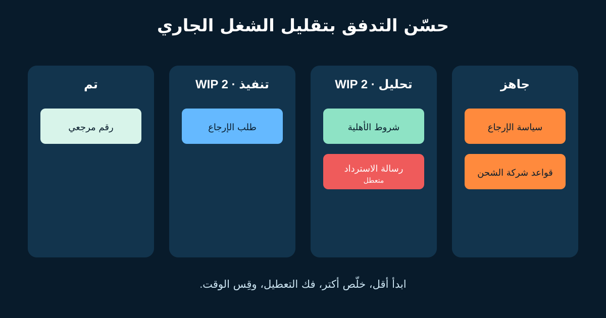
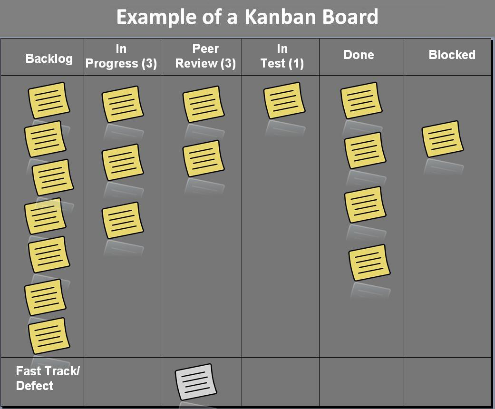

# Kanban لمحلل الأعمال: التدفق وWIP وCycle Time

Kanban استراتيجية لتحسين تدفق القيمة خلال عملية. الفريق يُظهر الـWorkflow الحقيقي، يدير العناصر النشطة، ويحسن النظام بالدليل. بالنسبة لمحلل الأعمال (BA)، Kanban بيكشف انتظار القرارات وسعة التحليل والشغل المتعطل.

هو مش مجرد Sticky Notes، ومش لازم يستبدل Scrum. فريق Scrum ممكن يستخدم ممارسات Kanban داخل الـSprints، وفريق الدعم ممكن يشتغل بتدفق مستمر.



## 1. ارسم الـWorkflow الموجود فعلًا

فريق المتجر الافتراضي يستقبل تغييرات رحلة الإرجاع:

```text
جاهز ← تحليل ← تنفيذ ← تحقق ← تم
```

الرسم يبقى مفيدًا لما السياسات تكون واضحة:

| الحد | سياسة مقترحة |
|---|---|
| جاهز ← تحليل | المشكلة وطالبها والنتيجة وصاحب القرار معروفون |
| تحليل ← تنفيذ | القواعد والأمثلة والاعتماديات والمخاطر اتراجعت معًا |
| تنفيذ ← تحقق | السلوك المتكامل متاح في البيئة المتفق عليها |
| تحقق ← تم | دليل القبول متسجل وإجراءات الإطلاق والتشغيل محددة |

دي سياسات افتراضية. السياسة لازم تحسن قرارًا، مش تعمل بوابة سرية يمتلكها Role واحد.

## 2. قلّل الشغل الجاري (WIP)

**Work in Progress (WIP)** هو الشغل اللي بدأ ولسه ما خلصش. **WIP Limit** أقصى عدد متفق عليه داخل حالة. لو حد التحليل اتنين وفيه عنصران، الفريق يخلّص أو يفك التعطيل قبل ما يسحب ثالثًا.

خمس Features نصف محللة تعمل Switching وانتظار وافتراضات قديمة أكتر من عنصرين بيخلصوا بتعاون. الحد يكشف مشكلة السعة لكنه مش بيحلها لوحده.

لو رسالة الاسترداد متعطلة بسبب قرار سياسة، الـBA:

1. يعلّمها Blocked ويسجل السبب ووقت البداية؛
2. يتواصل مع صاحب القرار بالقرار المحدد المطلوب؛
3. يساعد الفريق يختار Swarm أو Split أو سحب عنصر آخر مؤقتًا؛
4. يراجع التعطيل المتكرر في نقاش التحسين.

ماترفعش الحد بس علشان البورد يبدو ملتزمًا.

## 3. اسحب شغلًا لما توجد سعة

في **Pull System**، سعة المرحلة التالية هي اللي تسمح بدخول شغل جديد. الفريق ما يزقش عشر طلبات «عاجلة» للتحليل. يرتب قائمة الجاهز ويسحب الأعلى قيمة لما توجد سعة.

أسئلة مفيدة: هل العنصر مستوفي سياسة الدخول؟ هل صاحب القرار متاح؟ هل نقدر نقسمه لنتيجة لها قيمة؟ وهل الـExpedite استثنائي فعلًا، وأنهي شغل هيتأخر بسببه؟

## 4. اقرأ مقاييس التدفق الأربعة

دليل Kanban إصدار 2025 بيحدد أربعة مقاييس إلزامية:

| المقياس | المعنى | مثال |
|---|---|---|
| **WIP** | عناصر بدأت ولم تنتهِ | 5 عناصر إرجاع مفتوحة الآن |
| **Throughput** | عناصر انتهت في مدة | 8 عناصر خلال أسبوعين |
| **Work Item Age** | عمر عنصر لم ينتهِ | رسالة الاسترداد مفتوحة من 9 أيام |
| **Cycle Time** | المدة من بداية عنصر مكتمل لنهايته | الأهلية أخذت 6 أيام |

اتفقوا الساعة تبدأ وتنتهي إمتى. مقارنة «من الالتزام للإنتاج» مع «من بداية التطوير لنهاية الاختبار» تنتج استنتاجات كاذبة.

متوسط Cycle Time مش وعدًا. شوف التوزيع والـPercentiles: لو 85% من العناصر المشابهة خلصت خلال 12 يومًا، ده توقع احتمالي مش ضمانًا لكل عنصر.

## 5. شخّص النظام، مش الأشخاص

لو WIP التحليل دايمًا عند الحد، والعمر يزيد قبل مراجعة السياسة، والتنفيذ بينتظر الأمثلة، والـThroughput متذبذب، الاستنتاج الضعيف هو «الـBA بطيء».

تجارب أفضل: Office Hour مع مالك السياسة، Refinement لعدد أقل معًا، إظهار Discovery وDelivery كنوعين واضحين، أو تجهيز الأمثلة بدري.

المقاييس لتحسين النظام. ماتقارنش إنتاجية الأفراد بعدد الـTickets؛ الأحجام مختلفة والضغط يشجع تقسيمًا مصطنعًا وشغلًا مخفيًا.

## 6. Scrum وKanban يشتغلوا معًا

| Scrum يوفر | Kanban يضيف |
|---|---|
| Product Goal وSprint Goal | رؤية التدفق نحو الهدف |
| Events وAccountabilities محددة | WIP Limits وسياسات Pull |
| Sprint كدورة Feedback ثابتة | دليل Cycle Time وAge داخل الـSprint |
| Increment وDefinition of Done | تركيز لحد ما الشغل يحقق Done فعلًا |

خلي Sprint Goal مهمًا. ماتختارش شغلًا بعيدًا عن الهدف لمجرد إنه بيتحرك بسرعة.

## 7. البورد الحقيقي مجرد بداية



*مثال فعلي للوحة Kanban. الصورة لـDr Ian Mitchell، من [Wikimedia Commons](https://commons.wikimedia.org/wiki/File:Kanban_board_example.jpg)، ومتاحة بـCC0 أو CC BY-SA 2.5.*

البورد الرقمي في Jira أو Azure DevOps أو Trello مجرد تمثيل برضه. اتأكد إن الـDiscovery والموافقات والعيوب والمتابعة التشغيلية مش مخفية. إعداد الأداة يتبع الـWorkflow، مش العكس.

## 8. Template لمراجعة التدفق

```text
الخدمة / القيمة المقدمة:
حالات الـWorkflow ونقطتا البداية والنهاية:
سياسة الدخول والخروج لكل حالة:
WIP Limit وسببه لكل حالة نشطة:
سياسة العنصر المتعطل وصاحب القرار:
Classes of Service وقواعدها إن وجدت:
WIP الحالي:
Throughput للفترة الأخيرة:
توزيع / Percentile الـCycle Time:
أقدم العناصر النشطة:
الاختناق الملحوظ ودليله:
تجربة تحسين واحدة ومالكها وتاريخ مراجعتها:
```

### تمرين سريع

حد التحليل اتنين. عنصر متعطل من 9 أيام، وعنصر نشط، ومدير طلب بدء عنصر ثالث عاجل. اكتب الأسئلة اللي هتسألها، والتحديث اللي هتعمله على البورد، وخيارًا يحافظ على الشفافية.

## مراجع للتوسع

- [The Kanban Guide](https://kanbanguides.org/)
- [The official Scrum Guide](https://scrumguides.org/scrum-guide.html)
- [Agile Manifesto principles](https://agilemanifesto.org/principles)

*الـWorkflow والحدود والمقاييس والسياسات افتراضية. اتفق عليها مع الناس اللي بتعمل الشغل وبتستقبل قيمته.*
