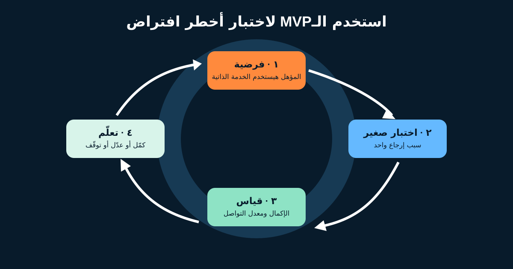

# تفكير الـMVP ومقاييس المنتج لمحلل الأعمال

**الحد الأدنى من المنتج القابل للاستخدام (MVP)** هو أصغر طريقة مسؤولة لاختبار افتراض مهم بدليل حقيقي. مش «الإصدار الأول بكل الـFeatures المطلوبة»، ومش إذنًا لإطلاق حل غير آمن أو غير متاح أو غير موثوق.

بالنسبة لمحلل الأعمال (BA) أو Product Owner (PO)، تفكير الـMVP بيربط المشكلة وأخطر افتراض وأصغر اختبار مفيد والمقياس والقرار التالي.



## 1. صِغ فرضية، مش أمنية Feature

المشكلة الافتراضية: عملاء كتير بيتصلوا بالدعم علشان يعرفوا يرجّعوا منتجًا مؤهلًا.

```text
نعتقد إن العملاء المؤهلين هيبدأوا الإرجاع من غير دعم
لو المنتج شرح الأهلية وأصدر رقمًا مرجعيًا واضحًا.

هنعتبر الفرضية مدعومة لما يزيد الإكمال ويقل التواصل غير الضروري
للفئة المتفق عليها، من غير زيادة الطلبات المكررة أو استثناءات السياسة
أو شكاوى الاسترداد.
```

| العبارة | حالتها | الدليل المطلوب |
|---|---|---|
| «إزاي أرجّع؟» سبب تواصل متكرر | محتاجة تأكيد | Baseline مصنّف لاتصالات الدعم |
| العميل يفهم صياغة الأهلية | افتراض | Usability Test وبيانات الفشل |
| شركة شحن واحدة تدعم التجربة | اعتمادية | تأكيد التكامل والعمليات |
| تقليل الاتصالات يقلل التكلفة | فرضية | Cost Model وتغير فعلي في الحجم |

## 2. اختار أقل اختبار مسؤول

كلمة Minimum مرتبطة بهدف التعلم. الاختبار ممكن يكون Clickable Prototype أو Concierge يدوي أو Pilot محدود أو Landing Page أو جزء Product شغال.

أول جزء مسؤول للإرجاع ممكن يدعم: عميلًا محليًا مسجلًا؛ منتجًا واحدًا من فئات قياسية؛ شركة شحن وطريقة الدفع الأصلية؛ حالة رفض واضحة ومنع التكرار وAudit وFallback للدعم؛ وAnalytics للمحاولات والنتائج والفشل والتواصل.

التبديل والطلبات الدولية ومراجعة التلف خارج النطاق حاليًا، والاستبعاد واضح ومش منسيًا.

**الجودة غير القابلة للتفاوض:** الخصوصية والأمان والقانون والإتاحة والنزاهة المالية والتعافي الآمن مش اختيارية لأن النطاق صغير.

## 3. ابنِ Metric Tree من النتيجة

| المستوى | مثال الإرجاع |
|---|---|
| نتيجة العمل | تقليل تكلفة الدعم غير الضروري مع الحفاظ على الثقة |
| نتيجة المستخدم | العميل المؤهل يكمل الطلب بثقة |
| سلوك المنتج | يبدأ، يعدّي الأهلية، يؤكد، يستلم المرجع |
| النتيجة التشغيلية | ينجح حجز الشحن ومتابعة الاسترداد |
| Guardrails | التكرار والشكاوى وتجاوز السياسة ومشاكل الإتاحة |

**KPI** هو مقياس تم اختياره لأنه مهم لهدف. مش كل Metric هي KPI، وكل KPI محتاجة مالكًا وتعريفًا ومصدرًا ودورية وحدًا للتصرف.

## 4. عرّف المقياس علشان محللين يطلعوا نفس الرقم

### Conversion Rate

```text
معدل إكمال الإرجاع المؤهل
= Sessions المؤهلة التي أنشأت طلبًا واحدًا
  ÷ Sessions المؤهلة التي بدأت رحلة الإرجاع
```

عرّف «مؤهل» وSession والفترة والتكرار والـBots والمستخدمين الداخليين والأحداث المتأخرة.

### Churn أو Abandonment

في Subscription Product، **Customer Churn** غالبًا العملاء المفقودون خلال فترة ÷ العملاء في بدايتها. في الرحلة دي، كلمة Abandonment أوضح:

```text
معدل ترك رحلة الإرجاع
= بدايات مؤهلة بلا طلب خلال 24 ساعة
  ÷ بدايات رحلة الإرجاع المؤهلة
```

ماتسميش كل Drop-off «Churn». اختار مصطلحًا مطابقًا لحدث العمل.

### مقاييس التشغيل والحماية

- نسبة نجاح حجز الشحن؛
- Median وHigh Percentile لوقت إصدار المرجع؛
- نسبة الطلبات المكررة؛
- اتصالات لكل 100 محاولة مؤهلة؛
- نسبة تجاوز السياسة يدويًا؛
- نسبة شكاوى أو مشاكل Accessibility.

زيادة Conversion بسرعة مش نجاحًا لو التكرار أو شكاوى الاسترداد زادت.

## 5. ثبّت Baseline وSegments

قبل الإطلاق، سجّل معدل التواصل الحالي والحجم المؤهل والإكمال اليدوي. قارن فئات وفترات متكافئة.

قسّم لما التقسيم يساعد قرارًا: الجهاز أو فئة المنتج أو عميل جديد/حالي أو اللغة أو شركة الشحن أو سبب الخطأ. احمِ الخصوصية وتجنب مجموعات صغيرة تكشف الأشخاص.

انتبه لتغير المقام. لو قاعدة الأهلية اتغيرت، النسبة ممكن تتحرك من غير تغير سلوك المستخدم. سجّل إصدار القاعدة وتاريخ الـRelease مع المقياس.

## 6. اتفق مسبقًا: الدليل هيغير الخطة إزاي؟

| دليل الـPilot | القرار |
|---|---|
| الإكمال يتحسن والـGuardrails مقبولة | وسّع لفئة أخرى |
| المستخدم يفشل عند صياغة الأهلية | عدّل المحتوى واختبر قبل التوسّع |
| فشل شركة الشحن هو المسيطر | أصلح التكامل أو التعافي قبل Features جديدة |
| الاتصالات لا تقل رغم الإكمال | حلّل الأسباب والفرضية |
| فشل ضابط خصوصية أو مالي أو سياسة | أوقف أو قيّد التجربة وأصلح الضابط |

القواعد دي أمثلة وليست Benchmarks. اتفق على مدة وحجم ملاحظة وموسمية وFeedback نوعي مع Analytics وأصحاب المصلحة.

## 7. MVP Experiment Brief قابل لإعادة الاستخدام

```text
المشكلة والدليل:
المستخدم المستهدف والسياق:
أخطر افتراض:
الفرضية:
أصغر اختبار مسؤول:
داخل / خارج النطاق:
الجودة والضوابط غير القابلة للتفاوض:
مقياس النتيجة وصيغته الدقيقة:
الـBaseline والمصدر وفترة الملاحظة:
الـSegments:
Guardrail ومقاييس التشغيل:
Instrumentation ومالك البيانات:
قواعد القرار: كمّل / عدّل / توقّف:
الموافقون وتاريخ المراجعة:
```

### تمرين سريع

صمم MVP لإضافة **الاستبدال** بعد تجربة الإرجاع. حدد أخطر افتراض، جزءًا داخل النطاق، استبعاديْن، مقياس نتيجة، اثنين Guardrails، وقرارًا يوقف التوسّع.

## مراجع للتوسع

- [IIBA: Solution Evaluation](https://www.iiba.org/knowledgehub/the-business-analysis-standard/5-applying-business-analysis-tasks/5-3-business-analysis-knowledge-areas/solution-evaluation/)
- [IIBA: The Business Analysis Standard](https://www.iiba.org/knowledgehub/the-business-analysis-standard/)
- [Google HEART framework research paper](https://research.google/pubs/measuring-the-user-experience-on-a-large-scale-user-centered-metrics-for-web-applications/)

*كل الأهداف والمعادلات والفترات وقواعد القرار أمثلة تعليمية. راجع تعريفات المقاييس وتفسيرها مع Product وAnalytics والمالية والقانون والعمليات.*
