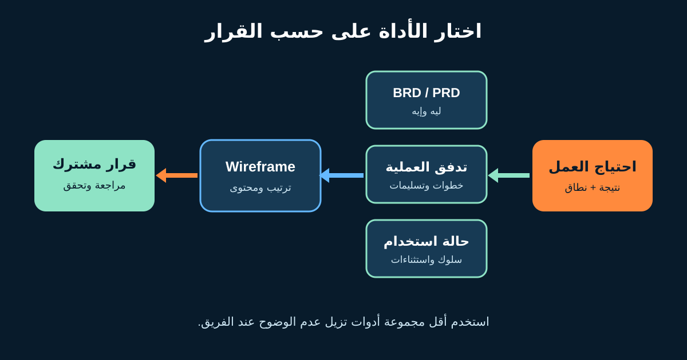

# مستندات ونماذج المتطلبات لمحلل الأعمال

قيمة المتطلب مش في إنه موجود داخل مستند كبير. قيمته إن الناس الصح تفهمه وتراجعه وتتخذ قرارًا وتقدر تتحقق من النتيجة بعد التنفيذ. علشان كده محلل الأعمال (BA) بيختار **أداة توثيق (Artifact)**—نص أو جدول أو رسم أو مثال أو Prototype—على حسب عدم الوضوح اللي محتاج يزيله.

هنستخدم مثالًا افتراضيًا واحدًا: متجر أونلاين عايز العميل يبدأ إرجاع المنتج المؤهل من غير ما يتصل بالدعم. هنجهز حزمة متطلبات صغيرة ومترابطة بدل خمس مخرجات منفصلة.



## 1. ابدأ بالقرار، مش بالـTemplate

قبل ما تفتح BRD أو ترسم Flow اسأل:

| السؤال | مثال الإرجاع |
|---|---|
| الأداة هتدعم قرار إيه؟ | الموافقة على نطاق أول إصدار للخدمة الذاتية |
| مين هيراجعها؟ | Product Owner والدعم والمالية وفريق التنفيذ والـCompliance |
| إيه غير الواضح؟ | مالك سياسة الأهلية ورسالة الاسترداد وفشل شركة الشحن والقياس |
| المعلومة مستقرة قد إيه؟ | السياسة مستقرة نسبيًا؛ تفاصيل الشاشة هتتطور |
| إيه الدليل اللي هيؤكدها؟ | بيانات تواصل الدعم ومراجعة السياسة وتجربة المستخدم وUAT |

معيار IIBA لتحليل الأعمال بيوضح إن المتطلبات والتصميمات ممكن تتمثل في نصوص ومصفوفات ورسومات. مفيش مستند واحد إلزامي لكل المؤسسات. لو عند شركتك Templates رسمية التزم بالحوكمة، لكن قلّل التكرار لما المراجعين يسمحوا.

## 2. افهم وظيفة الـBRD والـPRD

المسميات مش موحّدة في كل الشركات، فثبّت التعريف المحلي الأول.

| الأداة | تركيزها المعتاد | مثال الإرجاع |
|---|---|---|
| **BRD: Business Requirements Document** | المشكلة والأهداف والنطاق وأصحاب المصلحة والقدرات والقيود والفوائد | تقليل اتصالات الدعم من غير كسر ضوابط السياسة |
| **PRD: Product Requirements Document** | نتيجة المنتج والمستخدمون والسلوك ونطاق الإصدار والمقاييس والقرارات | تمكين إرجاع منتج مؤهل واحد وإصدار رقم مرجعي |

المستند المختصر المفيد ممكن يشمل: المشكلة والدليل؛ الهدف والمقاييس؛ داخل وخارج النطاق؛ أصحاب القرار؛ الوضع الحالي والمستقبلي؛ القواعد والبيانات ومتطلبات الجودة؛ المخاطر والافتراضات والاعتماديات؛ وسجل المراجعة.

ماتنسخش نفس القاعدة في BRD وPRD وTicket وخطة اختبار من غير مالك. اربطهم بمصدر واحد مُحدّث أو حدد مسؤولية المزامنة بوضوح.

## 3. ارسم العملية علشان تكشف نقاط التسليم

**Process Flow** بيوضح انتقال الشغل بين الخطوات. و**Swimlane Diagram** بيضيف المسؤولية.

```text
العميل                 نظام المتجر             العمليات
يختار المنتج  ------> يفحص الأهلية
يشوف السبب   <------- مؤهل / سبب الرفض
يؤكد الطلب   ------> ينشئ الإرجاع
                       يطلب الشحن ----------> يتابع الاستثناء
يستلم المرجع <------- يحفظ النتيجة
```

ضيف مسارات الفشل: إيه اللي يحصل بعد انتهاء مدة الإرجاع؟ هل الطلب يتحفظ لو شركة الشحن غير متاحة؟ مين يتعامل مع اختلاف حالة المنتج؟ وإمتى يدخل قرار يدوي؟

الـBA يراجع كل خطوة مع الشخص اللي بينفذها فعلًا. الرسم الجميل اللي فريق العمليات مش شايف نفسه فيه مش Process متحقق منها.

## 4. استخدم Use Case لما التفاعل والاستثناءات تكون مهمة

**حالة الاستخدام (Use Case)** بتوصف تفاعل Actor مع النظام علشان يحقق هدفًا. بتفيد لما التفريعات أكبر من Story قصيرة.

| الحقل | المثال المكتمل |
|---|---|
| الهدف | بدء إرجاع منتج تم تسليمه ومؤهل |
| الـActor الأساسي | عميل مسجل الدخول |
| البداية | يختار العميل «إرجاع المنتج» |
| الشروط السابقة | الطلب ظاهر وحالة المنتج Delivered |
| المسار الناجح | يختار المنتج ← السبب ← يراجع التعليمات ← يؤكد ← يستلم المرجع |
| مسار بديل | الشحن غير متاح: احفظ الطلب ووضح الخطوة التالية |
| استثناء | المدة انتهت: لا تنشئ طلبًا واعرض السبب وطريق الدعم |
| النتيجة | طلب إرجاع واحد ونتيجة أهلية قابلة للمراجعة |

ماتحوّلش الـUse Case لتصميم شاشة خطوة بخطوة. سجّل السلوك الملحوظ والقواعد والبدائل، وسيب للتصميم مساحة يختبر أفضل واجهة.

## 5. استخدم Wireframe لاختبار الترتيب والمعنى بدري


*Wireframe ورقي لاستكشاف ترتيب المحتوى. الصورة لـFernando Mafra، من [Wikimedia Commons](https://commons.wikimedia.org/wiki/File:Wireframe_(5019534612).jpg)، بترخيص CC BY-SA 2.0.*

الـ**Wireframe** تمثيل بسيط للشاشة يساعد الفريق يناقش المحتوى والإجراءات والتنقل والحالات قبل ما التفاصيل البصرية تخلي التغيير أغلى.

على شاشة الإرجاع، اكتب أسئلة على الرسم: هنظهر المبلغ المدفوع ولا القابل للاسترداد؟ هل السياسة تظهر قبل التأكيد؟ شكل Loading و«مفيش منتجات مؤهلة» والفشل المؤقت إيه؟ هل لوحة المفاتيح وقارئ الشاشة يقدروا يفهموا الرحلة؟ وهل النسخة العربية RTL فعلًا في الترتيب والأيقونات؟

الـWireframe مش دليل إن القواعد أو الـWorkflow صح. اربط مناطقه بالمتطلبات والأمثلة واختبره مع مستخدمين ممثلين.

## 6. اربط الأدوات بالقرار والتحقق

| ID | الاحتياج أو المتطلب | النموذج المساند | التحقق |
|---|---|---|---|
| OBJ-01 | تقليل اتصالات «إزاي أرجّع؟» | مقياس المنتج | قارن الـBaseline بما بعد الإطلاق |
| RULE-01 | المنتج المؤهل فقط يبدأ إرجاعًا | Use Case وEligibility Flow | أمثلة حدود ومراجعة مالك السياسة |
| UX-01 | العميل يفهم سبب عدم الأهلية | حالات الـWireframe | Usability وUAT |
| OPS-01 | فشل الشحن يدخل متابعة العمليات | استثناء في الـSwimlane | Integration Test وUAT للعمليات |

التتبع لازم يجاوب «ليه ده موجود؟» و«هنعرف منين إنه نجح؟»، مش يبقى قائمة محدش بيحدّثها.

## 7. Template لحزمة المتطلبات

```text
القرار الذي تدعمه الحزمة:
المشكلة والدليل والمستخدمون المتأثرون:
الهدف والمقاييس:
داخل / خارج النطاق:
أصحاب المصلحة وأصحاب القرار:
الوضع الحالي:
الوضع المستقبلي والاستثناءات:
المتطلبات وقواعد العمل:
احتياجات البيانات والتكامل والأمان والإتاحة والتقارير:
حالات الاستخدام أو الأمثلة:
أسئلة الـWireframe / Prototype:
الافتراضات والمخاطر والاعتماديات والقرارات المفتوحة:
الربط بالتحقق والمقاييس:
المراجعون وتاريخ المراجعة والقرار:
```

### تمرين سريع

وسّع الرحلة علشان تدعم **إرجاع منتجين من نفس الطلب**. اكتب جملة نطاق، واستثناء Process، ومسار Use Case بديل، وثلاث ملاحظات على Wireframe. بعد كده حدد مين يقدر يؤكد كل نقطة.

## مراجع للتوسع

- [IIBA: The Business Analysis Standard](https://www.iiba.org/knowledgehub/the-business-analysis-standard/)
- [IIBA: BABOK glossary](https://www.iiba.org/career-resources/a-business-analysis-professionals-foundation-for-success/babok/glossary/)
- [W3C: نصائح تصميم Web Accessibility](https://www.w3.org/WAI/tips/designing/)

*السيناريو والأدوار والقواعد والمقاييس افتراضية للتعليم. أكد المستندات والموافقات وطريقة الرسم المطلوبة داخل مؤسستك.*
