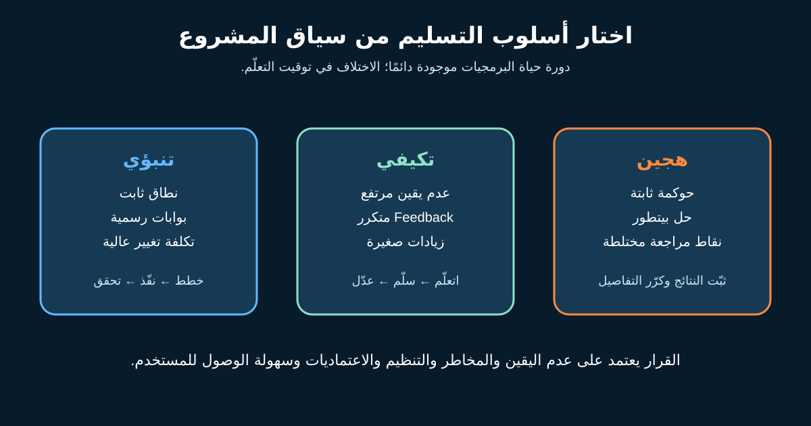

# دورة حياة البرمجيات: Waterfall وAgile والأسلوب الهجين

**دورة حياة تطوير البرمجيات (SDLC)** هي الشغل المطلوب لتحويل فكرة لحل شغال، من فهم الاحتياج لحد التشغيل والتحسين ثم الإيقاف. أي فريق محتاج يفهم ويصمم ويبني ويختبر ويطلق ويشغّل ويتعلّم، مهما كانت المنهجية.

**Waterfall** و**Agile** و**Hybrid** بتوصف تنظيم الشغل وتوقيت القرارات والـFeedback. دور محلل الأعمال (BA) مش الدفاع عن موضة؛ دوره يساعد الفريق يختار بناءً على عدم اليقين والمخاطر والتنظيم والاعتماديات وإمكانية الوصول للمستخدم.



## 1. تتبع دورة الحياة، مش سهمًا في اتجاه واحد

في مثال متجر الإرجاع الافتراضي، الدورة فيها:

| جانب من الدورة | سؤال الـBA |
|---|---|
| الاحتياج والجدوى | أنهي مشكلة عميل أو عمليات تستحق الحل؟ |
| المتطلبات والتصميم | إيه السلوك والقواعد والبيانات والجودة والضوابط؟ |
| البناء والتكامل | أنهي قرارات أو Interfaces ما زالت محتاجة توضيحًا؟ |
| Verification وValidation | هل اتبنى صح؟ وهل حل احتياج أصحاب المصلحة؟ |
| الإطلاق والانتقال | هل المستخدم والدعم والبيانات والتدريب والرجوع جاهزين؟ |
| التشغيل والتحسين | مقاييس الإكمال والفشل والتواصل والاسترداد بتقول إيه؟ |
| الإيقاف | أنهي سجلات وتكاملات ورسائل لازم نحافظ عليها؟ |

الجوانب دي ممكن تتداخل وتتكرر. حتى إرشادات NASA الرسمية بتوصف شغلًا تقنيًا تكراريًا داخل مراحل رسمية؛ وجود Stage Gates مش معناه منع التكرار.

## 2. الأسلوب التنبؤي: خطط وثبّت قبل البناء الكبير

في الأسلوب التنبؤي أو ما يُسمى غالبًا **Waterfall**، الفريق يحدد تفاصيل أكبر للنطاق والمتطلبات والتصميم والتكلفة والموافقات قبل المراحل التالية، وتتحكم بوابات رسمية في الانتقال.

يناسب أكتر لما النتيجة والحل معروفين، أو التغيير المتأخر غالي، أو العقود بتحدد مخرجات وقبولًا، أو السلامة والتدقيق والتنظيم محتاجين أدلة رسمية، أو في Migration له موعد وRollback ثابت.

لو في تعديل إجباري على تنظيم المدفوعات بموعد محدد، الـBA يحافظ على الـBaseline والتتبع وتقييم التغيير وأدلة الاختبار.

**المخاطرة:** أصحاب المصلحة يشوفوا سلوكًا شغالًا متأخرًا. قلّلها بـPrototypes ومحاكاة ومراجعة نماذج واختبارات تكامل مبكرة.

## 3. الأسلوب التكيفي: اتعلّم من زيادات صغيرة قابلة للاستخدام

أسلوب **Agile** يتوقع التعلم ويسلّم أجزاء صغيرة. التفاصيل بتظهر مع الدليل. يناسب لما احتياج المستخدم أو خيارات الحل غير مؤكدة، والـFeedback متاح، والقيمة قابلة للتقسيم.

في الإرجاع، الفريق ممكن يبدأ بفئة منتجات وشركة شحن واحدة ويقيس الإكمال واتصالات الدعم قبل التوسّع.

الـBA يخلي النتيجة والقواعد والمخاطر والمقاييس واضحة، ويجهز أجزاء صغيرة قابلة للاختبار، ويحدّث الفهم بعد الـFeedback. Agile مش معناها من غير خطة أو Architecture أو Documentation أو رقابة.

**المخاطرة:** المرونة تتحول لفوضى. احمِ Product Goal وصاحب القرار ومعايير الجودة ودليل الإطلاق.

## 4. Hybrid: أجزاء مختلفة تحتاج إيقاعًا مختلفًا

الأسلوب **الهجين** مفيد لما الحوكمة تنبؤية لكن تعلّم المنتج تكيفي. لازم يبقى تصميمًا مقصودًا، مش مجموعة Meetings متعارضة.

| ثابت أو له Gate | تكراري أو مستمر |
|---|---|
| موعد Compliance ودليل Audit | اختبار صياغة الشاشة مع المستخدم |
| حدود سياسة الاسترداد المعتمدة | إطلاقات صغيرة لرحلة الإرجاع |
| ضوابط الأمن والخصوصية | ترتيب Backlog من الـFeedback |
| قرار Go-live | تجارب وتحسينات بعد الإطلاق |

حدد نقطة الربط: إمتى التجربة تحتاج موافقة؟ أنهي تغيير يؤثر على الـBaseline؟ وإيه الدليل اللي يعدّي الـGate؟

## 5. استخدم Decision Matrix بدل الصور النمطية

| العامل | إشارة للتنبؤي | إشارة للتكيفي | ملاحظة الإرجاع |
|---|---|---|---|
| عدم يقين الاحتياج | منخفض | مرتفع | المشكلة معروفة والرحلة الأفضل غير مؤكدة |
| تكلفة التغيير | عالية | قابلة للإدارة | السياسة غالية التغيير والواجهة أرخص |
| الوصول للـFeedback | نادر | متكرر | جلسات مستخدم كل أسبوعين |
| التنظيم | Baseline رسمي | الضابط يتطور مع النتيجة | قواعد الاسترداد ثابتة والصياغة قابلة للتجربة |
| الاعتماديات | إطلاق منسق | أجزاء مستقلة | شركة الشحن تحتاج تكاملًا مبكرًا |
| تقسيم القيمة | مفيش قيمة قبل الاكتمال | نتيجة جزئية مفيدة | فئة وشركة واحدة تنتج تعلمًا |

**توصية المثال:** Hybrid. ثبّت السياسة والخصوصية والمحاسبة وضوابط الإطلاق، وكرر رحلة العميل في أجزاء صغيرة. دي توصية تعليمية مش قاعدة عامة.

## 6. Template لاختيار أسلوب التسليم

```text
المبادرة والنتيجة المطلوبة:
عدم اليقين في الاحتياج والحل:
قيود التنظيم والعقد والسلامة والتدقيق:
تكلفة التغيير المتأخر:
الاعتماديات والمواعيد الثابتة:
الوصول للمستخدمين والـFeedback التشغيلي:
أصغر جزء له قيمة مستقلة:
الـBaselines والـGates والأدلة المطلوبة:
إيقاع الـFeedback:
الأسلوب المقترح وسببه:
المخاطر التي يخلقها وكيف سنقللها:
صاحب القرار وتاريخ المراجعة:
```

### تمرين سريع

قارن بين (١) حساب ضريبة إجباري يبدأ في تاريخ ثابت، و(٢) مساعد اختياري لشرح الإرجاع وفائدته غير مؤكدة. اقترح أسلوبًا لكل واحد وحدد نشاط تحقق مبكر.

## مراجع للتوسع

- [Manifesto for Agile Software Development](https://agilemanifesto.org/)
- [NASA Software Engineering Handbook: Software Life Cycle](https://swehb.nasa.gov/spaces/SWEHBVB/pages/32604451/SWE-019+-+Software+Life+Cycle)
- [NASA Systems Engineering Handbook](https://www.nasa.gov/reference/systems-engineering-handbook/)
- [The official Scrum Guide](https://scrumguides.org/scrum-guide.html)

*سيناريو الإرجاع والتوصية افتراضيان. استخدم حوكمة مؤسستك وتصنيف المخاطر وأدلة التسليم المطلوبة.*
