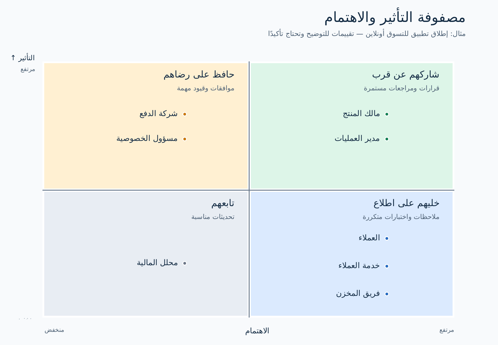

# تحليل أصحاب المصلحة (Stakeholder Analysis)

## 1. يعني إيه تحليل أصحاب المصلحة (Stakeholder Analysis)؟

**صاحب المصلحة (Stakeholder)** هو شخص أو فريق أو جهة تقدر تأثر على المشروع أو تتأثر بنتائجه. ولما نتكلم عنهم كمجموعة بنقول **أصحاب المصلحة (Stakeholders)**. تحليل أصحاب المصلحة معناه نعرف مين الأطراف دي، نفهم احتياجاتها ومدى تأثيرها، ونحدد إزاي وإمتى نشاركها في المشروع.

دور **محلل الأعمال** إنه يجمع المتطلبات (Requirements) من الناس المناسبة، ويتأكد إنها بتعكس احتياجاتهم. مجرد قائمة أسماء مش كفاية؛ لازم تعرف ليه كل طرف موجود فيها، وهتحتاج تتواصل معاه في إيه.

### اسأل 3 أسئلة أساسية

1. **مين** هيأثر على التغيير أو هيتأثر به؟
2. **إيه** اللي محتاجه، أو قلقان منه، أو مسؤول عن قراره؟
3. **إزاي وإمتى** هنشركه في المشروع؟

## 2. المثال العملي: تطبيق للتسوق أونلاين

شركة بيع بالتجزئة هتطلق تطبيق يقدر العملاء من خلاله يشوفوا المنتجات، يدفعوا، ويتابعوا طلباتهم. فريق المخزن بيجهز الطلبات، وخدمة العملاء بترد على الاستفسارات وطلبات الإرجاع، والمديرين بيتابعوا المبيعات. شركة دفع خارجية بتعالج عمليات الدفع.

**مخرجات التحليل في المثال:** سجل أصحاب المصلحة (Stakeholder Register)، ومصفوفة التأثير والاهتمام (Power–Interest Matrix)، وخطة مشاركة أصحاب المصلحة (Stakeholder Engagement Plan). الأدوار والتقييمات هنا للتوضيح؛ في مشروع حقيقي لازم تتأكد منها مع الفريق.

### حدد نطاق المشروع (Scope)

قبل ما تبدأ في قائمة أصحاب المصلحة، اكتب وصفًا مختصرًا للنطاق:

> «العملاء هيشوفوا المنتجات، يطلبوا، يدفعوا أونلاين، ويتابعوا تجهيز وشحن الطلب. الموظفون هيديروا الطلبات والمخزون واستفسارات الدعم والتقارير».

المثال يشمل تجربة العميل **وكمان** شغل الفرق الداخلية وراءها. ضيف طرفًا للقائمة لما تقدر توضح علاقته بالنطاق، وراجع القائمة لو النطاق اتغير.

## 3. حدد أصحاب المصلحة (Identify Stakeholders)

امشِ مع رحلة الطلب من تصفح المنتجات لحد التسليم والإرجاع. دور على اللي هيستخدم التطبيق، أو هيتغير شغله، أو هيوافق على قرارات، أو هيقدم خدمة، أو هيعتمد على بيانات النظام.

| المجموعة | أمثلة | ليه مهمين؟ |
|---|---|---|
| أصحاب القرار | مالك المنتج (Product Owner)، مدير العمليات (Operations Manager) | بيحددوا الأولويات وبيوافقوا على النطاق ويتابعوا النتائج |
| المستخدمون والموظفون المتأثرون | العملاء (Shoppers)، خدمة العملاء (Customer Support)، فريق المخزن (Warehouse Staff) | بيوضحوا الاحتياجات وبيجربوا خطوات العمل |
| المتخصصون والجهات المرتبطة بالنظام | شركة الدفع (Payment Provider)، مسؤول الخصوصية (Privacy Officer) | عندهم شروط للتكامل أو التعاقد أو حماية البيانات |
| مستخدمو التقارير | محلل المالية (Finance Analyst) | بيعتمد على تقارير المبيعات وتسوية المدفوعات |

**داخلي (Internal) أو خارجي (External):** الداخلي تابع للشركة صاحبة التطبيق، والخارجي من خارجها. الجهة الخارجية ممكن يكون تأثيرها كبير. ابدأ بالدور أو الفريق، وبعدها حدد شخصًا يمثله في الاجتماعات والموافقات.

### إزاي تلاقي أطرافًا ناقصة؟

- راجع مخطط سير العمل، الهيكل التنظيمي، العقود، أنظمة الربط، والمتطلبات الموجودة.
- اسأل كل شخص تقابله: «مين كمان هيتأثر بالتغيير ده؟»
- راجع الحالات الاستثنائية: فشل الدفع، نفاد منتج، الإرجاع، واسترداد المبلغ.
- اعرف مين بيوافق على المتطلبات والخصوصية والعمليات وجاهزية الإطلاق.

## 4. حلّل احتياجات كل صاحب مصلحة

هنا يبدأ **استخلاص المتطلبات (Requirements Elicitation)**: اجمع معلومات من المقابلات، وملاحظة الشغل، ومراجعة خطوات العمل، ومستندات المشروع. ما تفترضش احتياجات الشخص من مسماه الوظيفي فقط.

| العنصر | السؤال اللي تجاوب عنه |
|---|---|
| التأثر | إيه اللي هيتغير في شغله أو تجربته؟ |
| الاحتياج | إيه النتيجة أو المعلومات اللي محتاجها؟ |
| القلق | إيه اللي ممكن يصعّب استخدامه للحل أو دعمه للمشروع؟ |
| التأثير | هل يقدر يوافق، يوقف، يمول، أو يغير قرارًا مهمًا؟ |
| الاهتمام | قد إيه هيتابع المشروع ده تحديدًا؟ |
| المشاركة | محتاجين منه إيه، وفي أي مرحلة؟ |

**أسئلة مفيدة في المقابلة:** «إيه أصعب حاجة في الوضع الحالي؟» «هتعرف منين إن الحل نجح؟» «إيه الحالات الاستثنائية اللي لازم النظام يتعامل معاها؟» «إيه القرارات اللي من مسؤوليتك؟» «مين بيعتمد على شغلك؟»

## 5. استخدم مصفوفة التأثير والاهتمام (Power–Interest Matrix)

**التأثير (Power)** هو قدرة الطرف على اتخاذ قرار، أو الموافقة، أو التأثير في مسار المشروع. **الاهتمام (Interest)** هو مدى متابعته للمشروع وتأثره بنتائجه. التقييم مرتبط **بالمشروع نفسه**، وممكن يتغير من مرحلة لمرحلة.

للتقييم السريع، استخدم **مرتفع** أو **منخفض** بناءً على دليل. في التأثير، راجع صلاحية الموافقة والميزانية والمسؤولية عن التشغيل والاعتماد على جهة معينة. في الاهتمام، راجع حجم التأثر ومدى المشاركة. لو مش متأكد، اكتب إن التقييم محتاج تأكيد.

| التأثير / الاهتمام | طريقة التعامل | أمثلة من تطبيق التسوق |
|---|---|---|
| مرتفع / مرتفع | **شاركهم عن قرب:** أشركهم في القرارات والمراجعات المتكررة | مالك المنتج، مدير العمليات |
| مرتفع / منخفض | **حافظ على رضاهم:** ارجع لهم في الموافقات والقيود والحالات الخاصة | شركة الدفع، مسؤول الخصوصية |
| منخفض / مرتفع | **خليهم على اطلاع:** قابلهم، واعرض عليهم النماذج، واختبر معهم | العملاء، خدمة العملاء، فريق المخزن |
| منخفض / منخفض | **تابعهم:** ابعت التحديثات المناسبة وراجع التقييم لو تأثيرهم زاد | محلل المالية في نطاق المثال ده |

اعتبرنا تأثير شركة الدفع مرتفعًا لأن تكامل الدفع أو موافقتها ضروري للإطلاق. واعتبرنا اهتمام محلل المالية منخفضًا على أساس إن طلباته للتقارير محدودة. **غيّر مكان أي دور لو اكتشفت معلومات مختلفة.** التأثير المنخفض ما يعنيش إن احتياجات الطرف ممكن تتجاهلها.

## 6. اعمل سجل أصحاب المصلحة (Stakeholder Register)

السجل بيحوّل التحليل إلى مرجع عملي للـ BA. الجدول مختصر للتوضيح؛ في المشروع الحقيقي ضيف أسماء الممثلين ووسائل التواصل وأسباب التقييم وتواريخ المراجعة.

| صاحب المصلحة | النوع | أهم احتياج أو قلق | التأثير | الاهتمام | خطوة الـ BA |
|---|---|---|---|---|---|
| مالك المنتج | داخلي | أهداف العمل والنطاق والأولويات | مرتفع | مرتفع | رتب المتطلبات وخد الموافقات على القرارات |
| مدير العمليات | داخلي | تنفيذ الطلبات والتعامل مع الاستثناءات | مرتفع | مرتفع | ارسم سير العمل وراجع قواعد التشغيل |
| شركة الدفع | خارجي | خطوات الدفع وشروط التكامل | مرتفع* | منخفض* | أكد متطلبات الربط والتسوية والاختبار |
| مسؤول الخصوصية | داخلي | التعامل المناسب مع بيانات العملاء | مرتفع* | منخفض* | راجع حركة البيانات ومتطلبات الخصوصية |
| العملاء | خارجي | دفع سهل ومتابعة الطلبات والإرجاع | منخفض لكل فرد | مرتفع | قابل عينة من العملاء واختبر معهم التطبيق |
| خدمة العملاء | داخلي | سجل الطلبات وأدوات حل المشاكل | منخفض | مرتفع | راقب الشغل وراجع سيناريوهات الدعم |
| فريق المخزن | داخلي | دقة تجهيز الطلبات وتحديث المخزون | منخفض | مرتفع | راجع خطوات التنفيذ واختبر الاستثناءات |
| محلل المالية | داخلي | بيانات المبيعات والاسترداد والتسوية | منخفض* | منخفض* | حدد التقارير وراجعها في مراحل متفق عليها |

\* **تقييم للتوضيح:** تأكد منه مع فريق المشروع. وفرّق بين تأثير **عميل واحد** وتأثير العملاء كمجموعة.

## 7. حوّل التحليل لخطة مشاركة أصحاب المصلحة (Stakeholder Engagement Plan)

اربط كل صف في السجل بنشاط واضح، وشخص مسؤول، وموعد. الـ BA غالبًا بيقود نقاشات المتطلبات، بينما مدير المشروع (Project Manager) أو مالك المنتج ممكن يدير التواصل العام.

| صاحب المصلحة | النشاط | التوقيت | النتيجة المتوقعة |
|---|---|---|---|
| مالك المنتج | ورشة أولويات وقرارات | عند تغيير النطاق وفي كل دورة تخطيط | أولويات متفق عليها وقرارات موثقة |
| مدير العمليات | مراجعة خطوات العمل | أثناء الاستكشاف ثم قبل قبول الحل | تأكيد خطوات تجهيز الطلبات والاستثناءات |
| العملاء | مقابلات وتجربة نموذج للتطبيق | قبل قرارات التصميم وأثناء الاختبار | احتياجات موثقة ومشاكل استخدام واضحة |
| خدمة العملاء وفريق المخزن | مراجعة سيناريوهات واختبار قبول المستخدم (User Acceptance Testing - UAT) | أثناء مراجعة المتطلبات وقبل الإطلاق | خطوات عمل مؤكدة ومشاكل مسجلة |
| شركة الدفع ومسؤول الخصوصية | مراجعة متخصصة | قبل تثبيت التصميم وقبل الإطلاق | تأكيد القيود والموافقات |
| محلل المالية | مراجعة التقارير | أثناء تصميم التقارير وقبل قبول الحل | حقول وقواعد تسوية متفق عليها |

في كل نشاط، سجل **مين هيحضر، وإيه القرار أو الملاحظة المطلوبة، وإمتى، وفين هتوثق النتيجة**.

## 8. راجع التحليل وحدّثه

راجع السجل مع مالك المنتج ومسؤولي التشغيل. اسأل: هل في خطوة عمل، أو موافقة، أو نظام متصل، أو مجموعة مستخدمين، أو حالة استثنائية ناقصة؟ وراجع المتطلبات معاهم للتأكد من صحتها؛ دي خطوة **التحقق من المتطلبات (Requirements Validation)**. أعد تقييم التأثير والاهتمام لو النطاق أو الصلاحيات اتغيرت، خصوصًا قبل قرارات التصميم الكبيرة والإطلاق.

### أخطاء شائعة

| الخطأ | الأفضل تعمل إيه؟ |
|---|---|
| تسجل المديرين فقط | ضيف المستخدمين والموظفين المتأثرين والجهات الخارجية المهمة |
| تتعامل مع تقييم التأثير والاهتمام كأنه حقيقة مؤكدة | اكتب سبب التقييم وتأكد من التقييمات غير الواضحة |
| تتجاهل المستخدمين لأن تأثيرهم منخفض | اسمع منهم في تفاصيل الشغل اللي هم أدرى بها |
| تستخدم نفس طريقة التواصل مع كل الناس | اختار الطريقة حسب المعلومة أو القرار المطلوب |
| تعمل المصفوفة مرة وتسيبها | حدّثها مع تغيّر النطاق والأدوار ومراحل المشروع |

## 9. قالب جاهز لسجل أصحاب المصلحة

انسخ الجدول ده في مستند المشروع أو ملف Excel:

| صاحب المصلحة / ممثله | داخلي / خارجي | إزاي هيتأثر | الاحتياج أو القلق | التأثير | الاهتمام | الدليل / الافتراض | طريقة المشاركة | المسؤول | تاريخ المراجعة |
|---|---|---|---|---|---|---|---|---|---|
|  |  |  |  |  |  |  |  |  |  |

## مراجع للتوسع

- [IIBA: تحليل أصحاب المصلحة](https://www.iiba.org/knowledgehub/babok-applied/stakeholder-analysis/)
- [قاموس BABOK من IIBA: قائمة أصحاب المصلحة](https://www.iiba.org/career-resources/a-business-analysis-professionals-foundation-for-success/babok/glossary/)
- [PMI: إدارة أصحاب المصلحة ومصفوفة التأثير والاهتمام](https://www.pmi.org/learning/library/stakeholder-management-task-project-success-7736)
