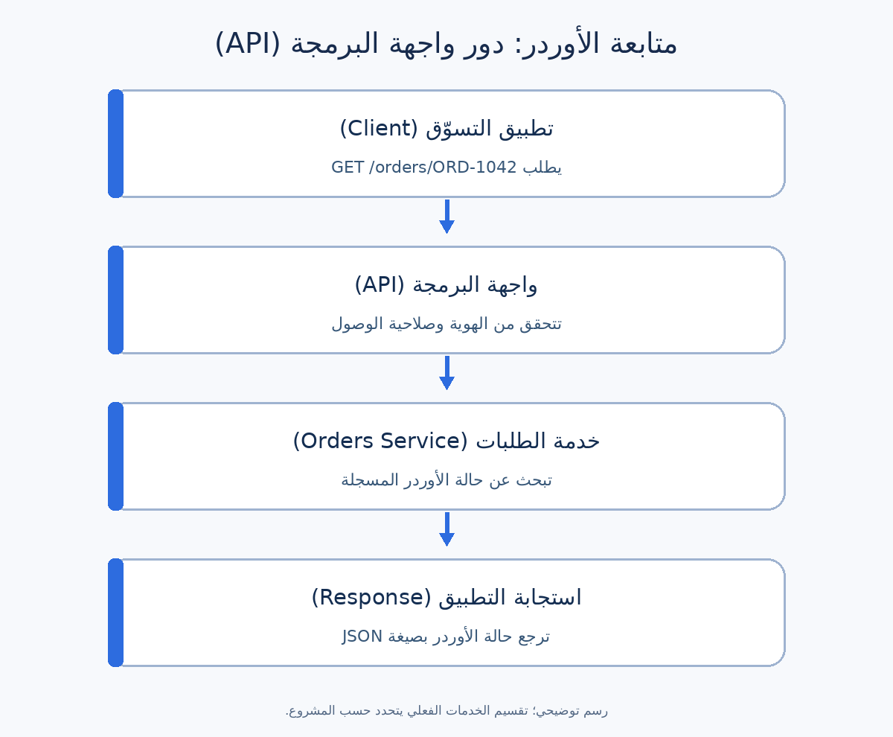

# واجهات البرمجة (APIs): دليل عملي لمحلل الأعمال

واجهة البرمجة (Application Programming Interface أو **API**) هي طريقة متفق عليها تخلي نظام يطلب معلومة أو خدمة من نظام تاني. مثلًا، تطبيق التسوّق ممكن يسأل نظام الطلبات عن حالة أوردر العميل من خلال API، بدل ما يقرأ قاعدة البيانات بنفسه.

كمحلل أعمال سؤالك الأساسي: **لازم النظامين يتفقوا على إيه عشان العميل يشوف المعلومة الصحيحة، حتى لو حصل خطأ؟** مش مطلوب منك تكتب كود الـAPI عشان تجاوب.

## الفكرة ببساطة

كتير من واجهات البرمجة على الويب تستخدم بروتوكول نقل البيانات (HTTP): تطبيق أو **عميل تقني (Client)** يرسل **طلبًا (Request)** إلى **خادم (Server)**، والخادم يرجع **استجابة (Response)**. الـAPI مفهوم أوسع من HTTP؛ الدليل ده بيركّز على HTTP API كمثال عملي.

| المصطلح | معناه ببساطة | في مثالنا |
| --- | --- | --- |
| نقطة الوصول (Endpoint) | عنوان وظيفة في الـAPI | `/orders/{orderId}` |
| طريقة الطلب (Method) | نوع العملية المطلوبة | `GET` لقراءة بيانات الأوردر |
| الطلب (Request) | ما يرسله التطبيق للنظام | «هات الأوردر `ORD-1042`» |
| المُعامل (Parameter) | قيمة يحددها المُرسل | `orderId = ORD-1042` |
| الترويسة (Header) | بيانات إضافية مع الطلب أو الرد | `Authorization` تحمل بيانات الدخول |
| متن الرسالة (Body) | البيانات الأساسية في الطلب أو الرد | JSON فيها حالة الأوردر |
| رمز الاستجابة (Status code) | رقم يلخّص نتيجة الطلب | `200` يعني الطلب نجح |
| اتفاق الواجهة (API contract) | ما اتفق عليه الفريق بين النظامين | المدخلات، النتائج، الأخطاء، وقواعد الوصول |

تنسيق البيانات (JSON) طريقة شائعة لتمثيل بيانات منظمة. مثلًا `"status": "SHIPPED"` معناها أن قيمة حقل الحالة هي `SHIPPED`. رقم HTTP `200` يقول إن **الطلب التقني** نجح؛ أما `SHIPPED` فتصف **حالة الأوردر في البيزنس**. الاتنين مش نفس الحاجة.

## مثال عملي: متابعة أوردر من تطبيق تسوّق

**افتراضات للتوضيح:** عميل مسجّل دخوله يفتح شاشة متابعة أوردر يخصّه. نظام الطلبات يحتفظ بالحالة، والـAPI ترجعها للتطبيق. أرقام الأوردرات والحالات والقواعد هنا أمثلة تعليمية؛ اتأكد منها في مشروعك الحقيقي.



1. التطبيق يطلب بيانات الأوردر `ORD-1042` من الـAPI.
2. الـAPI تتحقق مين المستخدم وهل يحق له مشاهدة الأوردر.
3. خدمة الطلبات (Orders Service) تجيب آخر حالة مسجلة.
4. الـAPI ترجع ردًا يقدر التطبيق يعرضه للعميل.

### إزاي تقرأ الطلب والرد؟

```http
GET /orders/ORD-1042 HTTP/1.1
Authorization: Bearer <access-token>
Accept: application/json
```

`GET` معناها «هات البيانات»، والمسار يحدد الأوردر. الرمز `<access-token>` مجرد مثال، مش كلمة سر حقيقية. في السيناريو ده العميل مسجّل دخوله بالفعل.

```http
HTTP/1.1 200 OK
Content-Type: application/json

{
  "orderId": "ORD-1042",
  "status": "SHIPPED",
  "lastUpdatedAt": "2026-09-24T10:30:00Z",
  "estimatedDeliveryDate": "2026-09-27"
}
```

الحرف `Z` مع الوقت يعني توقيت UTC. التطبيق ممكن يعرض «تم الشحن» و«التوصيل المتوقع: ٢٧ سبتمبر». لازم الفريق يحدد المنطقة الزمنية وطريقة عرض التاريخ للعميل، وإيه اللي يظهر لو موعد التوصيل غير متاح.

### لو الأمور ما مشيتش كالمتوقع

| الحالة | رد HTTP مقترح | تصرّف التطبيق |
| --- | --- | --- |
| أوردر العميل موجود | `200 OK` | يعرض الحالة ووقت آخر تحديث. |
| بيانات الدخول غير صالحة | `401 Unauthorized` | يطلب تسجيل الدخول مرة تانية. |
| المستخدم لا يملك صلاحية | `403 Forbidden` | ما يعرضش أي تفاصيل عن الأوردر. |
| الأوردر غير موجود | `404 Not Found` | يوضح المشكلة ويرجّع العميل لقائمة أوردراته. |
| الخدمة متوقفة مؤقتًا | `503 Service Unavailable` | يوضح أن التتبع غير متاح الآن ويتيح إعادة المحاولة. |

دي **اقتراحات للمثال**، مش قواعد مفروضة على أي مشروع. بعض الفرق ترجع `404` حتى لو الأوردر موجود لكن المستخدم غير مسموح له يشوفه، عشان ما تكشفش وجوده. اتفق مع فريق الأمن والتطوير على القرار ووثّقه. وبرضه `200` ما يضمنش إن بيانات الحالة اتحدّثت فورًا؛ اسأل عن معنى «آخر حالة».

## دور محلل الأعمال (BA)

شغلك تحوّل احتياج العميل إلى اتفاق واضح وقابل للاختبار. في المثال ده، اسأل:

1. **هدف البيزنس:** العميل محتاج يعرف إيه بالضبط؟ هل الحالة وحدها كفاية؟
2. **مصدر الحقيقة:** أنهي نظام مسؤول عن الحالة؟ وإيه تعريف `PLACED` و`PACKED` و`SHIPPED` و`DELIVERED`؟
3. **الصلاحيات:** هل العميل يشوف أوردراته فقط؟ وهل موظف الدعم له صلاحية مختلفة؟ **التحقق من الهوية (Authentication)** يحدد مين المستخدم، و**التحقق من الصلاحية (Authorization)** يحدد يقدر يعمل إيه.
4. **البيانات والخصوصية:** الشاشة محتاجة أنهي حقول؟ وهل فيه داعي نرجّع العنوان أو بيانات الدفع؟
5. **الاستثناءات:** لو الأوردر اتلغى، أو رقمه غلط، أو التحديث اتأخر، أو الخدمة وقعت: إيه المطلوب؟
6. **تجربة العميل والتشغيل:** إيه الرسالة اللي تظهر؟ بعد قد إيه لازم الحالة تتحدّث؟ مين يتابع لو البيانات متناقضة؟

### نموذج متطلبات صغير

| البند | متطلب مقترح للعملية `GET /orders/{orderId}` |
| --- | --- |
| المستخدم والحدث | عميل مسجّل دخوله يفتح شاشة متابعة أوردر. |
| المدخلات | `orderId` من الأوردر المختار، مع بيانات دخول صالحة. |
| قاعدة العمل | رجّع التفاصيل فقط لو الأوردر يخص العميل. |
| النجاح | رجّع الرقم والحالة ووقت التحديث وموعد التوصيل لو متاح. |
| الأخطاء | اتفق على `401` و`403`/`404` وخطأ توقف الخدمة. |
| قرارات مفتوحة | تعريف الحالات؛ سرعة تحديثها؛ التوقيت؛ سياسة رفض الوصول. |

**معايير قبول (Acceptance Criteria) كمثال:** لو عميل مسجّل دخوله فتح أوردره المشحون، لما التطبيق يطلب بيانات الأوردر، يظهر `SHIPPED` ووقت آخر تحديث. ولو طلب أوردر شخص تاني، الرد ما يكشفش تفاصيله. حدّد بيانات اختبار حقيقية ورمز الخطأ المتفق عليه قبل اعتماد المعايير.

## تقرأ توثيق الـAPI إزاي؟

وصف الواجهة (OpenAPI description) ممكن يعرض المسارات والطرق والمدخلات والردود وقواعد الأمان. دوّر على `GET /orders/{orderId}`، وبعدها راجع قيمة `orderId` المطلوبة، وشكل رد النجاح، وردود الخطأ، والصلاحيات. اسأل الفريق: التوثيق ده لأي نسخة وبيئة؟ وهل هو تصميم مقترح ولا سلوك مطبّق بالفعل؟

غالبًا `GET` لقراءة البيانات، و`POST` لإرسال بيانات للمعالجة أو إنشاء شيء، و`PUT` لاستبدال مورد، و`PATCH` لتعديل جزء منه، و`DELETE` لحذفه. بس اسم الطريقة وحده ما يحددش قاعدة البيزنس؛ وثّق النتيجة المتوقعة في اتفاق الـAPI.

### أخطاء شائعة

- توثيق حالة النجاح فقط ونسيان الصلاحيات والأخطاء وتوقف الخدمة.
- افتراض إن اسم حقل `status` يشرح معنى كل قيمة فيه.
- اعتبار نجاح طلب HTTP دليلًا على انتهاء رحلة الأوردر كلها.
- وضع رمز دخول حقيقي أو بيانات عميل أو دفع في مثال أو تذكرة.
- عرض كل الحقول اللي ترجع من النظام للمستخدم بدون مراجعة الاحتياج والصلاحيات.

## قالب تقدر تستخدمه

انسخ النموذج ده لكل عملية API مهمة:

```text
هدف البيزنس:
المستخدم والحدث:
العملية (Method + Path):
النظام المالك للبيانات:
المدخلات وقواعد التحقق:
المخرجات ومعنى كل حقل:
الهوية والصلاحيات:
سيناريوهات النجاح والأخطاء:
السرعة المطلوبة وحداثة البيانات:
ما يظهر للمستخدم:
القرارات المفتوحة وصاحب القرار:
معايير القبول وأمثلة الاختبار:
```

**تمرين سريع:** نظام الطلبات يقول `DELIVERED` لكن التطبيق لسه يعرض `SHIPPED`. اسأل ٣ أسئلة تساعدك تحدد المشكلة. مثلًا: مين مصدر الحالة؟ إمتى اتسجّل `DELIVERED`؟ هل فيه بيانات محفوظة مؤقتًا (Cache) أو تأخير في نقل التحديث؟ وبعدها حدّد الدليل المطلوب للإجابة عن كل سؤال.

## مراجع للتوسع

- [MDN: شرح HTTP](https://developer.mozilla.org/en-US/docs/Web/HTTP/Guides/Overview)
- [MDN: طرق الطلب](https://developer.mozilla.org/en-US/docs/Web/HTTP/Reference/Methods) و[رموز الاستجابة](https://developer.mozilla.org/en-US/docs/Web/HTTP/Reference/Status)
- [مواصفة OpenAPI](https://swagger.io/specification/)
- [OWASP: مخاطر أمان الـAPI](https://owasp.org/www-project-api-security/)
