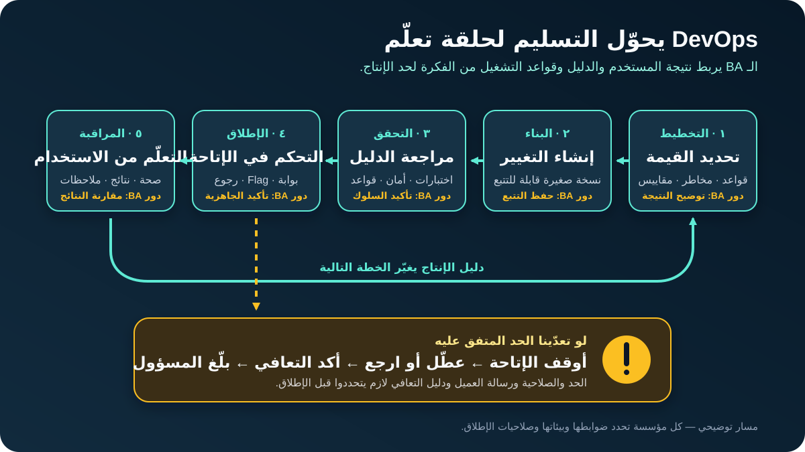

# DevOps لمحللي الأعمال: من المتطلب لدليل الإنتاج

**DevOps** بيجمع طريقة الشغل والممارسات التقنية والأتمتة، علشان الناس اللي بتخطط وتبني وتسلّم وتشغّل البرمجيات يقدّموا قيمة مع بعض. DevOps مش مجرد أداة نشر، ولا مسمى وظيفي، ولا فريق يستلم الشغل بعد ما يخلص.

بالنسبة لمحلل الأعمال (Business Analyst - BA)، DevOps بيربط المتطلب بالدليل عبر دورة التغيير كلها: اتفقنا على إيه؟ أنهي نسخة اتجربت؟ إيه اللي يتحكم في الإطلاق؟ الفريق هيكتشف الضرر إزاي؟ إيه اللي يحصل لو التغيير فشل؟ وهل نتيجة العمل اتحسنت بعد الإطلاق؟

الدرس ده للمبتدئين، وهنمشي فيه مع ميزة توضيحية في تطبيق تسوق أونلاين: **العميل يقدر يلغي طلبًا مدفوعًا قبل ما المخزن يبدأ التجهيز**. كل القواعد والمدد والحدود الرقمية في المثال افتراضات تعليمية، ولازم ملاك العمل والتقنية الحقيقيون يأكدوها.

## 1. شوف DevOps كحلقة تغذية راجعة مشتركة

طريقة التسليم التقليدية ممكن تكون: Business يكتب المتطلبات، وDevelopment يكتب الكود، وOperations ينشره، وSupport يكتشف المشاكل. كل مجموعة شايفة جزءًا فقط من النتيجة.

DevOps بيقلل المسافة دي. الفريق يخطط لتغيير صغير، ويبنيه، ويتحقق منه، ويطلقه بضوابط، ويراقب سلوكه في الإنتاج، وبعدها يرجّع الدليل للقرار التالي.

| مرحلة دورة العمل | مثال إلغاء الطلب | مساهمة الـ BA |
|---|---|---|
| **التخطيط** | تحديد إمتى الإلغاء مسموح | تأكيد القواعد والاستثناءات والمستخدمين والنتائج والمخاطر |
| **البناء** | تعديل التطبيق وخدمة الطلبات والتوثيق | الحفاظ على الربط بين المتطلبات والقرارات وشغل التنفيذ |
| **التحقق** | تشغيل فحوصات آلية واستكشافية | التأكد إن الدليل يغطي السلوك والاستثناءات |
| **الإطلاق** | إتاحة الميزة للمستخدمين بأمان | تأكيد شروط الجاهزية والتواصل وصاحب القرار |
| **المراقبة** | قياس الأخطاء وطلبات الإلغاء المكتملة | مقارنة صحة النظام ونتيجة العمل بالتوقعات |
| **التعلّم** | إصلاح الفجوات أو تغيير القاعدة | تحويل دليل الإنتاج لقرارات في الـ Backlog |

**سؤال الـ BA:** أنهي دليل لازم يكون موجودًا في كل مرحلة قبل ما التغيير يكمل؟

## 2. حوّل الفكرة لتغيير قابل للتشغيل

«العميل يقدر يلغي الطلب» بتوصف ميزة، لكنها مش كفاية للتسليم والتشغيل الآمن. في مثالنا، افترض إن أصحاب المصلحة اقترحوا القواعد **التوضيحية** دي:

- العميل الموثق يقدر يطلب الإلغاء طول ما حالة الطلب `PAID`.
- الإلغاء غير مسموح بعد ما الحالة تبقى `PACKING`.
- لو حالة الطلب اتغيرت أثناء التنفيذ، العميل يشوف النتيجة الحالية بدل رسالة نجاح غير حقيقية.
- النظام يسجل قرار الإلغاء والحالة اللي اعتمد عليها علشان Support والمراجعة.
- Operations يقدر يعطّل الميزة من غير انتظار Build جديد.

الـ BA لازم يستكشف أكتر من الـ Happy Path:

| المجال | السؤال المطلوب حسمه |
|---|---|
| قاعدة العمل | أنهي حالات تسمح بالإلغاء، ومين مالك القائمة؟ |
| التزامن | إيه اللي يحصل لو التجهيز بدأ أثناء تنفيذ الإلغاء؟ |
| الدفع | هل الإلغاء يبدأ Refund، ولا يفك حجز المبلغ، ولا يبدأ عملية منفصلة؟ |
| تجربة المستخدم | أنهي تأكيد وسبب وخطوة تالية يشوفهم العميل؟ |
| التشغيل | مين يقدر يعطّل الميزة وتحت أنهي شرط؟ |
| الدليل | أنهي Event يثبت إن الطلب نجح من أوله لآخره؟ |
| الدعم | أنهي معلومات تساعد موظف الدعم يشرح النتيجة من غير تخمين؟ |

هنا دور الـ BA بيقوّي شغل DevOps: المتطلب يشمل **إزاي التغيير هيتجرب ويتطلق ويتراقب ويتدعم ويتم التعافي منه**، مش بس الشاشة هتعمل إيه.

## 3. افهم مصطلحات التسليم

مش لازم تضبط Pipeline بنفسك علشان تناقشه بوضوح.

| المصطلح | معناه ببساطة | الـ BA يربط بيه إيه؟ |
|---|---|---|
| **التحكم في الإصدارات (Version Control)** | تاريخ قابل للتتبع لتغييرات الكود والإعدادات | المتطلب والقرار والـ Issue ونسخة التغيير بالضبط |
| **التكامل المستمر (Continuous Integration - CI)** | دمج التغييرات وفحصها باستمرار عن طريق Build واختبارات آلية | أنهي قواعد قبول ممكن تتفحص آليًا؟ |
| **التسليم المستمر (Continuous Delivery - CD)** | الحفاظ على تغيير تم التحقق منه وجاهز للإطلاق بخطوات قابلة للتكرار | أنهي دليل وموافقة يخلّوه جاهزًا؟ |
| **النشر المستمر (Continuous Deployment)** | كل تغيير ناجح في الضوابط بيتاح تلقائيًا | أنهي ضوابط تخلي الإتاحة التلقائية مقبولة؟ |
| **خط التسليم (Pipeline)** | مراحل آلية تنقل التغيير وتفحصه | نقطة التشغيل والفحوص والموافقات والمخرجات والفشل |
| **ناتج البناء (Artifact)** | نسخة لها رقم أنتجها الـ Build وبتُستخدم في الـ Deployment | هل نفس النسخة اللي اتجربت هي اللي بتتنقل؟ |
| **بيئة (Environment)** | مكان بيشتغل فيه البرنامج بإعدادات وبيانات معينة | إيه المختلف بين Development وTest وStaging وProduction؟ |
| **النشر التقني (Deployment)** | وضع نسخة في بيئة تشغيل | هل البرنامج اتغير حتى لو المستخدم لسه مش شايف الميزة؟ |
| **الإطلاق للمستخدم (Release)** | إتاحة السلوك للجمهور المقصود | مين يشوفه، وإمتى، وتحت أنهي شروط؟ |
| **مفتاح الميزة (Feature Flag)** | تحكم يشغّل أو يوقف السلوك من غير Build جديد | مين يتحكم فيه، وإيه الوضع الافتراضي، وإمتى يتشال؟ |
| **الرجوع (Rollback)** | استعادة حالة آمنة سابقة أو تعطيل التغيير | إيه اللي يفعّله، ومين يقرر، وإزاي نثبت التعافي؟ |
| **قابلية الملاحظة (Observability)** | Logs وMetrics وTraces وEvents تساعد تفسر سلوك النظام | أنهي أسئلة للمستخدم والعمل لازم دليل الإنتاج يجاوب عنها؟ |

**فرق مهم:** التغيير اللي اتعمل له Merge مش بالضرورة اتنشر، والنسخة اللي اتعمل لها Deployment مش بالضرورة اتاحت للمستخدمين. سجل كل حالة لوحدها.

## 4. تابع التغيير عبر البيئات

الفرق بتستخدم بيئات منفصلة لتقليل المخاطر، لكن الأسماء والأغراض بتختلف.

| البيئة | الغرض المعتاد | مثال الإلغاء |
|---|---|---|
| **Development** | شغل سريع على تغيير غير مكتمل | المطور يفحص التعامل مع الحالات ببيانات اختبار |
| **Test / QA** | اختبار وظيفي وغير وظيفي بعد دمج الأجزاء | QA يجرب الحالات المسموحة والممنوعة وتغير الحالة المتزامن |
| **Staging / pre-production** | تحقق في بيئة شبيهة بالإنتاج قبل الإطلاق | الفريق يراجع الإعدادات والصلاحيات والمراقبة ومسار Support |
| **Production** | مستخدمون حقيقيون وتشغيل فعلي | المستخدمون المعتمدون يشوفوا الميزة والنتائج الحقيقية تتراقب |

اسم البيئة مش ضمان إنها مطابقة للإنتاج. بيانات الاختبار ممكن تكون أصغر، وبعض التكاملات تكون محاكاة، والصلاحيات تختلف، وحجم الاستخدام الحقيقي يكشف سلوكًا ما ظهرش قبل كده.

**إجراء الـ BA:** سجل الاختلافات المهمة والمخاطرة الناتجة عنها. مثلًا، لو خدمة المخزن في Staging محاكاة، الفريق لسه محتاج دليل إن تكامل الإنتاج يتعامل مع تغيّر الحالة أثناء الإلغاء.

الأفضل نقل **نفس الـ Artifact برقم نسخته** بين البيئات كلما أمكن، مع تغيير الإعدادات المعتمدة للبيئة بدل بناء كود مختلف في كل مرحلة. اسأل الفريق بيثبت إزاي أنهي نسخة وإعدادات اتجربوا.

## 5. اقرأ CI/CD Pipeline كسلسلة أدلة

الـ Pipeline مش كويس تلقائيًا لمجرد إنه آلي. اقرأه كمجموعة أسئلة وأدلة.

| مرحلة الـ Pipeline | مثال للدليل | سؤال الـ BA |
|---|---|---|
| اقتراح التغيير | Issue ومتطلب وقرار وDiff مراجَع ومربوطين | نقدر نتتبع سبب وجود التغيير؟ |
| Build | إنتاج Artifact برقم نسخة بنجاح | هل دي نفس النسخة اللي هتستخدمها باقي المراحل؟ |
| الفحوص الآلية | اختبارات Unit وIntegration وSecurity وقواعد العمل | أنهي سلوك متفق عليه واستثناءات مغطاة؟ |
| النشر في Test | نشر الـ Artifact بإعدادات معروفة | هل البيئة بتمثل التكاملات عالية المخاطرة؟ |
| دليل القبول | نتائج لحالات الإلغاء ورسائل المستخدم | مين يراجع القبول من منظور العمل، وإيه اللي لسه يدوي؟ |
| بوابة الإطلاق | اكتمال الفحوص المطلوبة والموافقة والخطة | القرار مبني على دليل ولا مجرد ضغطة شكلية؟ |
| النشر في Production | تسجيل النسخة والوقت والمنفذ والنتيجة | الفريق يقدر يحدد إيه اللي اتغير وقت الحادث؟ |
| فحص ما بعد الإطلاق | مقارنة صحة النظام ونتيجة العمل بالحدود | نراقب قد إيه قبل ما نسمي الإطلاق ناجحًا؟ |

المرحلة الفاشلة لازم توقف أو تحوّل التغيير حسب قاعدة متفق عليها. تجنب الاستثناءات غير الظاهرة. لو فيه تجاوز طارئ مسموح، حدد مين يعتمده، وأنهي دليل يتحفظ، وإمتى يتعمل التحكم اللي تم تخطيه بعد كده.

## 6. اكتب معايير قبول تعيش في الإنتاج

معايير قبول الميزة عادة بتوصف السلوك الظاهر. المعايير الجاهزة لـ DevOps بتوصف كمان دليل التشغيل والتعامل مع الفشل.

بالنسبة لميزة الإلغاء:

| النوع | معيار قبول توضيحي |
|---|---|
| وظيفي | Given عميل موثق وطلب حالته `PAID`، When ينجح الإلغاء، Then التطبيق يعرض تأكيدًا والطلب لا يكمل للتجهيز |
| استثناء | Given الطلب اتغير إلى `PACKING` قبل اكتمال التحديث، Then التطبيق لا يدّعي النجاح ويعرض الحالة الحالية والخطوة التالية |
| مراجعة | كل محاولة تسجل Order ID والحالة السابقة والنتيجة وReason Code والنسخة والتوقيت من غير كشف بيانات ممنوعة |
| أداء | نتيجة الإلغاء تظهر داخل زمن الاستجابة اللي اتفق عليه Product وOperations وتحت حمل متفق عليه |
| إطلاق | الميزة تبدأ Off ولا يفعّلها غير دور الإطلاق المفوض |
| مراقبة | Dashboard يفصل المحاولات الناجحة والمرفوضة والفاشلة واللي انتهت مهلتها |
| تعافٍ | لو تعدينا حد الفشل المتفق عليه، المالك المحدد يقدر يعطّل الميزة ويؤكد إن Checkout وشغل المخزن رجعوا طبيعي |

ما تخترعش زمن استجابة أو Alert Threshold علشان المتطلب يبان كامل. سجله **قرارًا مفتوحًا** ومعاه مالك لحد ما الفريق يستخدم أثر العمل ودليل النظام ويتفق عليه.

## 7. افصل الـ Deployment عن الـ Release

الفريق يقدر ينشر الكود تقنيًا ويتحكم في توقيت إتاحته للمستخدمين. من الخيارات الشائعة:

| الخيار | معناه ببساطة | سؤال مفيد |
|---|---|---|
| **إتاحة كاملة مرة واحدة** | النسخة الجديدة تخدم كل الجمهور المقصود | هل الأثر صغير والتعافي سريع كفاية؟ |
| **Feature Flag** | تشغيل السلوك الجديد منفصل عن الـ Deployment | مين يغيّر الـ Flag، وهل المسار القديم لسه آمن؟ |
| **Canary / إتاحة تدريجية** | مجموعة صغيرة تشوف التغيير قبل التوسع | أنهي مجموعة ومقاييس ومدة وحد توقف؟ |
| **Blue-green** | نقل الـ Traffic بين نسختين جاهزتين في الإنتاج | توافق البيانات والرجوع هيتعاملوا إزاي؟ |

دي خيارات وليست متطلبات ثابتة لكل مشروع. الفريق يختار حسب المعمارية والتكلفة وأثر المستخدم والتنظيم والقدرة على التعافي.

في مثالنا، الفريق بيقترح Feature Flag وإتاحة تدريجية. قبل الإطلاق، الـ BA يساعد في تأكيد المستخدمين المستهدفين، والحالات المستبعدة، ورسائل العميل وSupport، ومدة المراقبة، ومقاييس النجاح، وحد التوقف، وصاحب القرار، وإيه اللي يحصل للطلبات الجارية لما الـ Flag يبقى Off.

## 8. راقب صحة التقنية ونتيجة العمل

«السيرفر شغال» مش دليل إن الميزة شغالة للعميل. اجمع بين إشارات تقنية وإشارات للمستخدم والعمل.

| الإشارة | مثال الإلغاء | أهميتها |
|---|---|---|
| صحة التقنية | Error Rate وResponse Time وفشل Dependencies | اكتشاف الطلبات المكسورة أو البطيئة |
| النتيجة الوظيفية | إلغاءات ناجحة ومرفوضة وفاشلة ومنتهية المهلة | فصل الرفض الصحيح عن عطل النظام |
| نتيجة العمل | طلبات توقفت قبل التجهيز واتصالات Support الممكن تجنبها | هل الميزة حققت القيمة المقصودة؟ |
| حد حماية (Guardrail) | طلب اتلغى غلط أو اتجهز رغم تأكيد الإلغاء | اكتشاف ضرر تخفيه متوسطات النجاح |
| ملاحظات المستخدم | أنماط الشكاوى والرسائل المربكة | كشف مشاكل الـ Telemetry لوحده ما يوضحهاش |

كل Alert لازم يكون له مالك وإجراء متوقع. Dashboard محدش بيراجعه مش ضابط. اتفق إمتى الإطلاق يُعتبر سليمًا، وإمتى الإتاحة تتوقف، وإمتى يبدأ Incident.

الـ BA يراجع كمان **المعنى الحقيقي للمقياس**: لو Dashboard بيسمي المحاولة «ناجحة»، هل ده معناه إن حالة الطلب اتغيرت، وشغل المخزن توقف، والعميل وصله الرد؟ ولا معناه بس إن API واحد رجّع `200`؟

## 9. خطط للرجوع والحوادث قبل الإطلاق

Rollback مش دايمًا «نرجع النسخة القديمة». ممكن قاعدة البيانات أو رسالة لنظام خارجي تكون اتغيرت بالفعل. الفريق قد يحتاج يعطّل الميزة، أو يعمل إصلاحًا للأمام، أو يعوّض عمليات اكتملت، أو يجمع بين الحلول.

اسأل الأسئلة دي قبل الإطلاق:

1. أنهي شرط يفعّل إيقاف الإتاحة أو التعطيل أو الرجوع أو إعلان Incident؟
2. مين صاحب قرار التنفيذ، ومين ينفذه؟
3. إيه اللي يحصل للطلبات اللي بدأت ولسه ما خلصتش؟
4. هل البيانات متوافقة مع النسخة السابقة؟
5. العملاء المتأثرون وSupport هيتبلغوا إزاي؟
6. أنهي دليل يثبت تعافي الخدمة وشغل الـ Business؟
7. أنهي إجراءات وقرارات وتعلّم بعد الحادث هيتسجلوا؟

في الإلغاء، إخفاء الزر يمنع طلبات جديدة لكنه ما يحلش طلبًا بدأ وغيّر حالة الـ Order بالفعل. خطة التعافي لازم تتعامل مع النجاح الجزئي وتطابق سجلات الطلب والدفع والمخزن.

تجنب مراجعات الحوادث المبنية على اللوم. المخرج المفيد هو دليل عن الظروف والضوابط والاكتشاف والاستجابة والتحسينات.

## 10. DevOps-ready Change Brief: مثال مكتمل

استخدم المخرج ده قبل اعتماد خطة الإطلاق النهائية.

| الحقل | المثال المكتمل |
|---|---|
| **التغيير والنتيجة** | تمكين العميل الموثق من إيقاف الطلب المؤهل قبل التجهيز، وتقليل تجهيزات يمكن تجنبها ومجهود Support |
| **قاعدة العمل التوضيحية** | `PAID` مؤهل؛ `PACKING` غير مؤهل؛ والحالة تُفحص مرة أخرى أثناء الطلب |
| **الرحلة والأنظمة المتأثرة** | تفاصيل الطلب، وCancellation API، وخدمة الطلبات، ومتابعة الدفع، وإشعار المخزن، وشاشة Support |
| **التتبع** | ربط المتطلب وسجل القرار وطلب التغيير ودليل الاختبار ونسخة الـ Artifact وسجل الإطلاق |
| **أهم الاستثناءات** | تغيّر الحالة أثناء الطلب؛ Timeout في Dependency؛ ضغطة مكررة؛ تحديث جزئي للأنظمة التالية |
| **دليل الـ Pipeline** | اختبارات القواعد والتكامل والأمان ودليل Staging وبوابة الموافقة |
| **أسلوب الإطلاق** | Feature Flag وإتاحة تدريجية؛ الجمهور والمدة قرارات مفتوحة |
| **إشارات النجاح** | اكتمال الإلغاء المؤهل وتقليل اتصالات Support الممكن تجنبها |
| **حدود الحماية** | لا نجاح كاذب، ولا إلغاء غير مصرح، ولا تجهيز بعد تأكيد النجاح |
| **التوقف والتعافي** | المالك المفوض يعطّل الـ Flag عند تجاوز الحد المتفق عليه؛ والفريق يطابق الحالات الجارية |
| **التواصل** | رسالة العميل، ودليل Support، وتنبيه Operations، ومالك تحديثات الحادث |
| **قرارات مفتوحة** | زمن الاستجابة، وحد التنبيه، ومجموعات الإتاحة، ومدة المراقبة، والاحتفاظ، وملكية الـ Refund |

الـ Brief مش بديل للمتطلبات التفصيلية أو Runbook الفريق التقني. هو يضمن إن نتيجة العمل وطريقة التشغيل يفضلوا متصلين.

## 11. قِس التدفق من غير ما تحوّل المقاييس لأهداف شكلية

إرشادات DORA الحالية لأداء تسليم البرمجيات بتستخدم خمسة مقاييس. بتساعد الفريق يناقش **سرعة التدفق وعدم الاستقرار** لخدمة معينة:

| المقياس | معناه ببساطة |
|---|---|
| **Change lead time** | الوقت من Code Commit لحد Deployment ناجح في Production |
| **Deployment frequency** | عدد مرات نشر التغييرات خلال فترة |
| **Failed deployment recovery time** | وقت التعافي من Deployment فاشل يحتاج تدخلًا فوريًا |
| **Change fail rate** | نسبة الـ Deployments اللي تحتاج تدخلًا فوريًا |
| **Deployment rework rate** | نسبة الـ Deployments غير المخططة الناتجة عن Incident في الإنتاج |

استخدمها مع مقاييس المنتج والموثوقية والأمان ونتيجة المستخدم. دي إشارات لتعلّم الفريق، مش تقييم أداء أفراد. سرعة النشر مش نجاح لو أخطاء الإلغاء أو ضرر العميل أو إعادة الشغل زادوا.

## 12. قالب DevOps-ready Change Brief

انسخ الهيكل ده في Discovery أو Refinement أو تخطيط الإطلاق:

| الحقل | إجابتك |
|---|---|
| التغيير ونتيجة المستخدم أو العمل المقصودة | |
| القواعد المؤكدة والافتراضات والقرارات المفتوحة | |
| الرحلة والأنظمة والبيانات والفرق المتأثرة | |
| روابط التتبع ومعرّفات النسخ | |
| المسار الطبيعي والاستثناءات المهمة | |
| دليل السلوك والأداء والأمان | |
| اختلافات البيئات وحدود الاختبار | |
| فحوص الـ Pipeline وبوابات الموافقة | |
| أسلوب الـ Deployment والـ Release | |
| إشارات التقنية والعمل وحدود الحماية | |
| حدود التنبيه والمالك والإجراء المتوقع | |
| الرجوع والتعطيل والتعويض ودليل التعافي | |
| تواصل العميل وSupport وOperations | |
| مالك مراجعة ما بعد الإطلاق والتعلّم | |

## 13. تمرين عملي

وسّع ميزة الإلغاء بحيث العميل يقدر يلغي **منتجًا واحدًا من طلب فيه عدة منتجات**.

1. حدد سؤالين جديدين عن قواعد العمل ونظامين لاحقين قد يتأثروا.
2. أضف Pipeline Test واحدًا لطلب فيه منتج مؤهل وآخر غير مؤهل.
3. اشرح اختلافًا في بيئة الاختبار ممكن يخفي مشكلة في Production.
4. اختر إشارة نجاح للعمل وGuardrail واحدًا للضرر.
5. اكتب شرط توقف، واشرح هل تعطيل الميزة وحده يكفي لتعافي الطلبات الجارية.

لو مش قادر تربط المتطلب بدليل قبل الإطلاق وبعده، يبقى التغيير لسه مش DevOps-ready.

## مراجع للتوسع

- [Microsoft Learn: يعني إيه DevOps؟](https://learn.microsoft.com/en-us/devops/what-is-devops)
- [DORA: التسليم المستمر](https://dora.dev/capabilities/continuous-delivery/)
- [DORA: مقاييس أداء تسليم البرمجيات](https://dora.dev/guides/dora-metrics/)
- [GitHub Docs: Workflows](https://docs.github.com/en/actions/concepts/workflows-and-actions/workflows)
- [Google SRE Book: مراقبة الأنظمة الموزعة](https://sre.google/sre-book/monitoring-distributed-systems/)
