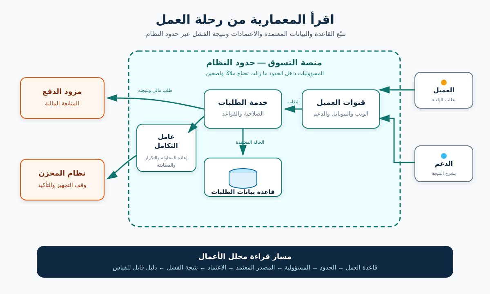

# معمارية البرمجيات لمحللي الأعمال

**معمارية البرمجيات (Software Architecture)** بتوصف الأجزاء المهمة في النظام، وإزاي بتتفاعل، والقيود المحيطة بيها، والقرارات اللي بتشكل سلوكها. هي أكبر من مجرد رسم تقني؛ لأنها بتأثر على قابلية المتطلب للتنفيذ، ومكان ملكية البيانات، والفرق اللي لازم تتغير، ونقط الفشل، والمفاضلات اللي يقبلها العمل.

محلل الأعمال (BA) مش مطلوب منه يختار كل Framework أو يصمم كل Component. المطلوب يكون عنده فهم معماري كفاية يسأل: حدود النظام فين؟ أنهي أنظمة مشاركة في الرحلة؟ مين مالك كل قاعدة وبيان؟ إيه اللي يحصل لو Dependency بطيئة أو غير متاحة؟ وأنهي توقعات جودة هي اللي بتوجه التصميم؟

الدليل ده للمبتدئين وبيتابع تغييرًا توضيحيًا في منصة تسوق إلكتروني: **السماح لعميل موثّق بإلغاء طلب مدفوع قبل ما يبدأ تجهيز المخزن**. كل قاعدة واسم نظام وهدف استجابة وتوزيع ملكية في المثال افتراض تعليمي لازم أصحاب المصلحة الحقيقيون يأكدوه.

## 1. ابدأ بنتيجة العمل، مش برسم صناديق

المعمارية مجموعة اختيارات لها أثر، مش مجرد مستطيلات. ابدأ بالنتيجة والقيود اللي بتدي للاختيارات معناها.

في ميزة الإلغاء، النتيجة المقصودة هي وقف الطلب المؤهل قبل شغل تجهيز ممكن نتفاداه، مع إعطاء العميل نتيجة حقيقية. والقاعدة التوضيحية المبدئية هي:

> العميل الموثّق يقدر يلغي الطلب طول ما حالته الحالية `PAID`، والإلغاء يُرفض لما الحالة تبقى `PACKING`.

الجملة دي بتفتح أسئلة معمارية فورًا:

- أنهي نظام هو المصدر المعتمد لحالة الطلب؟
- هل تطبيق العميل بيقرأ الحالة مباشرة ولا من خلال API؟
- المخزن بيعرف إزاي إن الطلب اتلغى؟
- هل الإلغاء يبدأ Refund كمان؟
- إيه اللي يحصل لو التجهيز بدأ أثناء الطلب؟
- أنهي دليل يمكّن Support يشرح النتيجة؟

الـBA يسجل النتيجة، والقواعد المؤكدة، والافتراضات، والقيود، والقرارات المفتوحة قبل مناقشة حل مفضل. غير كده، رسم شكله احترافي ممكن يخلي تصميم غير مؤكد يبان كأنه متطلب متفق عليه.

## 2. ارسم سياق النظام وحدوده

**رسم سياق النظام (System Context Diagram)** هو نظرة بعيدة لنظام برمجي واحد، والمستخدمين، والأنظمة الخارجية اللي بيتعامل معاها. نموذج C4 بيوصي بيه كنقطة بداية يقدر يناقشها أصحاب المصلحة التقنيون وغير التقنيين.

في مثالنا، النظام داخل النطاق هو **منصة التسوق**. المشاركون المباشرون هم العميل وموظف Support. والاعتمادات الخارجية تشمل مزود الدفع ونظام المخزن.

| العنصر | داخل حدودنا ولا خارجها؟ | المالك التوضيحي | سؤال الـBA |
|---|---|---|---|
| تطبيق العميل وقدرة إدارة الطلب | داخل | فريق منتج التسوق | أنهي رحلات مستخدم وقواعد يقدر الفريق يغيرها؟ |
| بيانات الطلب | داخل | فريق الطلبات | أنهي سجل هو المرجع المعتمد للحالة؟ |
| مزود الدفع | خارج | المزود الخارجي مع مالك المالية | أنهي قواعد للطلب والاستجابة والـTimeout والمطابقة؟ |
| نظام المخزن | خارج | فريق التنفيذ أو Vendor | إزاي وإمتى يقبل إلغاء؟ |
| شاشة Support | مطلوب تأكيده | فريق عمليات العملاء | هل هي جزء من المنصة ولا نظام متكامل منفصل؟ |

**وجود النظام خارج الحدود لا يقلل أهميته.** ممكن Dependency خارجية تكون حرجة حتى لو فريقك ما يقدرش يتحكم فيها. وضّح الملكية والتحكم بدل ما تفترض إن كل صندوق متصل يقدر يتغير مع الميزة.

## 3. قرّب الصورة على قد القرار

رسومات المعمارية ممكن تعرض مستويات تفاصيل مختلفة. نموذج C4 بيسمي أربع درجات شائعة: سياق النظام، والـContainers، والـComponents، والكود. أغلب مناقشات الـBA تحتاج أول مستويين، وتدخل في تفاصيل Component محدد لما يحل سؤال متطلب أو مخاطرة.

| المنظور | السؤال اللي بيجاوب عنه | استخدامه المفيد للـBA |
|---|---|---|
| **سياق النظام** | مين بيستخدم النظام، وأنهي أنظمة تانية بتتفاعل معاه؟ | تأكيد النطاق وأصحاب المصلحة والاعتمادات الخارجية والملكية |
| **Container** | أنهي تطبيقات أو مخازن بيانات شغالة داخل حدود النظام؟ | تتبع الرحلات والمسؤوليات والبيانات وأثر النشر |
| **Component** | أنهي مسؤوليات أساسية موجودة داخل Container واحد؟ | توضيح قاعدة أو Interface أو مالك معقد عند الحاجة |
| **الكود** | الكلاسات أو الوظائف البرمجية متقسمة إزاي؟ | غالبًا غير مطلوب لتحليل الأعمال |

كلمة “Container” هنا معناها تطبيق أو مخزن بيانات، ومش لازم تكون Docker Container. منصة التسوق ممكن تحتوي على تطبيق Web/Mobile، وOrder Service، وOrder Database، وIntegration Worker. دي مسؤوليات منطقية توضيحية؛ الفريق الحقيقي ممكن ينشرها مع بعض أو بشكل منفصل.

ما تطلبش أعلى مستوى تفاصيل تلقائيًا. الرسم اللي يعرض كل عنصر تقني ممكن يخفي القرارات اللي أصحاب المصلحة محتاجين ياخدوها فعلًا.

## 4. تتبع رحلة واحدة عبر المعمارية

الرسم الثابت بيوضح التركيب. **التدفق الديناميكي (Dynamic Flow)** بيشرح إيه اللي بيحصل في سيناريو محدد وبأنهي ترتيب. تابع رحلة الإلغاء من إجراء العميل لحد الدليل النهائي:

1. تطبيق العميل يبعت طلب إلغاء فيه معرف الطلب وهوية موثّقة.
2. Order Service يتحقق من صلاحية العميل ويقرأ الحالة الحالية من المصدر المعتمد.
3. لو الحالة مؤهلة، الـService يغير الطلب إلى `CANCELLED` باستخدام ضابط يمنع تعارض تحديث التجهيز.
4. المنصة تطلب من قدرة الدفع بدء الإجراء المالي المناسب.
5. المنصة تبلغ المخزن إنه ما يجهزش الطلب.
6. العميل وSupport يستلموا نتيجة تعكس الحالة اللي وصل لها النظام فعلًا.
7. أدلة المراجعة والمراقبة تسجل النتيجة من غير كشف بيانات ممنوعة.

بعد كده أضف مسارات الفشل:

| الفشل أو الاستثناء | سؤال لازم المعمارية تجاوب عنه | أثره على المتطلب |
|---|---|---|
| التجهيز بدأ أثناء الإلغاء | أنهي تحديث يكسب، وإزاي التعارض يتكشف؟ | تحديد قاعدة ذرّية أو رد تعارض؛ ممنوع نجاح كاذب |
| مزود الدفع عمل Timeout | هل إلغاء الطلب اتثبت، ولا Pending، ولا اتراجع؟ | تحديد رسالة العميل وإعادة المحاولة والمطابقة والملكية |
| رسالة المخزن اتكررت | هل المستقبِل يقدر يعالج نفس التعليمات بأمان؟ | طلب قاعدة Idempotency أو تعامل مع التكرار |
| Support فتح بيانات قديمة | الحالة لازم تكون حديثة قد إيه قبل نصيحة العميل؟ | تحديد المصدر والتحديث ووقت آخر قراءة الظاهر |
| الإشعار فشل | هل فشل الإشعار يلغي عملية الإلغاء؟ | فصل معاملة العمل عن معالجة التواصل |

**إجراء الـBA:** اعمل Sequence واحد على الأقل للمسار الطبيعي وواحد لأعلى استثناء خطورة. صندوق وسهم بينهم ما يشرحوش التوقيت أو النجاح الجزئي أو إعادة المحاولة أو التعويض.

## 5. حدد المسؤولية وملكية البيانات

المعمارية بتبقى أسهل في التحليل لما كل مسؤولية لها مالك واضح، وكل حقيقة مهمة لها مصدر معتمد.

| المعلومة أو القاعدة | المصدر المعتمد المقترح | القراء أو المستهلكون | سؤال مفتوح |
|---|---|---|---|
| حالة الطلب الحالية | Order Database من خلال Order Service | تطبيق العميل وSupport وتكامل المخزن | هل نظام تاني يقدر يغير الحالة مباشرة؟ |
| أهلية الإلغاء | قواعد نطاق الطلب | تطبيق العميل وSupport والاختبارات الآلية | هل الأهلية مبنية على الحالة بس؟ |
| حالة متابعة الدفع | قدرة الدفع | المالية وSupport ورسائل العميل | إيه المعنى الدقيق لـ“بدأ الـRefund”؟ |
| تأكيد المخزن | سجل تكامل المخزن | Operations وSupport والاستجابة للحوادث | نستنى قد إيه قبل التصعيد؟ |
| رسالة العميل | قواعد تجربة المستخدم والمحتوى | تطبيق العميل والإشعارات | أنهي Result Code يقابله أنهي نص؟ |

خلي بالك من علامتين خطر:

- **ملكية مشتركة:** كذا نظام يقدر يغير نفس حقيقة العمل من غير قاعدة تعارض واحدة.
- **نسخة بيانات بتتعامل كأنها أحدث حقيقة:** شاشة أو تقرير أو Cache يعرض نسخة قديمة كأنها المرجع.

الـBA يوثق المعنى والمالك والجهات المسموح لها بالكتابة والمستهلكين واحتياج حداثة البيانات والاحتفاظ وقاعدة المطابقة للبيانات الحرجة. رسم قاعدة البيانات وحده مش هيكشف كل القرارات دي.

## 6. حوّل توقعات الجودة لمحركات للمعمارية

المتطلبات الوظيفية بتوصف النظام بيعمل إيه. **خصائص الجودة (Quality Attributes)**، وغالبًا بتدخل ضمن المتطلبات غير الوظيفية، بتوصف يعمله بالجودة المطلوبة إزاي. هي بتأثر على المعمارية لما تكون محددة بما يكفي لتوجيه القرار واختباره.

| خاصية الجودة | صياغة ضعيفة | توقع توضيحي أفضل | سؤال معماري |
|---|---|---|---|
| الأداء | “الإلغاء سريع” | العميل يستلم نتيجة مؤكدة أو مرفوضة أو Pending داخل Percentile وحمل متفق عليهم | أنهي Calls موجودة في مسار الاستجابة؟ |
| الإتاحة | “متاح دائمًا” | تحديد وقت الخدمة المطلوب والتوقف المقبول والسلوك وقت التدهور | هل المنصة تقبل طلب لو Dependency غير متاحة؟ |
| الموثوقية | “مفيش طلب يضيع” | كل طلب مقبول يوصل لحالة نهائية قابلة للتتبع أو Recovery Queue ظاهرة | فين بتتعالج إعادة المحاولة والتكرار والنتائج الجزئية؟ |
| الأمان | “إلغاء آمن” | فقط العميل المفوض أو الموظف المصرح له يقدر يلغي، والمحاولات قابلة للمراجعة من غير كشف بيانات حساسة | فين الهوية والصلاحية بيتفحصوا؟ |
| التوسع | “يدعم النمو” | تحديد حجم الاستخدام المتوقع ونمط الذروة وحد المراجعة | أنهي Component يبقى عنق زجاجة الأول؟ |
| التعافي | “نعمل Rollback عند الحاجة” | تحديد فقد البيانات المقبول وزمن التعافي والمطابقة والمالك | هل النسخة القديمة تفهم بيانات كتبتها الجديدة؟ |
| سهولة التغيير | “سهل التعديل” | لقواعد الأهلية مالك واحد موثق ويمكن اختبارها من غير تكرار المنطق في القنوات | القاعدة مركزية ولا منسوخة؟ |

ما تخترعش أرقام علشان المتطلب يبان كامل. سجل المقياس والحمل ونقطة القياس والمالك والهدف كقرارات مفتوحة لحد ما أصحاب الصلاحية يأكدوها.

## 7. ناقش الخيارات كمفاضلات، مش كموضة

مصطلحات زي Layered Architecture وMicroservices وEvent-driven Architecture وServerless بتوصف أنماطًا مفيدة. ولا واحد فيهم “أحدث” أو أصح تلقائيًا لكل مشكلة.

بالنسبة لتحديث المخزن، الفريق ممكن يقارن:

| الخيار | فائدة محتملة | تكلفة أو مخاطرة | دليل يحتاجه الـBA |
|---|---|---|---|
| استدعاء المخزن بشكل Synchronous | الرد الفوري ممكن يبسط نتيجة العميل | طلب العميل بقى معتمدًا على سرعة المخزن وإتاحته | سلوك الاستجابة والـTimeout وأثر التوقف |
| إرسال Event بشكل Asynchronous | تدفق الطلب يقدر يكمل والمخزن يعالج لاحقًا | الحالة قد تختلف مؤقتًا؛ والتكرار والتأخير يحتاجوا معالجة | التأخير المقبول وحالة Pending وإعادة المحاولة والتكرار والمطابقة |
| Batch مجدول | بسيط مع نظام مخزن قديم | الإلغاء ممكن يوصل متأخر بعد بدء التجهيز | مواعيد القطع والحجم والإجراء التشغيلي ووعد العميل |

الـBA ما يختارش لوحده. دوره يظهر نتائج كل اختيار على العمل علشان المعماريين والمهندسين وOperations وSecurity وProduct وملاك العمل يقرروا بوعي.

اطلب سجل القرار: بنحل أنهي مشكلة؟ أنهي خيارات اتدرست؟ أنهي خصائص جودة وقيود أثرت؟ أنهي نتيجة جانبية قبلناها؟ وإمتى نراجع القرار؟

## 8. اقرأ رسم المعمارية بشكل نقدي

لما يظهر رسم في Workshop، استخدم القائمة دي:

1. **الغرض:** الرسم معمول علشان يجاوب عن أنهي سؤال؟
2. **النطاق:** إيه داخل حدود النظام، وإيه اتساب عمدًا؟
3. **المفتاح:** الأشكال والألوان والخطوط واتجاهات الأسهم معناها إيه؟
4. **المسؤوليات:** كل عنصر له غرض مختصر، ولا مجرد اسم منتج؟
5. **التفاعلات:** التسميات واضحة إذا كانت بيانات ولا Command ولا Event ولا إجراء مستخدم؟
6. **الملكية:** مين مالك كل نظام وInterface وقاعدة وبيانات حرجة؟
7. **حدود الثقة:** فين الهوية والصلاحيات والبيانات الحساسة أو الطرف الثالث بيعدّوا الحدود؟
8. **الفشل:** إيه اللي يحصل لو Dependency بطيئة أو واقفة أو رجعت نتيجة غير مؤكدة؟
9. **الوقت:** ده الوضع الحالي ولا المستهدف ولا خطوة انتقالية، وبيمثل أنهي تاريخ أو Version؟
10. **الدليل:** أنهي متطلبات وقرارات وعقود Interfaces وقياسات تشغيل بتدعمه؟

الرسم المفيد نموذج تواصل، مش دليل إن النظام شغال صح. راجعه قدام السيناريوهات وعقود التكامل وتعريفات البيانات والاختبارات ودليل الإنتاج.

## 9. مثال مكتمل: Architecture Discovery Brief

استخدم المخرج ده قبل Solution Workshop أو Architecture Review.

| الحقل | مثال الإلغاء المكتمل |
|---|---|
| **نتيجة العمل** | وقف الطلبات المدفوعة المؤهلة قبل التجهيز وإعطاء العميل نتيجة حقيقية |
| **النطاق والحدود** | تغيير داخل منصة التسوق؛ الدفع والمخزن يفضلوا Dependencies خارجية |
| **المستخدمون** | عميل موثّق وموظف Support ومستجيب Operations |
| **القاعدة المؤكدة** | لا توجد بعد؛ أهلية `PAID` وعدم أهلية `PACKING` افتراضات توضيحية تنتظر ملاكها |
| **المسؤوليات الأساسية** | عرض الإجراء، تفويض الطلب، تحديد الأهلية، تحديث الطلب، تنسيق الدفع والمخزن، وتوصيل النتيجة |
| **المصدر المعتمد** | المقترح: Order Service يتحكم في حالة الطلب؛ والدفع والمخزن يملكوا حالات المعالجة المحلية |
| **التدفق الحرج** | طلب ← تفويض ← إعادة قراءة الحالة ← تغييرها ← إبلاغ الاعتمادات ← عرض وتسجيل النتيجة |
| **أهم الاستثناءات** | تجهيز متزامن، Timeout للدفع، تكرار رسالة المخزن، شاشة Support قديمة، فشل الإشعار |
| **محركات الجودة** | رد حقيقي، وصول مفوض، تتبع، زمن استجابة محدود، وتعافٍ من الفشل الجزئي |
| **قيود خارجية** | عقود المزود وقدرة تكامل المخزن وسياسة الخصوصية والاحتفاظ |
| **خيارات للتقييم** | استدعاء المخزن Synchronous أو Event؛ نتيجة نهائية فورية أو حالة Pending ظاهرة |
| **الدليل المطلوب** | رسومات Context وSequence، عقود API/Event، ملكية البيانات، أمثلة قبول، وخطة مراقبة ومطابقة |
| **القرارات المفتوحة وملاكها** | مالك الأهلية، معنى الـRefund، هدف الاستجابة، نافذة إعادة المحاولة، مالك التصعيد، ومدة الاحتفاظ |

الـBrief مش بديل لتصميم المعماري أو مواصفة هندسية. هو يضمن إن مناقشة التصميم تبدأ بمعنى العمل وتظهر القرارات غير المحسومة.

## 10. قالب Architecture Discovery Brief لإعادة الاستخدام

انسخ الهيكل ده لأي ميزة تانية:

| الحقل | ملاحظاتك |
|---|---|
| نتيجة العمل والرحلة المتأثرة | |
| النظام داخل النطاق وحدوده الواضحة | |
| المستخدمون والأدوار والأنظمة الخارجية | |
| القواعد المؤكدة والافتراضات والقيود والقرارات المفتوحة | |
| المسؤوليات أو الـContainers الأساسية | |
| البيانات الحرجة والمصدر المعتمد | |
| ترتيب تفاعل المسار الطبيعي | |
| مسارات الفشل والـTimeout والتكرار والنجاح الجزئي | |
| الأمان وحدود الثقة | |
| توقعات الأداء والإتاحة والموثوقية والتوسع والتعافي | |
| الخيارات المعمارية ومفاضلات العمل | |
| ملاك الأنظمة والقواعد والبيانات والقرارات | |
| دليل التحقق والتشغيل المطلوب | |
| تاريخ أو Version الرسم ومحفز المراجعة | |

## 11. تمرين عملي

وسّع السيناريو بحيث العميل يقدر يلغي **منتجًا واحدًا من طلب متعدد المنتجات** بينما باقي المنتجات تكمل للتجهيز.

1. عدّل الحدود لو التنفيذ بيتم في أكتر من مخزن.
2. حدد المصدر المعتمد لحالة المنتج وحالة الطلب بالكامل.
3. اكتب مسارًا طبيعيًا ومسار فشل جزئي واحدًا.
4. حدد توقع موثوقية قابلًا للقياس من غير اختراع قيمة الهدف.
5. قارن تحديثًا Synchronous بـEvent Asynchronous، واذكر مفاضلة واحدة على العمل.
6. أضف مالك القرار والدليل المطلوب قبل الإطلاق.

لو الفريق مش قادر يشرح مين مالك القاعدة، وفين الحالة المعتمدة، وإيه اللي بيعدي الحدود، وإيه اللي يحصل وقت فشل Dependency، فالمعمارية لسه مش واضحة بما يكفي للمتطلب.

## مراجع للتوسع

- [نموذج C4: رسم سياق النظام](https://c4model.com/diagrams/system-context)
- [نموذج C4: مستويات الرسومات](https://c4model.com/diagrams)
- [Microsoft Azure Architecture Center: التصميم لاحتياجات العمل](https://learn.microsoft.com/en-us/azure/architecture/guide/design-principles/build-for-business)
- [Microsoft Azure Architecture Center: أنماط المعمارية](https://learn.microsoft.com/en-us/azure/architecture/guide/architecture-styles/)
- [ISO/IEC/IEEE 42010:2022 — وصف المعمارية](https://www.iso.org/standard/74393.html)
- [AWS Well-Architected Framework: التعريفات والمفاضلات](https://docs.aws.amazon.com/wellarchitected/latest/framework/definitions.html)
