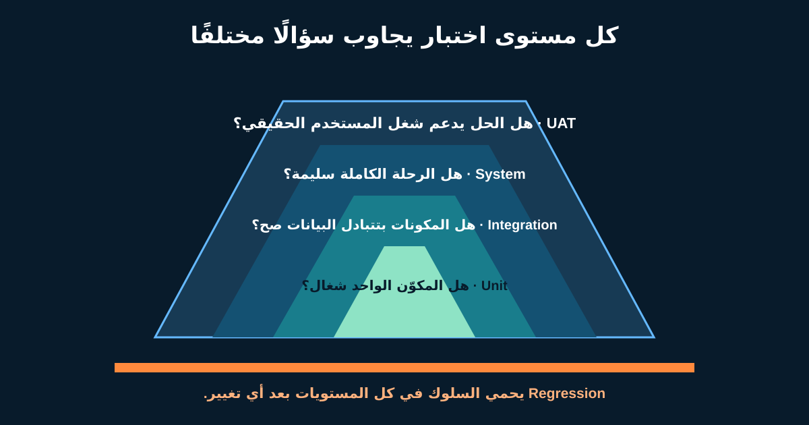

# اختبار البرمجيات والعيوب وUAT لمحلل الأعمال

الاختبار مش نشاطًا واحدًا في نهاية التسليم. كل نوع بيوفر دليلًا مختلفًا: Function شغالة، مكونات بتتبادل بيانات صح، الرحلة الكاملة سليمة، والمستخدم الحقيقي يقدر ينجز شغله.

محلل الأعمال (BA) بيربط المتطلبات والأمثلة ومخاطر العمل والبيانات والأدوار والنتائج بخطة الاختبار. غالبًا بينسق **اختبار قبول المستخدم (UAT)**، لكن قرار القبول التجاري مسؤولية أصحاب المصلحة، مش Checkbox يملكها الـBA وحده.



## 1. اسأل: كل مستوى اختبار بيجاوب إيه؟

| المستوى | السؤال الأساسي | مثال الإرجاع | المسؤولية المعتادة |
|---|---|---|---|
| **Unit / Component** | هل مكوّن صغير يعمل منفردًا؟ | حساب الأهلية يرفض اليوم 31 لقاعدة 30 يومًا | Developers وغالبًا Automated |
| **Integration** | هل المكونات أو الأنظمة تتبادل صح؟ | حالة الطلب ورد شركة الشحن يترسموا للحقول الصحيحة | الفريق التقني مع أمثلة الـBA |
| **System / End-to-end** | هل سلوك الحل الكامل يعمل؟ | العميل يؤكد ويستلم مرجعًا واحدًا والـAudit والأخطاء سليمة | فريق الاختبار والتسليم |
| **UAT** | هل مستخدم ممثل ينجز شغله الحقيقي ويقبل النتيجة؟ | الدعم والعمليات يتعاملوا مع النجاح وفشل الشحن | ممثلو العمل بدعم الـBA والفريق |

المسميات والملكية تختلف. المهم الدليل والمخاطرة المغطاة. UAT مايبقاش أول مرة نختبر المكونات.

## 2. تحقق من المواصفات ومن الاحتياج

- **Verification:** هل الحل حقق المتطلبات والتصميم المحدد؟
- **Validation:** هل الحل يلبّي احتياج أصحاب المصلحة في بيئته الحقيقية؟

شاشة ممكن تعدّي كل Acceptance Criteria لكن توهم العميل إن الاسترداد مضمون؛ دي مشكلة Validation. وممكن المستخدم يحبها لكن التأكيد المكرر ينشئ طلبين؛ دي كمان مشكلة Verification.

الـBA يخلي الاثنين واضحين: تتبع المتطلب للاختبار وسيناريوهات عمل واقعية.

## 3. خطط للـUAT قبل نهاية البناء

| الجانب | قرار الإرجاع |
|---|---|
| النطاق | إرجاع محلي لمنتج واحد ومسارات استثناء محددة |
| المختبرون | موظف دعم، مشغل إرجاع، مالك السياسة؛ Usability للعميل منفصلة لو لزم |
| البيئة | UAT متكاملة مع تحكم في سلوك شركة الشحن |
| البيانات | طلبات Synthetic في اليوم 29 و30 و31 وفئات مقبولة ومرفوضة |
| الوصول | أدوار عميل ودعم وعمليات بأقل صلاحية لازمة |
| Entry Criteria | الاختبارات الحرجة عدّت؛ المشاكل المعروفة مشتركة؛ Build وRules Version مسجلان |
| Exit Criteria | السيناريوهات الحرجة عدّت؛ المخاطر الباقية موثقة؛ Approver محدد يقرر |
| الدليل | النتيجة ومرجع Screenshot/Log والمختبر والتاريخ والـBuild |

ماتستخدمش بيانات شخصية أو دفع حقيقية إلا لو ضوابط معتمدة تسمح. جهز بيانات آمنة ممثلة وطريقة Reset.

## 4. صمم السيناريوهات حول مخاطر العمل

| ID | السيناريو | النتيجة المتوقعة | الأولوية |
|---|---|---|---|
| UAT-01 | منتج مؤهل والشحن متاح | طلب واحد ومرجع واحد | Critical |
| UAT-02 | اليوم 31 من مدة 30 يومًا | لا طلب؛ سبب وطريق دعم صحيحان | Critical |
| UAT-03 | تأكيد مرتين | لا طلب ولا تحصيل مكرر | Critical |
| UAT-04 | Timeout بعد التأكيد | الحالة والخطوة واضحتان والعمليات تتعافى | High |
| UAT-05 | رحلة عربية بلوحة مفاتيح وقارئ شاشة | ترتيب وتسميات وتركيز وأخطاء مفهومة | High |
| UAT-06 | موظف الدعم يرى الطلب الجديد | بيانات وAudit History صحيحان | High |

UAT مش ضغطًا عشوائيًا. فيه مساحة للاستكشاف، لكن كل قاعدة حرجة وHandoff تشغيلي يحتاج دليلًا متوقعًا.

## 5. اكتب Defect Report يمكن إعادة تنفيذه

```text
العنوان: طلب إرجاع مكرر بعد إعادة محاولة التأكيد
Build / Environment: 2026.09.27-rc2 / UAT
Role وTest Data: Customer C101 / order O501 / item I1
Precondition: منتج مؤهل؛ رد شركة الشحن تأخر 20 ثانية
الخطوات: أكد؛ انتظر؛ Refresh؛ أكد مرة أخرى
Expected: طلب واحد والمرجع ظاهر
Actual: طلبان R901 وR902
Evidence: IDs والوقت من غير بيانات شخصية
Business impact: خطر تحصيل Courier وRefund مكررين
Severity مقترحة: High
Requirement / Scenario: STORY-RET-01 / UAT-03
```

**Severity** تصف التأثير، و**Priority** تصف إمتى نصلحه. مشكلة صياغة ممكن Severity منخفضة لكن Priority عالية قبل Disclosure منظم. الفريق المسؤول يقرر بالدليل.

## 6. افهم دورة حياة الـTicket

```text
New/Open → Triaged → In progress → Ready for retest → Verified → Closed
                          ↘ Rejected / Duplicate / Deferred
```

الأسماء تختلف. حدد مين يحرك كل حالة وإيه الدليل. «Cannot reproduce» يبدأ فحص البيانات والبيئة والـBuild والتوقيت والـLogs، مش لوم الشخص.

بعد الإصلاح، اعمل **Confirmation Testing** للفشل الأصلي، ثم **Regression Testing** لاكتشاف آثار جانبية في أماكن أخرى.

## 7. خطط للـRegression من التأثير والمخاطرة

تغيير سطر في أهلية الإرجاع ممكن يؤثر على Web وMobile وشاشة الدعم وتكامل الشحن والاسترداد والتقارير والطلبات المفتوحة والترجمة.

| التغيير | فحوص مباشرة | Regression |
|---|---|---|
| المدة من 30 لـ45 يومًا | أيام 44 و45 و46 | طلب موجود، منع التكرار، التقرير، شاشة الدعم |
| معالجة Timeout | Retry والحالة المحفوظة | لا حجز مكرر، Operations Queue، رسالة العميل |
| نص الخطأ العربي | المعنى وRTL | Focus وقارئ الشاشة والإنجليزية لم تتأثر |

اعمل Automation للفحوص المستقرة والمتكررة لما تكون مجدية، وسيب الاستكشاف البشري للمخاطر الجديدة والـUsability. الـAutomation قدرة تنفيذ، مش بديلًا عن تحديد إيه المهم.

## 8. خطة UAT قابلة لإعادة الاستخدام

```text
نتيجة العمل ونطاق UAT:
صاحب قرار القبول وتاريخه:
الأدوار / المختبرون الممثلون:
Environment وBuild وConfiguration:
Test Data آمنة وطريقة Reset:
Entry Criteria:
سيناريوهات End-to-end والاستثناءات الحرجة:
فحوص الإتاحة والأمان والتقارير والتشغيل:
قواعد Severity / Priority وإيقاع Triage:
مناطق تأثير الـRegression:
Exit Criteria والمخاطر الباقية المقبولة:
مكان الدليل والقرار النهائي:
```

### تمرين سريع

مدة الإرجاع اتغيرت من 30 لـ45 يومًا. اكتب 3 Boundary Tests و2 Integration Checks و2 UAT Scenarios و4 مناطق Regression. حدد مين يقبل مخاطرة العمل الباقية.

## مراجع للتوسع

- [ISTQB Certified Tester Foundation Level](https://www.istqb.org/certifications/certified-tester-foundation-level-ctfl-v4-0/)
- [NASA Systems Engineering Handbook](https://www.nasa.gov/reference/systems-engineering-handbook/)
- [Cucumber: Gherkin reference](https://cucumber.io/docs/gherkin/reference/)

*البيئة والأدوار والـSeverity وقواعد القبول افتراضية. استخدم حوكمة الاختبار وسلطة قبول المخاطر في مؤسستك.*
