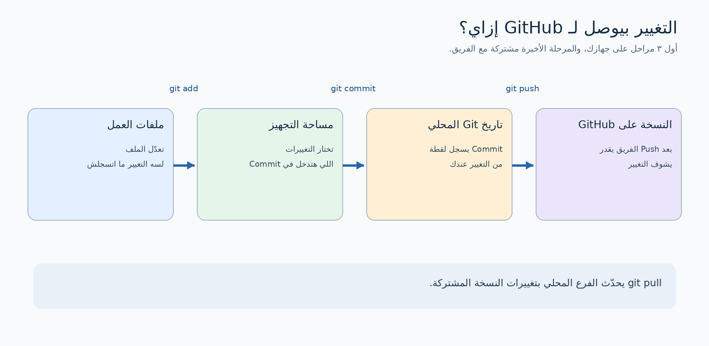
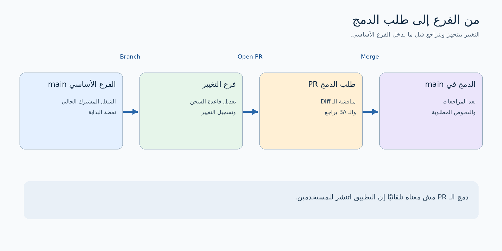
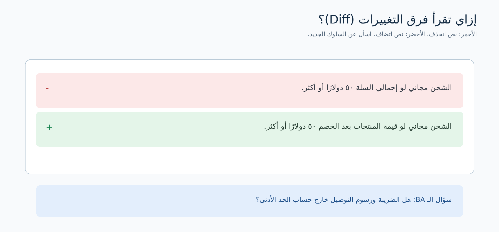

# Git وGitHub لمحلل الأعمال: توتوريال من البداية

## 1. الفكرة الأساسية

**التحكم في الإصدارات (Version Control)** بيحفظ تاريخ التغييرات اللي بتحصل للملفات. بكده الفريق يقدر يعرف: *إيه اللي اتغير؟ مين غيّره؟ ليه؟ والملف كان شكله إيه قبل التغيير؟* في مشاريع البرمجيات، من أشهر الأدوات المستخدمة **Git**.

**GitHub** موقع وخدمة بتستضيف مشروعات Git، وبتساعد الفريق يتعاون من خلال المهام والنقاشات والمراجعات. ببساطة: **Git هو النظام اللي بيسجل تاريخ الملفات؛ GitHub مكان يشارك فيه الفريق الملفات والتاريخ ده ويراجع التغييرات.** وممكن تستخدم Git من غير GitHub، وفيه خدمات تانية للاستضافة.

| حاجة الـ BA ممكن يحتاج يعملها | Git وGitHub يساعدوا إزاي؟ |
|---|---|
| يلاقي التوثيق الحالي | يفتح الملف على الفرع الأساسي للمشروع |
| يفهم تعديل جديد | يقرأ وصف طلب الدمج والتغييرات في الملفات |
| يسأل عن قاعدة عمل | يعلق على السطر المرتبط بها مباشرة |
| يتابع تنفيذ طلب | يشوف المهمة المرتبطة بالتغيير وهل اتدمج |
| يشير لنسخة بعينها | يستخدم رابطًا مربوطًا بتغيير محدد بدل رابط بيتغير محتواه |

## 2. مثال هنمشي عليه

تخيل فريقًا بيبني **تطبيق تسوق أونلاين**. المشروع موجود على GitHub في **مستودع (Repository أو Repo)**، يعني مكان ملفات المشروع وتاريخها. ضمن الملفات مستند نصي اسمه `docs/checkout-rules.md` فيه قواعد إتمام الطلب.

الفريق عايز يوضح قاعدة جديدة: «الشحن المجاني متاح لما قيمة المنتجات **بعد الخصم** تكون 50 دولار أو أكثر». المطور بيغير الكود والمستند في فرع منفصل. الـ BA بيراجع التغيير المقترح من خلال **طلب دمج (Pull Request - PR)**، ويسأل: هل الضريبة تدخل في حساب الـ 50 دولار؟

**مش لازم تفهم كل سطر كود.** ابدأ بوصف التغيير، وقاعدة العمل أو المتطلب المتغير، ومعايير القبول أو الاختبارات المرتبطة به.

## 3. المصطلحات اللي هتقابلها

| المصطلح | معناه ببساطة | مثال من التطبيق |
|---|---|---|
| **المستودع (Repository / Repo)** | ملفات المشروع ومعاها تاريخ تغييرات Git | مشروع تطبيق التسوق |
| **محلي (Local)** | نسخة على جهاز الشخص | نسخة المشروع على جهاز المطور |
| **بعيد أو مشترك (Remote)** | نسخة موجودة على خادم | مستودع الفريق على GitHub |
| **استنساخ (Clone)** | تنزيل نسخة للعمل ومعاها تاريخ Git ورابط النسخة المشتركة | نسخ المستودع على جهازك |
| **ملفات العمل (Working Files)** | الملفات اللي بتتعدل قبل تسجيل التغيير في تاريخ Git | ملف قواعد الشراء أثناء تعديله |
| **مساحة التجهيز (Staging Area)** | اختيار التغييرات اللي هتدخل في التسجيل القادم | تجهيز تعديل المستند المقصود فقط |
| **تسجيل تغيير (Commit)** | تسجيل لقطة من التغييرات المجهّزة مع رسالة ومعرّف | «توضيح حد الشحن المجاني» |
| **فرع (Branch)** | مسار عمل منفصل يبدأ من نقطة محددة | `docs/free-shipping-rule` |
| **الفرع الأساسي (`main`)** | اسم شائع للفرع الرئيسي؛ فريقك ممكن يستخدم اسمًا آخر | الفرع المشترك الحالي |
| **رفع التغييرات (Push)** | إرسال التسجيلات المحلية للنسخة المشتركة | نشر الفرع على GitHub |
| **جلب وتطبيق التحديثات (Pull)** | تحديث الفرع المحلي بتغييرات النسخة المشتركة | تحديث نسختك قبل الشغل |
| **فرق التغييرات (Diff)** | مقارنة توضح السطور المحذوفة والمضافة | نص قاعدة الشحن قبل وبعد |
| **طلب دمج (Pull Request / PR)** | طلب لمراجعة فرع ثم دمجه في فرع آخر | اقتراح تعديل القاعدة والكود |
| **دمج (Merge)** | إدخال تغييرات فرع في الفرع المستهدف | إضافة التغيير المراجع إلى `main` |

**افتكر الفرق:** الـ Commit بيسجل التغيير **محليًا**، لكنه لوحده ما بيرفعوش إلى GitHub. الـ Push بينشره. أما الـ Pull Request فهو نقاش ومراجعة قبل الدمج، ومش هو أمر `git pull`.

## 4. التغيير بيوصل لـ GitHub إزاي؟



الخطوات المعتادة:

1. **تعدّل** ملفًا في نسختك المحلية.
2. **تجهّز** التغييرات المطلوبة بأمر `git add`.
3. **تسجلها** في تاريخ Git المحلي بأمر `git commit`.
4. **ترفع** الفرع إلى GitHub بأمر `git push`.
5. لما تحتاج تحدّث نسختك المحلية من التغييرات المشتركة، تستخدم `git pull`.

تخيل مساحة التجهيز كأنها **طاولة بتحط عليها الملفات اللي هتدخل في الطرد القادم**. الـ Commit بيسجل محتوى الطرد محليًا، والـ Push بينشره للفريق. ده تشبيه لتسهيل الفهم؛ الملفات تفضل قابلة للتعديل بعد الـ Commit.

## 5. ليه الفريق بيستخدم الفروع (Branches)؟

**الفرع (Branch)** بيسمح لشخص يجهز تغييرًا ويجربه من غير ما يغير الفرع الأساسي فورًا. ممكن يعمل أكتر من Commit على فرعه، وبعدها يقترح النتيجة للمراجعة.



في مثالنا، المطور بيعمل فرعًا اسمه `docs/free-shipping-rule`، ويعدّل القاعدة والكود، وبعدها يفتح PR باتجاه `main`. الـ BA وباقي المراجعين يناقشوا التغيير. بعد اكتمال المراجعات والفحوص المطلوبة، شخص مخوّل يعمل Merge. الفريق ممكن يحذف الفرع المؤقت بعد كده؛ تاريخ التغييرات المدمجة يفضل موجودًا.

**النسخة المتفرعة (Fork)** حاجة مختلفة: هي نسخة مستقلة من المستودع تحت حساب أو جهة أخرى، وغالبًا تُستخدم لما المساهم ما عندوش صلاحية تعديل المستودع الأصلي. كبداية، ركز على فهم الـ Branch والـ PR.

## 6. الـ BA يراجع Pull Request إزاي؟

على GitHub افتح المستودع واختار **Pull requests**. غالبًا هتلاقي وصف الطلب، وتبويبات **Conversation** و**Commits** و**Files changed**. شكل الشاشة ممكن يتغير، لكن وظيفة كل جزء هي الأهم.

| المكان | راجع إيه؟ |
|---|---|
| عنوان ووصف الـ PR | إيه المشكلة اللي بيتحلّها؟ وهل فيه Issue أو متطلب مرتبط؟ |
| **Files changed** | إيه السلوك أو النص أو الاختبارات اللي اتغيرت؟ |
| **Conversation** | إيه الأسئلة والقرارات اللي اتناقشت؟ |
| حالة الفحوص والمراجعات | هل المراجعات والفحوص المطلوبة اكتملت؟ |

**فرق التغييرات (Diff)** بيعرض عادة السطر المحذوف باللون الأحمر وعلامة `-`، والسطر المضاف بالأخضر وعلامة `+`:

```diff
- Free shipping applies when the basket total is at least $50.
+ Free shipping applies when the basket subtotal after discounts is at least $50.
```



**تعليق مفيد من الـ BA:** «هل قيمة الـ 50 دولار لا تشمل الضريبة ورسوم التوصيل؟ ممكن نضيف مثالًا لسلة قيمتها 55 دولارًا وعليها خصم 10 دولارات؟» السؤال يحدد غموضًا في القاعدة ويقترح حالة قابلة للاختبار. تعليق زي «ده غلط» وحده مش كفاية علشان الفريق يعرف المطلوب.

المراجعة على GitHub ممكن تكون **تعليق (Comment)**، أو **موافقة (Approve)**، أو **طلب تعديلات (Request changes)**. وافق رسميًا فقط لو الدور ده ضمن مسؤولياتك في الفريق. وافتكر: دمج الـ PR يعني إن التغيير دخل الفرع المستهدف؛ مش بالضرورة إنه نزل للمستخدمين.

## 7. شغل تقدر تعمله من موقع GitHub فقط

مش لازم تثبّت Git علشان تبدأ:

1. **اقرأ المشروع:** افتح صفحة المستودع، واختار الفرع الصحيح من قائمة الفروع، ثم افتح `README.md` أو ملف التوثيق.
2. **شوف تاريخ ملف:** افتح الملف وابحث عن **History** لمعرفة التعديلات السابقة. لو هتشارك رابطًا للنسخة اللي شفتها بالضبط، استخدم رابطًا ثابتًا مربوطًا بـ Commit.
3. **تابع الشغل:** افتح **Issue** لتسجيل مشكلة أو سؤال أو اقتراح، لو دي طريقة الفريق. اربطه بمتطلب أو معيار قبول.
4. **راجع PR:** اقرأ الهدف، افتح **Files changed**، واكتب تعليقًا على السطر المناسب، ثم تابع الرد.
5. **اقترح تعديلًا صغيرًا في التوثيق:** لو عندك صلاحية، عدّل ملف Markdown من الموقع، واحفظ التغيير على فرع جديد، وافتح PR حسب قواعد الفريق.

**Issue ولا PR؟** الـ Issue توثق حاجة محتاجة نقاشًا أو تنفيذًا. الـ PR تقترح تغييرات محددة في الملفات. غالبًا الفريق بيربط الاتنين، لكن كل واحد له دور مختلف.

## 8. الأوامر الأساسية: للقراءة والفهم

تقدر تتعلم من موقع GitHub أو GitHub Desktop. الأوامر دي علشان تفهم كلام الفريق؛ جرّبها فقط على مستودع عندك صلاحية عليه وبعد معرفة طريقة الفريق.

```bash
git clone <repository-url>                # تنزيل نسخة محلية بتاريخ Git
cd <repository-folder>
git switch main                         # الانتقال إلى الفرع الأساسي
git pull                                # تحديث الفرع المحلي
git switch -c docs/free-shipping-rule   # إنشاء فرع جديد والانتقال إليه
# عدّل docs/checkout-rules.md في محرر نصوص
git status                              # عرض حالة الملفات والفرع
git diff                                # معاينة التغييرات غير المجهّزة
git add docs/checkout-rules.md          # تجهيز الملف للتسجيل
git commit -m "Clarify free-shipping threshold"
git push -u origin docs/free-shipping-rule
# افتح Pull Request على GitHub
```

`<repository-url>` و`<repository-folder>` **أماكن تضع فيها قيمك الحقيقية**، ومش أوامر تنسخها كما هي. المثال بيفترض إن الفرع الأساسي اسمه `main` وإن النسخة المحلية ما فيهاش تغييرات غير محفوظة قبل `git pull`. لو فريقك عنده أسماء أو قواعد صلاحيات مختلفة، اتبعها.

**ابدأ دائمًا بفهم `git status`:** بيقولك إنت على أي فرع، وهل عندك تغييرات محلية. `git diff` بيوريك *إيه* اللي اتغير قبل التسجيل. والجزء `-u origin` في أول Push بيربط الفرع المحلي بالفرع المقابل له في النسخة المشتركة.

## 9. فروق كتير بتتلخبط على المبتدئين

| المصطلحان | الفرق السريع |
|---|---|
| **Git وGitHub** | Git يسجل تاريخ الملفات؛ GitHub يستضيف المستودعات ويسهّل التعاون والمراجعة. |
| **Commit وPush** | Commit يسجل محليًا؛ Push ينشر التسجيلات للنسخة المشتركة. |
| **Pull وPull Request** | `git pull` يحدّث فرعك المحلي؛ PR طلب مراجعة ودمج على GitHub. |
| **Branch وFork** | Branch مسار عمل داخل المستودع؛ Fork نسخة مستقلة تحت مالك آخر. |
| **Clone وتنزيل ZIP** | Clone يجيب تاريخ Git والاتصال بالنسخة المشتركة؛ ZIP لقطة من الملفات فقط. |
| **Merge وDeploy** | Merge يدخل التغيير في فرع؛ Deploy ينشر البرنامج في بيئة تشغيل، وهي خطوة أخرى. |
| **Commit ID وVersion label** | الأول يحدد لقطة Git بعينها؛ `v1.0` اسم إصدار يختاره الفريق أو Tag لو مستخدم. |

**تعارض الدمج (Merge Conflict)** يحصل لما Git ما يقدرش يركب تغييرات معينة تلقائيًا، وغالبًا لأن شخصين عدّلوا نفس السطور. وقتها لازم شخص يحدد النص النهائي. الـ BA ممكن يساعد في توضيح قاعدة العمل المقصودة، حتى لو المطور هو اللي يحل التعارض في الملف.

## 10. عادات مفيدة للـ BA في مشروع برمجي

- اقرأ **هدف الـ PR والـ Diff** قبل ما تحكم على تفاصيل التنفيذ.
- اسأل عن السلوك بأمثلة: المدخلات، النتائج، الحالات الاستثنائية، ومعايير القبول.
- اربط الـ Issues والمتطلبات والـ PRs علشان سبب التغيير يبقى واضحًا.
- لما تشير إلى ملف، تأكد من **الفرع والـ Commit**؛ رابط `main` ممكن يعرض محتوى مختلفًا لاحقًا.
- ما تحطش بيانات عملاء أو كلمات مرور أو مفاتيح API أو ملفات سرية في المستودع إلا وفق سياسة الفريق المعتمدة.
- Git بيعرض فروق السطور بوضوح في الملفات النصية مثل `.md` والكود. ممكن تخزن Word أو PDF فيه، لكن مراجعة الفرق بين النسخ أصعب.
- اعرف مين عنده صلاحية **Approve وMerge**؛ مراجعة الـ BA مهمة، لكن الصلاحيات والمسؤوليات بتختلف من فريق للتاني.

## 11. تمرين من غير ما تكتب كود

افتح PR في مشروع مسموح لك تشوفه، أو اطلب من فريقك مثالًا للتدريب. جاوب عن الأسئلة دي:

1. الـ PR جاي من **أي فرع** ورايح إلى **أي فرع**؟
2. إيه المشكلة أو الـ Issue المرتبطة به؟
3. أي ملف وسطر بيوضحوا السلوك الجديد؟
4. إيه الاختبارات أو الأمثلة اللي تثبت السلوك؟
5. إيه السؤال اللي هتسأله قبل ما توافق على نتيجة التغيير من منظور العمل؟

**إجابة نموذجية من مثال التسوق:** «الوصف بيقول إن الخصومات بتأثر على الشحن المجاني. هل الحساب بيستخدم المجموع قبل الضريبة؟ ياريت نضيف اختبارًا لسلة قيمتها 55 دولارًا وخصم 10 دولارات».

## مراجع للتوسع

- [GitHub Docs: ما هو Git وعلاقته بـ GitHub؟](https://docs.github.com/en/get-started/using-git/about-git)
- [GitHub Docs: البداية مع Git](https://docs.github.com/en/get-started/learning-to-code/getting-started-with-git)
- [Git Book: تسجيل التغييرات ومساحة التجهيز](https://git-scm.com/book/en/v2/Git-Basics-Recording-Changes-to-the-Repository)
- [GitHub Docs: طلبات الدمج](https://docs.github.com/en/pull-requests/get-started/about-pull-requests)
- [GitHub Docs: مراجعة التغييرات المقترحة](https://docs.github.com/en/pull-requests/how-tos/review-pull-requests/reviewing-proposed-changes-in-a-pull-request)
