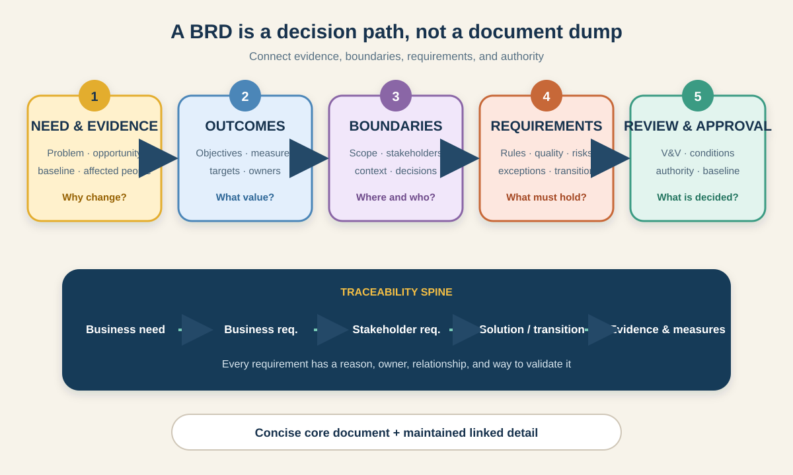

# How to Write a BRD: A Practical Guide for Business Analysts

A **Business Requirements Document (BRD)** organizes the business reason for a change, the outcomes it must achieve, the boundaries people are agreeing to, and the requirements and evidence needed to make a decision. Its job is not to become the largest document in the project. Its job is to create shared, reviewable understanding.

There is no single universal BRD structure. Some organizations use a formal signed document; others use a connected set of pages, models, and requirement records. The International Institute of Business Analysis (IIBA) treats requirements as usable representations of needs that may appear in documents, matrices, diagrams, or other artifacts. Confirm your local template, approval authority, and level of detail before you write.



This tutorial uses one illustrative scenario: a grocery retailer wants to introduce **click-and-collect**, allowing customers to order online and collect from selected stores. The data, rules, targets, roles, and constraints below are teaching assumptions—not universal retail facts.

## 1. Define the BRD's decision and audience

Do not start by filling every heading in a template. First state the decision the BRD must support.

```text
Decision: Approve, reject, or revise the first click-and-collect release for three pilot stores.
Primary readers: sponsor, retail operations, e-commerce, store managers, finance, risk, delivery team.
Approval authority: sponsor approves business scope and funding; Operations approves store process and capacity rules.
Document owner: Business Analyst.
Review point: before solution option selection and delivery planning.
```

Ask these questions before drafting:

- Is the BRD approving a problem, an investment, a scope, a set of business requirements, or all four?
- Which decisions belong elsewhere—for example, architecture, interface design, procurement, or release planning?
- Is one document required, or may detailed models and requirements be linked from a concise core?
- Who reviews, who recommends, and who has authority to approve?
- What versioning and change-control rules apply after approval?

**Common mistake:** writing for “all stakeholders.” Different readers need different depth. Keep the central decision visible, then link supporting detail rather than forcing every audience into one long narrative.

## 2. Write the executive summary last—but discover it first

The executive summary should explain the initiative in a page or less. Draft its facts early, but finalize it after the analysis is coherent.

### Example executive summary

> Customers in three pilot areas currently depend on home delivery. An illustrative baseline shows that missed delivery attempts and slot constraints create avoidable support contacts and redelivery work. The proposed change will let eligible customers place prepaid grocery orders online and collect them from a selected pilot store within an agreed pickup window. The first release excludes cash payment, walk-in ordering, and collection from non-pilot stores. Success will be evaluated through adoption, ready-on-time performance, uncollected orders, support contacts, and customer feedback. Approval is requested for the pilot business scope, operating model, and discovery of solution options—not for a final interface design.

A useful summary answers:

1. What problem or opportunity exists?
2. What evidence supports it?
3. Who is affected?
4. What outcome and business capability are proposed?
5. What is explicitly inside and outside the decision?
6. What approval is requested now?

Avoid claims such as “customers need this” without a source. Separate observed evidence, stakeholder opinion, assumption, and proposed target.

## 3. Turn the problem into objectives and measures

An objective describes the business result, not the feature being built. “Launch a pickup screen” is an output. “Offer a reliable alternative to home delivery” is closer to an outcome.

| Objective | Measure | Illustrative baseline | Illustrative pilot target | Source and owner |
|---|---|---:|---:|---|
| Provide a usable alternative to home delivery | Percentage of eligible online orders using collection | 0% | At least 8% after 12 weeks | Order analytics; Product Analyst |
| Protect fulfilment reliability | Orders ready by pickup-window start | Not available | At least 95% | Store operations events; Operations Lead |
| Limit operational waste | Uncollected orders after the grace period | Not available | Below 4% | Collection status report; Store Manager |
| Reduce avoidable assistance | Collection-related contacts per 100 collection orders | Not available | Establish baseline, then reduce by 15% | Support tags; Support Lead |

Targets should be challenged for feasibility and ownership. When no baseline exists, the BRD can require measurement before promising improvement.

**BA action:** trace each objective to at least one requirement and each measure to a defined data source, frequency, and owner.

## 4. Draw the scope boundary

Scope is clearer when it describes capabilities, process stages, locations, users, and exclusions—not only a feature list.

| Dimension | In scope for the pilot | Out of scope / later |
|---|---|---|
| Customers | Registered retail customers in eligible postcodes | Guest checkout and business accounts |
| Locations | Three named pilot stores | Other stores and third-party pickup points |
| Orders | Prepaid grocery orders from the existing online catalogue | Cash at collection and in-store walk-in orders |
| Process | Select store and window, reserve capacity, prepare, notify, verify, hand over, close order | Home-delivery changes and cross-store transfer |
| Operations | Store capacity, picking queue, exception handling, uncollected-order process | New warehouse network design |
| Time | Pilot preparation and 12-week evaluation | National rollout |

Add a small context view:

```text
Customer app / website
        |
        v
Online ordering ---- Payment service
        |
        v
Store capacity ---- Picking queue ---- Collection desk
        |
        v
Notifications and operational reporting
```

The diagram exposes interfaces and owners without prescribing technical architecture. If the proposal later adds same-day courier delivery from the store, treat it as a scope change, not a hidden BRD detail.

## 5. Identify stakeholders, decisions, and conflicts

A stakeholder list is not enough. Record what each party contributes and what they can decide.

| Stakeholder | Need or concern | Contribution | Decision authority |
|---|---|---|---|
| Sponsor | Value, cost, risk, strategic fit | Funding boundary and expected outcomes | Pilot investment and business scope |
| Store Operations | Capacity, workload, safety, exceptions | Current process and workable operating rules | Store process and staffing policy |
| Customers | Clear eligibility, reliable readiness, accessible collection | Research and usability evidence | No formal approval; needs must be represented and validated |
| Finance | Payment, refunds, shrinkage, reconciliation | Financial controls and reporting needs | Financial-control acceptance |
| Risk / Compliance | Identity, privacy, food handling, audit | Applicable obligations and evidence | Approval within assigned policy authority |
| Delivery Team | Feasibility, dependencies, quality constraints | Solution options and delivery evidence | Technical estimates and implementation approach |

Surface conflicts rather than averaging them away. Operations may want early cutoff times; customers may want flexibility; Product may want adoption. Record the trade-off, evidence, owner, and decision.

## 6. Describe the current state and future capability

The BRD should show what changes in the business, not only what software appears.

### Current-state problem

- all eligible online orders are configured for home delivery;
- stores do not publish collection capacity;
- staff have no standard collection queue or handover status;
- support handles delivery-alternative requests manually; and
- reporting cannot separate collection demand, readiness, and failed handovers.

### Future-state capability

Customers can choose an eligible store and pickup window. The business reserves capacity, prepares the order, communicates readiness, verifies the collector, records handover, handles expiry or failure, and measures the pilot.

Map at least the normal, alternative, and failure paths:

```text
Choose store and window
  -> reserve capacity
  -> authorize payment
  -> prepare order
  -> notify ready
  -> verify collector
  -> hand over and close

Alternatives / failures:
  no capacity | payment failure | unavailable item | late preparation
  collector cannot be verified | customer does not collect | system unavailable
```

**Common mistake:** documenting the future happy path while leaving the operating exception to “the business.” Exception handling is part of the business change and often creates requirements, roles, training, and cost.

## 7. Write traceable requirements at the right level

A BRD usually emphasizes business and stakeholder requirements. Depending on local practice, it may also summarize high-level solution and transition requirements or link to them elsewhere. Keep categories clear.

| ID | Type | Requirement | Rationale / trace |
|---|---|---|---|
| BR-01 | Business | The pilot shall provide a store-collection option for eligible online grocery orders in the three approved stores. | Supports alternative fulfilment objective |
| BR-02 | Business | The pilot shall produce evidence on adoption, readiness, uncollected orders, support demand, and customer feedback. | Supports pilot decision after 12 weeks |
| STK-01 | Stakeholder | Customers need to know whether a store and pickup window remain available before confirming the order. | Prevents false commitment and rework |
| STK-02 | Stakeholder | Store colleagues need a prioritized queue showing orders due for each collection window. | Supports ready-on-time objective |
| SOL-01 | High-level solution | The solution shall prevent confirmation when store capacity is no longer available. | Derives from STK-01 and capacity constraint |
| QLT-01 | Quality | The collection journey shall meet the organization's agreed accessibility and response-time criteria. | Supports usable access; detailed criteria linked separately |
| TRN-01 | Transition | Pilot-store colleagues shall complete role-based process training before launch. | Enables safe movement to future state |

Good requirement statements are necessary, feasible, unambiguous enough for their purpose, consistent, testable at the appropriate level, and traceable to a need. Do not hide multiple obligations inside one sentence.

Avoid premature design:

- Weak: “Add a green pickup button beside delivery.”
- Better stakeholder need: “Customers need to compare eligible fulfilment options before confirming an order.”
- Possible linked design question: “Would tabs, cards, or another control make the options easiest to understand?”

The better statement protects the need while allowing the design to be tested.

## 8. Record rules, quality, transition, and decision uncertainty

Business requirements alone rarely make the change operable. Add or link the information that constrains them.

### Illustrative business rules

- BRULE-01: only pilot stores with remaining collection capacity may be offered;
- BRULE-02: a collection reservation expires if payment authorization is not completed within the configured hold period;
- BRULE-03: the collector must satisfy the approved identity-check policy before handover; and
- BRULE-04: an uncollected order follows the approved food-safety, refund, and stock-disposition process.

The hold period and identity method are **open decisions** until their owners approve them. Do not invent a number or control merely to make the document look complete.

### RAID and decision log

| Kind | Example | Owner | Response or decision date |
|---|---|---|---|
| Risk | Collection demand may overload the picking queue at peak times | Operations Lead | Simulate capacity and define pilot limits before approval |
| Assumption | Existing payment authorization can support the reservation flow | Finance Product Owner | Confirm through service walkthrough by 9 Oct |
| Issue | Pilot store 2 has no secure waiting area | Store Manager | Propose layout or remove store from pilot by 11 Oct |
| Dependency | Notification service must support readiness and expiry messages in Arabic and English | Messaging Owner | Confirm capability and lead time by 8 Oct |
| Open decision | Identity check: order code, ID, or both? | Risk Owner | Decide after fraud and accessibility review by 10 Oct |

Also consider security, privacy, accessibility, performance, audit, reporting, localization, support, training, data migration, business continuity, and monitoring. Record “not applicable” only after review.

## 9. Verify, validate, approve, and maintain the BRD

Before approval, run two different checks:

- **Verification:** Is the BRD clear, consistent, complete enough for its purpose, correctly structured, and traceable?
- **Validation:** Do the objectives, boundaries, and requirements represent the real business and stakeholder needs and support value?

Use focused reviewers. Customers or research evidence validate the journey need; Operations validates store process; Finance validates controls; the delivery team checks feasibility; the sponsor validates investment alignment.

Record outcomes explicitly:

| Review item | Evidence | Decision | Owner / follow-up |
|---|---|---|---|
| Pilot scope | Store capacity workshop and context model | Revise: remove store 2 unless secure area is solved | Operations, 11 Oct |
| Customer eligibility | Policy examples and prototype feedback | Approved for registered customers only | Product Owner |
| Success measures | Analytics field review | Approved with new readiness event | Product Analyst |
| Uncollected-order rule | Finance and food-safety review | Open | Finance and Compliance, 10 Oct |

Approval does not freeze learning. It creates a known baseline. After approval, classify new information as clarification, corrected assumption, requirement change, defect correction, or design decision; then apply the agreed impact and approval process.

## 10. Completed one-page BRD summary

```text
Title: Click-and-Collect Pilot BRD
Decision requested: Approve the business scope and operating model for a three-store pilot.

Problem and evidence:
Home delivery is the only online fulfilment option in the pilot areas. Illustrative
support and delivery data indicate avoidable failed attempts, contacts, and redelivery work.

Outcome:
Eligible customers can collect prepaid grocery orders reliably from an approved store.

Measures:
Adoption; ready-on-time rate; uncollected-order rate; support contacts per 100 orders;
customer feedback. Baselines and owners are recorded in the measurement plan.

In scope:
Registered customers, existing online catalogue, prepaid orders, three candidate stores,
capacity reservation, preparation, notifications, identity check, handover, exceptions,
training, monitoring, and 12-week evaluation.

Out of scope:
Cash payment, guest checkout, non-pilot locations, third-party points, national rollout,
and changes to home-delivery routing.

Key requirements:
BR-01 pilot collection capability; BR-02 pilot evidence; STK-01 visible availability;
STK-02 store queue; SOL-01 capacity protection; QLT-01 quality criteria; TRN-01 training.

Key risk / open decision:
Peak workload; secure waiting area at store 2; payment-flow compatibility; identity method;
uncollected-order policy; bilingual messaging lead time.

Recommendation:
Approve stores 1 and 3 for solution-option analysis. Keep store 2 conditional. Do not
approve launch until the uncollected-order rule, identity control, and measurement events
have owners and accepted evidence.
```

## 11. Reusable BRD template

```text
Document title, ID, owner, version, status, and date:
Decision requested and approval authority:
Audience and linked artifacts:

1. Executive summary
2. Problem / opportunity and evidence
3. Business context and current state
4. Objectives, outcomes, baselines, targets, data sources, and owners
5. Scope: in / out / boundaries / context diagram
6. Stakeholders, needs, concerns, and decision rights
7. Future-state capability and process, including exceptions
8. Business requirements
9. Stakeholder requirements
10. High-level functional and quality requirements, or links to them
11. Business rules and constraints
12. Data, integration, reporting, audit, security, privacy, accessibility, and localization
13. Transition, operations, support, training, and continuity
14. Assumptions, risks, issues, dependencies, and open decisions
15. Traceability to objectives, measures, models, and validation evidence
16. Options considered and recommendation
17. Review findings, approvals, conditions, and change-control route
18. Glossary, references, appendices, and revision history
```

Delete sections that do not help the decision, but record why significant concerns are not applicable or are managed elsewhere. A concise BRD with maintained links is stronger than a comprehensive-looking document full of stale copies.

### Quick exercise

Extend the click-and-collect BRD to allow **another person to collect the order**. Write one objective impact, one scope decision, two stakeholder requirements, two business rules, one privacy or fraud risk, one exception path, and the evidence needed for approval. Identify which details belong in the BRD and which should be linked to a later solution or design artifact.

## Further reading

- [IIBA: Understanding Requirements and Designs](https://www.iiba.org/knowledgehub/the-business-analysis-standard/4-implementing-business-analysis/4-4-understanding-requirements-and-designs/)
- [IIBA: Free Business Requirements Document template](https://go.iiba.org/free-download-business-requirement-document-BRD-template)
- [IIBA: BABOK glossary](https://www.iiba.org/career-resources/a-business-analysis-professionals-foundation-for-success/babok/glossary/)
- [PMI: Professional Requirements Management](https://www.pmi.org/learning/library/project-requirements-management-process-groups-6599)

*The example baselines, targets, policies, dates, roles, stores, and requirements are illustrative. Follow your organization's terminology, document controls, regulatory obligations, and approval process.*
