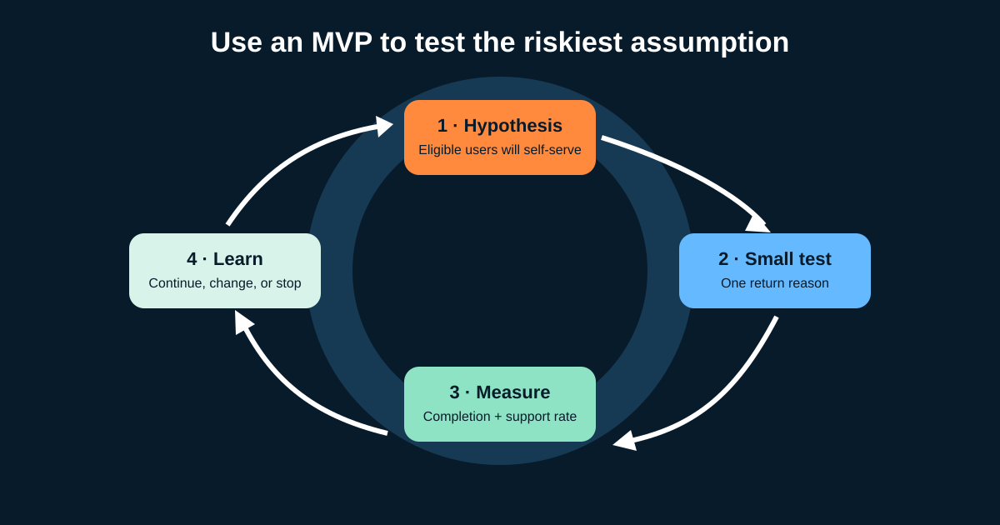

# MVP Thinking and Product Metrics for Business Analysts

A **Minimum Viable Product (MVP)** is the smallest responsible way to test an important product assumption with real evidence. It is not “version one with every requested feature,” and it is not permission to release unsafe, inaccessible, or unreliable work.

For a Business Analyst (BA) or Product Owner (PO), MVP thinking connects five things: the problem, the riskiest assumption, the smallest useful test, the measure, and the decision that follows.



## 1. Frame a hypothesis, not a feature wish

Illustrative online-shop problem: many customers contact support to ask how to return eligible items.

```text
We believe that eligible customers will start returns successfully without support
if the product explains eligibility and produces a clear reference number.

We will know this is supported when, for the agreed eligible population,
completion increases and avoidable support contacts decrease without increasing
duplicate requests, policy exceptions, or refund complaints.
```

Separate what is known from what is assumed:

| Statement | Status | Evidence needed |
|---|---|---|
| “How do I return?” is a common contact reason | To be confirmed | Categorized support baseline |
| Customers understand eligibility language | Assumption | Usability test and failure data |
| One courier can support the pilot | Dependency | Integration and operations confirmation |
| Fewer contacts will lower cost | Hypothesis | Cost model plus observed volume change |

## 2. Choose the minimum responsible test

An MVP is “minimum” relative to the learning goal. Options include a clickable prototype, concierge/manual service, limited pilot, landing page, or working product slice.

For returns, a responsible first product slice might include:

- logged-in domestic customers;
- one delivered item from standard returnable categories;
- one courier and the original payment method;
- a clear ineligible state, duplicate prevention, audit record, and support fallback; and
- analytics for attempts, outcomes, failures, and contacts.

It excludes exchanges, international orders, and damaged-item review for now. Those exclusions are visible, not silently forgotten.

**Non-negotiable quality:** privacy, security, legal obligations, accessibility, financial integrity, and safe recovery do not become optional because scope is small.

## 3. Build a metric tree from the outcome

Do not start with whatever the dashboard already contains.

| Level | Returns example |
|---|---|
| Business outcome | Reduce avoidable support cost while preserving trust |
| User outcome | Eligible customers complete a return request confidently |
| Product behavior | Start, eligibility pass, confirm, receive reference |
| Operational result | Courier booking and refund follow-up succeed |
| Guardrails | Duplicate rate, complaints, policy overrides, accessibility failures |

A **KPI (Key Performance Indicator)** is a metric selected as important to an objective. Not every metric is a KPI, and a KPI needs an owner, definition, source, cadence, and action threshold.

## 4. Define metrics so two analysts get the same answer

### Conversion rate

```text
Eligible return completion rate
= eligible sessions that created one return request
  ÷ eligible sessions that started the return flow
```

Define “eligible,” “session,” time window, duplicate handling, bots/internal users, and late events.

### Churn or abandonment

For a subscription product, **customer churn rate** commonly means customers lost during a period divided by customers at the start. For this journey, “abandonment” is clearer:

```text
Return-flow abandonment rate
= eligible starts with no request within 24 hours
  ÷ eligible return-flow starts
```

Do not call every drop-off “churn.” Choose language that matches the business event.

### Operational and guardrail measures

- courier booking success rate;
- median and high-percentile time to reference;
- duplicate-request rate;
- contacts per 100 eligible attempts;
- manual policy-override rate; and
- complaint or accessibility-issue rate.

A fast conversion increase is not success if duplicates or refund complaints rise.

## 5. Establish a baseline and segments

Before release, record the current support-contact rate, eligible volume, and existing manual completion. Compare equivalent populations and periods.

Segment where it can explain action: device, product category, new/returning customer, language, courier, or error reason. Protect privacy and avoid tiny groups that can identify people.

Watch for denominator changes. If the eligibility rule changes midway, the rate may move even when user behavior does not. Record rule versions and release dates with the metric.

## 6. Decide in advance how evidence changes the plan

Example decision rules—illustrative, not benchmarks:

| Evidence after the pilot | Decision |
|---|---|
| Completion improves and guardrails remain acceptable | Expand to another category |
| Users fail at eligibility wording | Revise content and retest before expansion |
| Courier failures dominate | Fix integration or add recovery before adding features |
| Contacts do not fall despite completion | Investigate contact reasons and hypothesis |
| Privacy, financial, or policy control fails | Stop or restrict the pilot and correct the control |

Avoid declaring success from a small noisy sample. Agree on minimum observation time, volume, seasonality, and qualitative feedback with analytics and stakeholders.

## 7. Reusable MVP experiment brief

```text
Problem and evidence:
Target user and context:
Riskiest assumption:
Hypothesis:
Smallest responsible test:
Included / excluded scope:
Non-negotiable quality and controls:
Primary outcome metric and exact formula:
Baseline, source, and observation window:
Segments:
Guardrail and operational metrics:
Instrumentation and data owner:
Decision rules: continue / change / stop:
Approvers and review date:
```

### Quick exercise

Design an MVP for adding **exchange** after the return pilot. Name the riskiest assumption, one included slice, two exclusions, one outcome metric, two guardrails, and a decision that would stop expansion.

## Further reading

- [IIBA: Solution Evaluation](https://www.iiba.org/knowledgehub/the-business-analysis-standard/5-applying-business-analysis-tasks/5-3-business-analysis-knowledge-areas/solution-evaluation/)
- [IIBA: The Business Analysis Standard](https://www.iiba.org/knowledgehub/the-business-analysis-standard/)
- [Google HEART framework research paper](https://research.google/pubs/measuring-the-user-experience-on-a-large-scale-user-centered-metrics-for-web-applications/)

*All targets, formulas, windows, and decision rules are teaching examples. Validate metric definitions and statistical interpretation with product, analytics, finance, legal, and operations stakeholders.*
