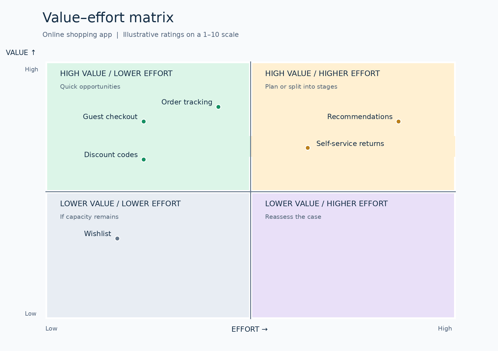

# Prioritization Techniques: A Practical Tutorial for Business Analysts

## 1. What is prioritization?

**Prioritization** is deciding what to do first and what can wait when time and resources are limited. For a **business analyst (BA)**, this means helping stakeholders make clear, justified decisions about **requirements** and **features**.

A priority should reflect more than who argues most strongly. Consider customer and business **value**, delivery **effort**, **urgency**, **dependencies**, and any legal or contractual obligations.

### Agree on four things before you start

1. **Decision scope:** Are you prioritizing the next release or the entire project?
2. **Items:** Compare requirements or features of similar size; split large items if necessary.
3. **Criteria:** What do “value” and “effort” mean here, and who can estimate them?
4. **Decision owner:** The BA facilitates and records the reasoning; the product owner or another authorized person approves the priority.

## 2. Practical example: an online shopping app

A retailer is preparing the first release of its app. Customers need to browse products, add items to a cart, pay, and receive order confirmation. The team is also considering guest checkout, order tracking, discount codes, a wishlist, self-service returns, and personalized recommendations.

**The question:** With limited capacity, what belongs in the first release, and in what order? We will apply four techniques to this example. Every number below is illustrative; a real project needs evidence and estimates from its team.

> **Important:** Settle what is essential for a usable product and what is legally, contractually, or securely required before scoring optional improvements by value and effort.

## 3. MoSCoW: What must the release include?

**MoSCoW prioritization** groups work into four categories for a **specific release or time period**. The categories communicate delivery expectations; they are not permanent labels.

| Category | Practical meaning | Shopping app example |
|---|---|---|
| **Must Have** | The release is not viable without it | Cart, secure payment, and order confirmation |
| **Should Have** | Important, but the release can work temporarily without it | Order tracking and guest checkout |
| **Could Have** | Valuable if capacity permits; omitting it does not stop release | Discount codes and wishlist |
| **Won’t Have this time** | Intentionally deferred, not rejected forever | Personalized recommendations |

**Ask in the workshop:** “If this is not ready at launch, would we stop the release?” A well-founded “yes” suggests a Must Have. If a workable temporary alternative exists, consider Should Have or Could Have. Avoid classifying everything as Must Have, and specify whether the category applies to this release or the whole project.

**Use it when:** You need a shared decision about the scope of a time-limited release. **Limitation:** Categories do not order items *within* a category or measure effort.

## 4. Value–effort matrix: Where are the quick opportunities?

A **value–effort matrix** plots expected value against implementation effort. Agree on a consistent scale, such as 1–10: a higher number means greater value or greater effort. Relative scores help comparison; they are not promises about delivery time or financial returns.

| Feature | Value / 10 | Effort / 10 | Reason |
|---|---:|---:|---|
| Guest checkout | 8 | 3 | Removes steps from checkout |
| Order tracking | 9 | 5 | Reduces uncertainty and support queries |
| Discount codes | 6 | 3 | Supports marketing campaigns |
| Wishlist | 4 | 2 | Useful, with less impact at launch |
| Self-service returns | 7 | 6 | Improves service but needs operational integration |
| Personalized recommendations | 7 | 8 | Potential value, with more data and complexity |



| Position | Initial response |
|---|---|
| High value / low effort | Consider delivering early |
| High value / high effort | Plan carefully and look for smaller increments |
| Low value / low effort | Consider if capacity remains after more important work |
| Low value / high effort | Reassess the case or defer |

**Use it when:** Business and delivery teams need a quick visual discussion. **Limitation:** Different teams can mean different things by “value.” The matrix does not itself show how many users benefit, how urgent a feature is, or how reliable the estimates are.

## 5. RICE: How can you compare ideas with data?

**RICE scoring** combines four factors:

| Factor | Meaning | Example question |
|---|---|---|
| **Reach** | People or events affected in a **defined period** | How many customers per month? |
| **Impact** | Expected effect on the goal for each person reached | How substantial is the change? |
| **Confidence** | How strongly evidence supports the estimates | Do we have data or only assumptions? |
| **Effort** | Estimated work across the team | How many person-weeks? |

**Formula:**

```text
RICE = (Reach × Impact × Confidence) ÷ Effort
```

Keep the time period and effort unit consistent across items. Here, Reach means **customers per month**, Effort means **person-weeks**, and Impact uses Intercom’s scale: `3, 2, 1, 0.5, 0.25`. Express Confidence as a decimal: `80% = 0.8`.

| Feature | Reach / month | Impact | Confidence | Effort / person-weeks | RICE score |
|---|---:|---:|---:|---:|---:|
| Guest checkout | 800 | 2 | 0.8 | 3 | **426.7** |
| Order tracking | 500 | 2 | 0.9 | 5 | **180** |
| Personalized recommendations | 400 | 1 | 0.5 | 8 | **25** |

For example, **guest checkout = (800 × 2 × 0.8) ÷ 3 = 426.7**. Its higher score makes it a strong candidate **under these assumptions**. The score is not a monetary value and does not override a mandatory requirement. Improve weak estimates before making a consequential decision.

**Use it when:** You have several ideas and enough data to make comparisons useful. **Limitation:** Weak inputs produce misleading precision; a small effort estimate can inflate a score even when the feature has dependencies.

## 6. WSJF: When does delay matter?

**Weighted Shortest Job First (WSJF)** helps sequence work when delaying it has a cost or means missing an opportunity. In SAFe, it estimates **Cost of Delay (CoD)** and divides it by relative **Job Size**:

```text
WSJF = Cost of Delay ÷ Job Size
```

For a simplified workshop exercise, estimate CoD as the sum of three *relative* scores: user or business value, time criticality, and risk reduction or opportunity enablement. Apply the **same relative scale** to all items. These scores support comparison; they are not actual currency amounts.

| Feature | Value | Time criticality | Risk / opportunity | CoD | Job size | WSJF score |
|---|---:|---:|---:|---:|---:|---:|
| Guest checkout | 8 | 5 | 3 | 16 | 5 | **3.20** |
| Order tracking | 8 | 3 | 3 | 14 | 8 | **1.75** |
| Personalized recommendations | 5 | 1 | 2 | 8 | 13 | **0.62** |

For example, **guest checkout = (8 + 5 + 3) ÷ 5 = 3.20**. The result helps sequence competing work. Check dependencies and team capacity before turning the ranking into a delivery plan.

**Use it when:** You are comparing initiatives or features whose costs of delay differ meaningfully. **Limitation:** Estimating CoD and size takes discussion and may be excessive for a small list.

## 7. Which technique should you choose?

| Your main question | Start with | Then check |
|---|---|---|
| “What belongs in this release?” | MoSCoW | Capacity and dependencies |
| “Where are the quick wins?” | Value–effort matrix | The evidence behind value and effort |
| “Which ideas look strongest using our product data?” | RICE | Data quality and confidence |
| “Which work becomes costly if delayed?” | WSJF | Cost of delay and job size |

**You can combine methods:** Use MoSCoW to set the release boundary, then RICE or WSJF to compare optional items. Do not compare a **RICE number** directly with a **WSJF number**; they use different scales.

## 8. How to run a prioritization workshop

1. State the release goal, deadline, and available capacity.
2. Prepare clear requirements; split oversized items and separate the problem from a proposed solution where possible.
3. Identify obligations, dependencies, and what is essential for launch.
4. Agree on the method, scoring scale, and source of each estimate.
5. Score items with the product owner, business and technical experts, and user representatives as appropriate.
6. Discuss results that conflict with real constraints, then record the decision, rationale, and decision owner.
7. Revisit priorities when new evidence, scope, deadlines, or capacity change.

**BA prompts:** “What outcome does this feature support?” “Who benefits?” “What evidence do we have?” “What happens if we delay it?” “What must happen before it?” “Who approves the decision?”

## 9. Common mistakes

| Mistake | Better approach |
|---|---|
| Marking everything Must Have | Ask whether launch really fails without each item |
| Letting one person define value | Include user evidence, business data, and decision makers |
| Calculating precise scores from weak assumptions | State confidence and test the most important assumptions |
| Ignoring dependencies or obligations | Identify them before ranking optional work |
| Treating the ranking as final | Update it when goals, evidence, or capacity change |

## 10. Reusable template

| Requirement / feature | Intended outcome | Evidence / assumption | Required for launch? | Value | Effort | Time criticality | Dependencies | Method / score | Decision and rationale | Decision owner | Review date |
|---|---|---|---|---|---|---|---|---|---|---|---|
|  |  |  |  |  |  |  |  |  |  |  |  |

### Quick exercise

Pick **three features** from the shopping app example. Classify them using MoSCoW, then assess their value and effort. If the two methods suggest different orders, write down **why**: a launch deadline, weak evidence, or a dependency may explain it.

## Further reading

- [Agile Business Consortium: MoSCoW prioritization](https://www.agilebusiness.org/resource/what-is-moscow-prioritization/)
- [Intercom: The original RICE model](https://www.intercom.com/blog/rice-simple-prioritization-for-product-managers/)
- [Scaled Agile Framework: WSJF](https://framework.scaledagile.com/wsjf/)

*The shopping app categories and numerical estimates are teaching examples, not facts about an existing project.*
