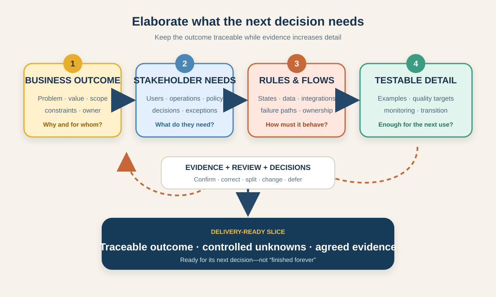

# Progressive Elaboration of Requirements for Business Analysts

Requirements rarely arrive complete. Early in an initiative, the team may know the business outcome but not every rule, exception, interface, or operational step. **Progressive elaboration** is the deliberate process of adding the right detail as knowledge and evidence grow.

It does not mean “leave everything vague until development starts.” It means keeping stable decisions visible, recording what is still unknown, and elaborating the nearest or riskiest work enough for the next decision. The International Institute of Business Analysis (IIBA) describes business analysis tasks as iterative activities that build knowledge, while Project Management Institute (PMI) material describes requirements analysis as moving from high-level requirements to lower levels of detail as more becomes known.



This tutorial uses one illustrative scenario: an online grocery shop wants customers to **reschedule a booked delivery slot** without contacting support. The roles, policies, times, systems, and measures are teaching assumptions, not universal retail rules.

## 1. Fix the anchors before adding detail

Progressive elaboration needs boundaries. Otherwise every new idea can masquerade as “more detail.” Start by agreeing the information that should remain stable until evidence or governance changes it.

| Anchor | Grocery example | BA question |
|---|---|---|
| Problem | Customers contact support when their chosen slot no longer works | What evidence shows the problem and who experiences it? |
| Outcome | Eligible customers can choose another available slot themselves | What observable change should users achieve? |
| Value measure | Fewer rescheduling contacts without increasing failed deliveries | How will we know the change helped? |
| Scope boundary | Existing paid orders before warehouse picking begins | Which orders, channels, and lifecycle states are included? |
| Constraint | A new slot must have delivery and picking capacity | Which rules or obligations cannot be ignored? |
| Decision owner | Operations owns capacity policy; Product owns release scope | Who can approve or change each anchor? |

These anchors are not immune to change. They are simply explicit. If the objective changes from “reschedule an order” to “edit items and address after payment,” that is not a small elaboration—it changes the need and deserves impact analysis.

**BA action:** label every statement as **confirmed**, **assumed**, **open**, or **out of scope**. A detailed assumption is still an assumption.

## 2. Elaborate through connected levels

Requirements can be expressed at different levels without forcing one rigid document hierarchy. The useful test is whether lower-level detail can be traced to a real need.

| Level | Rescheduling example | Evidence or reviewer |
|---|---|---|
| Business requirement | Reduce avoidable delivery-rescheduling contacts while protecting fulfilment performance | Support baseline, Operations lead, sponsor |
| Stakeholder requirement | A customer needs to see eligible alternative slots before confirming a change | Customer research, support cases |
| Solution requirement: behavior | The service shall return slots that satisfy capacity, location, and cutoff rules | Capacity policy owner, delivery team |
| Solution requirement: quality | Available slots should appear within the agreed response target under expected load | Performance evidence and service owner |
| Transition requirement | Support agents need guidance for orders that cannot be self-rescheduled | Support lead, training owner |
| Acceptance example | Given picking has not started and capacity exists, when the customer confirms a new slot, then one new reservation replaces the old one | Product, testing, operations |

The levels are connected, not merely written one after another. One business requirement may produce several stakeholder and solution requirements. A discovered exception may reveal a missing stakeholder or challenge the original scope.

**Common mistake:** replacing a high-level requirement instead of maintaining the relationship. Keep the outcome and link the detailed rule to it; this preserves the reason behind the rule.

## 3. Plan detail by decision horizon and risk

Not every requirement needs the same detail today. Use a simple horizon to decide where analysis effort belongs.

| Horizon | Needed detail | Example decision |
|---|---|---|
| **Now** — next delivery slice | Rules, scenarios, data, quality expectations, dependencies, acceptance evidence, unresolved blockers | Can the team implement rescheduling before picking begins? |
| **Next** — likely following slice | Clear outcome, major rules, options, risks, dependencies, discovery questions | Could rescheduling work after picking has started? |
| **Later** — candidate direction | Problem, value hypothesis, scope signal, major constraint | Should customers also change the delivery address? |

Bring a later item forward when it creates a decision dependency, long lead time, regulatory exposure, costly integration, or high uncertainty. Do not elaborate it just because somebody wants the backlog to look complete.

This is similar to **rolling-wave planning**: near-term work receives more detail while future work remains at an appropriate level. The BA still records enough future context to avoid local decisions that close valuable options.

**BA action:** give each item an **elaboration trigger**, such as “six weeks before target release,” “after the capacity API experiment,” or “when Legal confirms the cutoff policy.”

## 4. Use evidence loops, not document expansion

Elaboration should answer questions. Adding paragraphs without reducing uncertainty is documentation growth, not analysis.

For each pass, use this loop:

1. **Name the decision.** “Can a customer safely move an order after a driver route has been allocated?”
2. **Expose the gap.** Current systems do not share one definition of “allocation complete.”
3. **Choose a technique.** Map states with Operations, inspect event data, and prototype the customer message.
4. **Collect evidence.** Identify system events, policy limits, exception volumes, and user comprehension findings.
5. **Update connected artifacts.** Revise the state model, rules, examples, risks, and trace links.
6. **Review and decide.** Approve, split, investigate, defer, or reject; record the owner and date.

### Example discovery questions

- Which order state is authoritative: payment, warehouse, delivery, or customer-facing status?
- When is old capacity released and new capacity reserved?
- What happens if the old slot is released but the new reservation fails?
- Can promotional delivery fees change when the slot changes?
- Which notifications must be sent, in which language, and which one is the auditable confirmation?
- What should support see when the change is pending or partially failed?
- What response time and accessibility behavior make the journey usable?

The answer may create a requirement, a business rule, a model update, a design constraint, a risk response, or a decision to split the scope. Do not force every finding into a “The system shall…” sentence.

## 5. Separate elaboration from change and correction

Teams need a shared classification because each kind of movement has different governance.

| Movement | Example | Treatment |
|---|---|---|
| Elaboration within an agreed boundary | Define which capacity response counts as “slot available” | Add detail, trace it, and review with the right owner |
| Discovery that corrects an assumption | Support data shows most requests happen after picking starts | Update the assumption, reassess scope and value, record the evidence |
| Requirement change | Add delivery-address changes to the rescheduling journey | Assess value, impact, priority, dependencies, and approval |
| Defect correction | Two acceptance examples contradict the approved cutoff rule | Correct the inconsistency and re-verify affected artifacts |
| Design decision | Use a calendar or list to present slots | Record the rationale and validate usability; do not mislabel it as a business need |

A baseline does not prohibit learning. It identifies an approved reference point so people can see what changed. In a lightweight product team, version history and a recorded decision may be enough. A regulated or contractual initiative may require formal approval. Match control to risk and organizational policy.

**Warning:** “We are still elaborating” is not a safe excuse for silently expanding scope. If the outcome, boundary, cost, risk, agreement, or committed behavior changes, perform impact analysis and use the agreed approval route.

## 6. Decide when a slice has enough detail

“Complete requirements” is rarely a useful universal state. Ask whether this slice is ready for its next use—prioritization, design, estimation, implementation, testing, or approval.

For the first rescheduling slice, check:

- the user outcome and business value are traceable;
- in-scope order states and explicit exclusions are understood;
- business rules have owners and boundary examples;
- success, rejection, timeout, duplicate request, and partial-failure paths are covered;
- data sources and state ownership are identified;
- security, privacy, accessibility, performance, audit, and localization needs were considered;
- operational handling, monitoring, and support visibility are defined;
- acceptance examples are consistent with the flow and rules;
- remaining unknowns have owners, evidence plans, and decision dates; and
- impacted reviewers have verified quality and validated the intended value.

An item can be ready with a minor open question if the question will not change the current decision and has a controlled owner. A hidden dependency or unresolved policy conflict is different; it may block the slice or require it to be split.

## 7. Completed progressive elaboration record

| Pass | Known detail and evidence | Open item | Decision / next action |
|---|---|---|---|
| 1 — Outcome | Support contacts show customers need to move booked slots; objective and baseline agreed | Which order states are eligible? | Operations workshop; owner: BA; 6 Oct |
| 2 — Boundaries | First release covers paid orders before picking; address and item edits excluded | Exact cutoff and capacity source | Policy review plus API walkthrough; owners: Operations and Integration |
| 3 — Behavior | Search alternative slots → hold new slot → confirm change → release old slot | Atomic swap unavailable in current service | Add pending state and recovery path; architecture decision recorded |
| 4 — Examples | Success, no capacity, cutoff passed, duplicate submit, timeout, and recovery examples reviewed | Arabic notification wording | Content review with Support and Localization |
| 5 — Readiness | Rules, state model, acceptance examples, monitoring, and support path pass V&V | None blocking first slice | Ready for team sizing and implementation planning |

Notice what the record preserves: the outcome, new evidence, open questions, owners, and decisions. It does not pretend the last version existed on day one.

## 8. Reusable elaboration template

```text
Requirement / slice ID and title:
Business outcome and evidence:
Current decision horizon: Now / Next / Later
In scope / out of scope:
Stable anchors and decision owners:

Current detail:
- Stakeholder needs:
- Rules and process states:
- Data and integrations:
- Quality expectations:
- Transition and operations:
- Acceptance examples:

Evidence used and date:
Confirmed facts:
Assumptions:
Open questions, owners, and target dates:
Risks and dependencies:
Trace links:

Change classification: elaboration / corrected assumption / requirement change / defect / design decision
Impact and approval needed:
Readiness decision and reviewers:
Next elaboration trigger:
```

### Quick exercise

Apply the template to a second slice: **allow a customer to reschedule after warehouse picking has started**. Identify one stable anchor, two new stakeholder needs, three failure paths, one quality expectation, and the evidence needed before approving the slice. Then classify “also let the customer change the address” as elaboration or change, and explain why.

## Further reading

- [IIBA: Introducing Business Analysis Tasks](https://www.iiba.org/knowledgehub/business-analysis-standard/4-tasks-and-knowledge-areas/introducing-business-analysis-tasks/)
- [IIBA: Requirements Types Infographic](https://www.iiba.org/contentassets/38e412c7b77d456297d953de5bf5ca61/requirement-types-infograph.pdf)
- [PMI: Requirements analysis and progressive elaboration](https://www.pmi.org/learning/library/2019/04/07/15/30/time-manage-requirements-project-late-6956)
- [PMI: Lexicon of Project Management Terms](https://www.pmi.org/-/media/pmi/documents/registered/pdf/pmbok-standards/pmi-lexicon-pm-terms.pdf)

*The scenario, policies, dates, systems, measures, and readiness decisions are illustrative. Adapt the levels of detail, evidence, baselines, and approvals to your delivery approach, risk, contracts, and governance.*
