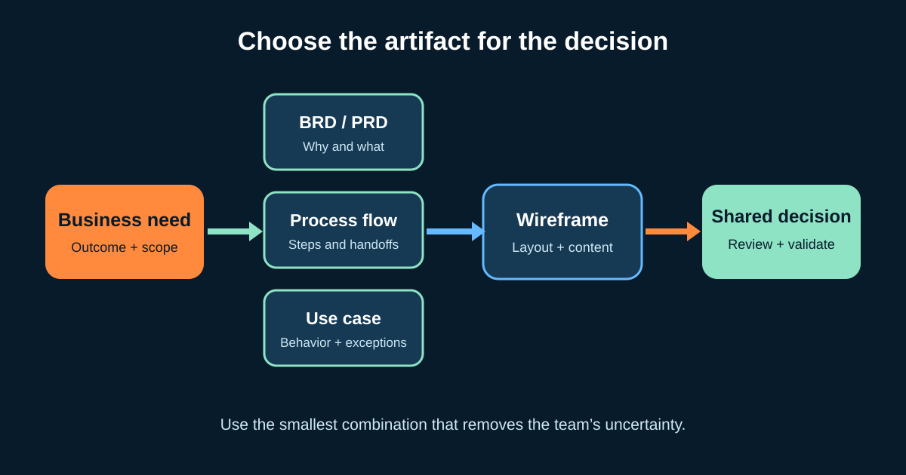

# Requirements Documents and Models for Business Analysts

A requirement is not valuable because it sits in a large document. It is valuable when the right people can understand it, challenge it, make a decision, and later verify the result. A Business Analyst (BA) therefore chooses an **artifact**—text, table, diagram, example, or prototype—based on the uncertainty that needs to be removed.

This tutorial uses one illustrative change: an online shop wants customers to start eligible returns without contacting support. We will build a small, connected requirements pack rather than five disconnected deliverables.



## 1. Start with the decision, not the template

Before opening a BRD or drawing a flow, ask:

| Question | Returns example |
|---|---|
| What decision must this artifact support? | Approve the scope of the first self-service release |
| Who will review it? | Product owner, customer service, finance, delivery team, compliance |
| What is unclear? | Eligibility ownership, refund message, courier failure, measures |
| How stable is the information? | Policy is fairly stable; screen details will evolve |
| What evidence will confirm it? | Support-contact data, policy review, usability feedback, UAT |

The IIBA Business Analysis Standard describes requirements and designs as information that may be expressed through text, matrices, and diagrams. It does not require one universal document. Your organization may mandate named templates; follow its governance, but remove duplication where reviewers permit it.

## 2. Know what a BRD and PRD are trying to do

The names are not standardized across every company, so confirm local definitions.

| Artifact | Typical emphasis | Returns example |
|---|---|---|
| **Business Requirements Document (BRD)** | Business problem, objectives, scope, stakeholders, high-level capabilities, constraints, benefits | Reduce avoidable support contacts while preserving policy controls |
| **Product Requirements Document (PRD)** | Product outcome, users, behavior, release scope, measures, assumptions, product decisions | Enable one eligible item to be submitted and return a reference number |

A useful concise document might contain:

1. problem and evidence;
2. objective and success measures;
3. in-scope and out-of-scope boundaries;
4. stakeholders and decision owners;
5. current and future process;
6. requirements, rules, data, and quality expectations;
7. risks, assumptions, dependencies, and open decisions; and
8. approval or review history.

Do not copy the same rule into a BRD, PRD, ticket, and test plan without an owner. Link to one maintained source or make the synchronization responsibility explicit.

## 3. Map the process to expose handoffs

A **process flow** shows how work moves between steps. A **swimlane diagram** adds responsibility. For the return journey, the proposed future flow is:

```text
Customer             Shopping system        Operations
Select item  ------> Check eligibility
See reason  <------- Eligible / reason
Confirm     ------> Create return
                    Request courier -------> Monitor exception
Receive reference <- Save outcome
```

Add failure paths, not just the happy path:

- What happens if the return window has expired?
- Is the request saved if courier booking is unavailable?
- Who handles an item received in a different condition?
- Where does a manual decision enter the flow?

The BA validates each step with the person who does the work. A polished diagram that operations does not recognize is not a validated process.

## 4. Use a use case when interaction and exceptions matter

A **use case** describes how an actor and a system interact to reach a goal. It is useful when branching behavior is too rich for one short story.

### Completed use-case summary

| Field | Example |
|---|---|
| Goal | Start a return for an eligible delivered item |
| Primary actor | Authenticated customer |
| Trigger | Customer selects “Return item” |
| Preconditions | Order is visible; item has a delivered status |
| Main success flow | Select item → choose reason → review instructions → confirm → receive reference |
| Alternative flow | Courier unavailable: save request and communicate the next step |
| Exception | Item outside window: do not create request; show policy reason and support route |
| Postcondition | One return request exists with an auditable eligibility result |

Do not turn a use case into screen-by-screen design. Record observable behavior, rules, and alternatives; let design explore how the interface should support them.

## 5. Use a wireframe to test layout and meaning early


*A paper wireframe used to explore layout. Photo by Fernando Mafra, sourced from [Wikimedia Commons](https://commons.wikimedia.org/wiki/File:Wireframe_(5019534612).jpg), licensed under CC BY-SA 2.0.*

A **wireframe** is a low-detail representation of a screen or page. It helps reviewers discuss content hierarchy, actions, navigation, and states before visual polish makes change expensive.

For the returns screen, label the wireframe with questions:

- Which amount is shown: paid amount, refundable amount, or estimate?
- Must the policy explanation appear before confirmation?
- How does the design show loading, no eligible items, and temporary failure?
- What must keyboard and screen-reader users be able to understand?
- Is the Arabic layout genuinely right-to-left, including icons and reading order?

A wireframe is not proof that the workflow or rules are correct. Link its numbered areas to requirements or examples, and test it with representative users.

## 6. Build traceability around decisions

Use lightweight IDs only where they help people connect information:

| ID | Need or requirement | Supporting model | Validation |
|---|---|---|---|
| OBJ-01 | Reduce avoidable “how to return” contacts | Product measure | Compare baseline and post-release rate |
| RULE-01 | Only eligible items can start a return | Use case, eligibility flow | Boundary examples and policy-owner review |
| UX-01 | Customer can understand why an item is ineligible | Wireframe states | Usability session and UAT |
| OPS-01 | Failed courier booking enters operational follow-up | Swimlane exception | Integration test and operations UAT |

Traceability should answer “why does this exist?” and “how will we know?” It should not become an inventory that nobody maintains.

## 7. Reusable requirements-pack template

```text
Decision this pack supports:
Problem, evidence, and affected users:
Objective and measures:
Scope / out of scope:
Stakeholders and decision owners:
Current-state process:
Future-state process and exceptions:
Requirements and business rules:
Data, integration, security, accessibility, and reporting needs:
Use cases or examples:
Wireframe / prototype questions:
Assumptions, risks, dependencies, open decisions:
Traceability to validation and measures:
Reviewers, review date, and decision:
```

### Quick exercise

Extend the return journey for a **partial return of two items**. Draft one scope statement, one process exception, one use-case alternative, and three annotations for a wireframe. Then identify the reviewer who can confirm each item.

## Further reading

- [IIBA: The Business Analysis Standard](https://www.iiba.org/knowledgehub/the-business-analysis-standard/)
- [IIBA: BABOK glossary](https://www.iiba.org/career-resources/a-business-analysis-professionals-foundation-for-success/babok/glossary/)
- [W3C Web Accessibility Initiative: designing for web accessibility](https://www.w3.org/WAI/tips/designing/)

*The scenario, roles, rules, and measures are illustrative. Confirm the required documents, approvals, and modelling notation in your organization.*
