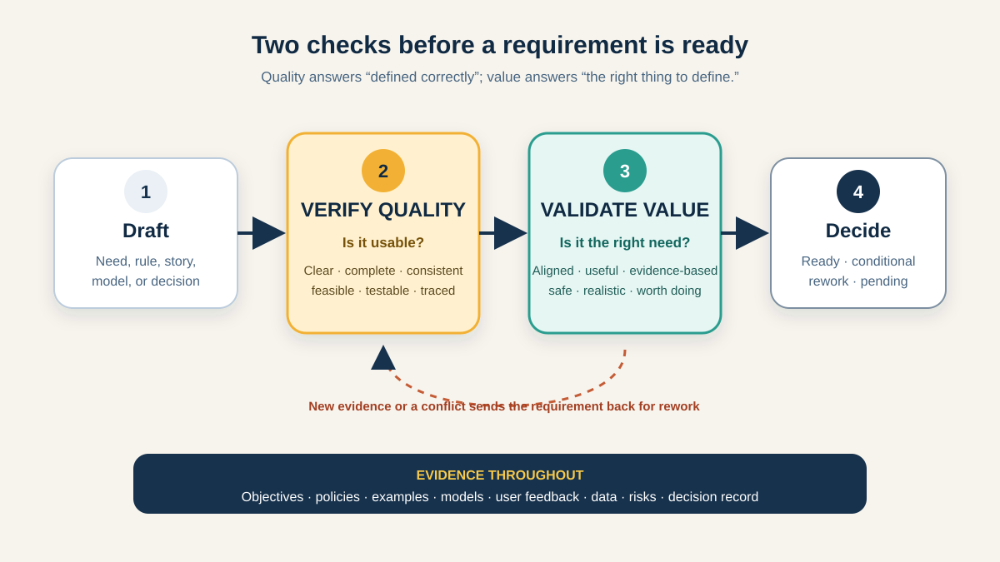

# Requirements Verification and Validation for Business Analysts

A requirement can be beautifully written and still describe the wrong outcome. It can also describe a valuable outcome so vaguely that two people build different things. **Requirements verification and validation (V&V)** protect against these two different failures.

- **Verification** asks: *Is the requirement defined well enough for its purpose?*
- **Validation** asks: *Is this the right requirement for the business need and the people affected?*

The International Institute of Business Analysis (IIBA) describes verification as checking that requirements and designs meet quality standards and are usable, while validation checks that they align with business requirements and support needed value. A Business Analyst (BA) uses both throughout analysis—not only in a final sign-off meeting.



This tutorial continues the illustrative BAC9 online-shop scenario. The shop wants customers to start eligible returns without contacting support. The policy, roles, numbers, and rules below are teaching assumptions, not universal retail rules.

## 1. Name the object you are checking

The words *verification* and *validation* are also used for designs, software, and complete systems. Avoid confusion by naming the object and the question.

| Activity | Object | Question | Example evidence |
|---|---|---|---|
| Requirements verification | Requirement or requirements set | Is it written, structured, and connected well enough to use? | Peer review, quality checklist, model consistency check |
| Requirements validation | Requirement or requirements set | Does it represent the real need and support value? | Policy-owner review, user examples, prototype feedback, objective trace |
| Solution verification | Built solution | Does the solution conform to the specified requirements? | Test results, inspection, analysis |
| Solution validation / acceptance | Built solution in realistic use | Does it meet user needs and work for the intended purpose? | End-to-end evaluation, operational trial, User Acceptance Testing (UAT) |

Requirements V&V should start before build. Testing the solution later may reveal a requirement defect, but that is an expensive way to discover an unclear boundary or a rule nobody needed.

**BA action:** write the review purpose as a sentence: “We are verifying the return-eligibility requirements for implementation readiness and validating them against the return-policy objective and customer journey.”

## 2. Verify one requirement for quality

The team starts with this draft:

> **R-01:** Customers can quickly return any product within 30 days.

It sounds reasonable, but a verification review exposes defects:

| Quality question | Problem in R-01 | BA follow-up |
|---|---|---|
| Necessary and traceable? | “Quickly” is not tied to an objective or measurable need. | Which outcome requires speed, and what measure would show it? |
| Atomic? | Eligibility, product type, time, and journey speed are mixed together. | Split independent rules and behaviours. |
| Unambiguous? | “Within 30 days” does not define start point, end point, time zone, or boundary. | Is day 30 included? Does the clock start at order, shipment, or delivery? |
| Complete? | Authentication, item condition, failure behaviour, and explanation are missing. | What must happen for eligible and ineligible items? |
| Consistent? | “Any product” may conflict with a policy excluding digital or final-sale items. | Which policy is authoritative, and who owns it? |
| Feasible? | The order service may not expose the delivery timestamp needed for the rule. | Can the source provide reliable data before the release date? |
| Testable? | “Quickly” has no observable pass condition. | Replace it with a justified, measurable expectation. |

After review, the team might separate it into requirements such as:

- **R-01:** The system shall evaluate a delivered physical order item against the return policy in effect for that order.
- **R-02:** An authenticated customer shall be able to submit a return request only for an eligible item that belongs to their order.
- **R-03:** When an item is ineligible, the system shall prevent submission and show the policy reason and an appropriate support route.
- **R-04:** The eligibility decision shall record the policy version, decision time, result, and reason for audit.

These examples are clearer, but they are not automatically valid. The policy owner still needs to confirm what “eligible” means, security specialists need to review ownership and audit needs, and customers need to understand the reason shown.

**Common mistake:** rewriting a sentence until it sounds professional without resolving the missing business decision. Better grammar cannot decide whether day 30 is included.

## 3. Verify the requirements as a connected set

An individual requirement may pass while the set still fails. Review the pack across views: objectives, process flow, business rules, data, user stories, acceptance examples, interface states, and non-functional expectations.

For the return journey, ask:

1. **Coverage:** Is there a requirement for every important process step and exception—eligibility, submission, refund handoff, courier failure, cancellation, and support?
2. **Consistency:** Do the policy table, process flow, story, and screen state use the same boundary and reason codes?
3. **Traceability:** Can each detailed requirement point backward to a stakeholder need, rule, risk, or objective and forward to an acceptance example or other evidence?
4. **Level and duplication:** Are business rules kept in one maintained source rather than copied differently across tickets?
5. **Dependencies:** Are required data, services, roles, permissions, operations, and reporting visible?
6. **Quality attributes:** Have accessibility, privacy, security, performance, availability, and audit needs been considered where relevant?

A simple trace can reveal a gap:

```text
Goal: reduce avoidable return-related support contacts
  → Capability: explain eligibility during self-service
    → R-03: block ineligible submission and show reason + support route
      → Example: day 31 shows RETURN_WINDOW_EXPIRED and no request is created
        → Evidence owner: policy owner + customer-service lead
```

Traceability is useful when it supports a question or decision. Do not create hundreds of links that nobody will maintain.

## 4. Validate the requirement against need and value

Now ask whether the verified requirements are the **right** requirements. A requirements set can be precise, consistent, and testable yet still automate the wrong policy or solve a low-value problem.

Use the returns scenario to test five dimensions:

| Validation dimension | BA question | Useful evidence |
|---|---|---|
| Need | What problem does self-service solve, for whom, and how do we know it exists? | Support-contact themes, journey research, stakeholder interviews |
| Alignment | Does the requirement support the agreed objective and scope? | Objective map, scope statement, business case |
| Value | Is the expected benefit worth cost, risk, and operational change? | Baseline and target measures, option comparison, service-cost estimate |
| Real use | Can representative users and staff complete the journey in their context? | Scenario walkthrough, prototype session, process simulation |
| Consequences | Who could be harmed or burdened, and what misuse or exception matters? | Risk review, accessibility feedback, fraud and privacy review |

Suppose data shows that most support contacts happen because customers cannot understand *why* an item is ineligible, not because the submission form is missing. That evidence may change the first release: clear eligibility explanations could deliver more value than automating courier booking.

**BA action:** bring the people who own the need and consequences—not only the people who wrote the requirement. For this change, that may include customers, customer service, the return-policy owner, operations, finance, security, accessibility specialists, and delivery representatives.

**Common mistake:** treating stakeholder approval as proof. Approval records a decision; validation needs relevant evidence and informed reviewers. Silence in a review thread is not evidence that the requirement is right.

## 5. Use examples to expose boundaries and disagreement

Abstract statements invite polite agreement. Concrete examples force the team to decide.

Assume, for teaching purposes, that the policy allows eligible physical items through the end of calendar day 30 after delivery. Ask reviewers to decide these cases:

| Example | Expected result to confirm | What it exposes |
|---|---|---|
| Delivered 29 days ago; eligible physical item | Allow return request | Normal path |
| Delivered exactly 30 calendar days ago | Allow or reject—policy owner must decide explicitly | Boundary inclusiveness and time zone |
| Delivered 31 days ago | Reject; show reason and support route | Failure behaviour |
| Digital item appears beside physical items | Exclude or explain according to policy | Product-type scope |
| Delivery timestamp is missing | Do not guess; define safe handling and owner | Data-quality exception |
| Two people submit the same item at nearly the same time | Create at most one active request and explain the second result | Duplicate and concurrency risk |
| Customer uses Arabic with a screen reader | Reason, focus order, status, and actions remain understandable | Accessibility and localization |

Examples can become acceptance criteria later, but their first job here is discovery. Record open decisions instead of hiding uncertainty inside vague language.

## 6. Run a lightweight V&V review

Use a repeatable flow rather than one large sign-off event.

1. **Prepare.** Define the review scope, requirement version, quality criteria, business objectives, decision rights, participants, and deadline.
2. **Pre-check.** The BA checks structure, duplicates, missing references, obvious ambiguity, and unresolved placeholders before using stakeholder time.
3. **Verify.** Review individual items and the set. Mark defects with an owner; do not silently edit a rule that requires a business decision.
4. **Validate.** Walk through realistic success, failure, boundary, and accessibility scenarios with relevant stakeholders. Compare the requirements with evidence and objectives.
5. **Resolve.** Classify each issue: wording defect, missing requirement, policy decision, scope change, design question, data constraint, or accepted risk.
6. **Decide and baseline.** Record what is accepted, rejected, deferred, or still open, who decided, and which version was reviewed.
7. **Revisit.** Re-verify and re-validate when assumptions, policies, scope, evidence, or solution constraints materially change.

Possible statuses are **ready**, **ready with recorded conditions**, **rework required**, or **decision pending**. “Reviewed” alone does not reveal whether an issue remains.

## 7. Completed requirements V&V matrix

This compact artifact keeps the requirement, evidence, result, and next action connected.

| ID | Requirement or decision | Verification evidence | Validation evidence | Result and owner |
|---|---|---|---|---|
| R-01 | Evaluate delivered physical items against the applicable policy | Clear terms; policy source linked; delivery field confirmed | Policy owner confirms policy version and day boundary | Ready — policy owner |
| R-03 | Block ineligible submission and show reason plus support route | Failure behaviour and observable output specified | Five customer walkthroughs reveal that policy code alone is unclear | Rework message — content designer |
| R-04 | Record decision inputs and result for audit | Required fields and source systems identified | Operations and security confirm investigation need; privacy review open | Conditional — security owner |
| D-01 | Include courier booking in release one | Scope and dependency are documented | Contact data suggests explanation solves the larger problem first | Deferred — product owner |

Notice that validation can change scope, not merely approve wording. Also notice that a conditional result names the unresolved evidence and owner.

## 8. Reusable review template

```text
Review name and requirement version:
Business need / objective:
Scope included and excluded:
Quality criteria used for verification:
Validation questions and success measures:
Required reviewers and decision owner:
Evidence available / missing:

For each item:
- ID and requirement / decision
- Source and backward trace
- Verification findings
- Validation evidence and stakeholder
- Exceptions / risks / assumptions
- Result: ready / conditional / rework / pending
- Action owner and due date

Overall gaps or conflicts:
Decision and rationale:
Approved version and date:
Trigger for another review:
```

### Quick exercise

Review this draft requirement: “Refund customers immediately when a return is approved.”

1. Find at least four verification defects.
2. Write three questions that validate the underlying need and value.
3. Create examples for a successful refund, a payment-provider timeout, and a partially refunded order.
4. Name the stakeholder who should decide each open point and the evidence you would record.

## Further reading

- [IIBA: The Business Analysis Standard — Verify and Validate Requirements and Designs](https://www.iiba.org/knowledgehub/the-business-analysis-standard/)
- [IIBA: BABOK glossary](https://www.iiba.org/career-resources/a-business-analysis-professionals-foundation-for-success/babok/glossary/)
- [ISO/IEC/IEEE 29148:2018 — Requirements engineering terms and processes](https://www.iso.org/obp/ui/#iso:std:iso-iec-ieee:29148:ed-2:v1:en)
- [NASA Systems Engineering Handbook — V&V planning and evidence](https://www.nasa.gov/reference/system-engineering-handbook-appendix/)

*The scenario, policy, roles, dates, measures, and decisions in this tutorial are illustrative. Follow your organization’s governance, domain regulations, and approval rules.*
