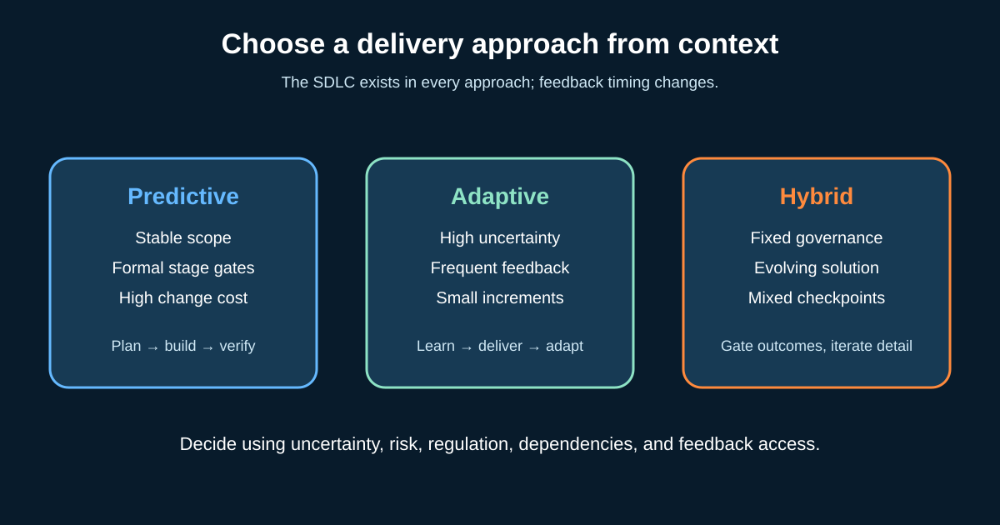

# SDLC, Waterfall, Agile, and Hybrid Delivery

The **Software Development Life Cycle (SDLC)** is the work needed to take a software change from an idea through operation and eventual retirement. Teams still need to understand needs, design, build, test, release, operate, and learn—whatever methodology they use.

**Waterfall**, **Agile**, and **hybrid** describe how that work is organized and when decisions and feedback happen. A Business Analyst (BA) should not argue from fashion. The BA helps match the approach to uncertainty, risk, regulation, dependencies, and access to feedback.



## 1. Follow the lifecycle, not a one-way picture

For our illustrative online-shop return feature, the lifecycle contains:

| Lifecycle concern | BA question |
|---|---|
| Need and feasibility | Which customer and operational problem is worth solving? |
| Requirements and design | What behavior, rules, data, quality, and controls are needed? |
| Build and integration | Which decisions or interfaces still need clarification? |
| Verification and validation | Was it built as specified, and does it solve the stakeholder need? |
| Release and transition | Are users, support, data, training, and fallback ready? |
| Operation and improvement | What do completion, failure, contact, and refund measures show? |
| Retirement | What records, integrations, and user communication must be preserved? |

These concerns can overlap and repeat. Even NASA's lifecycle guidance describes iterative and recursive technical work inside formal phases. A stage-gated environment is not automatically “no iteration.”

## 2. Predictive delivery: plan and baseline before major build

In a predictive or commonly called **Waterfall** approach, teams establish more scope, requirements, design, cost, and approval detail before later stages. Formal gates control movement between phases.

It fits better when:

- the required outcome and solution are well understood;
- physical or external dependencies make late change expensive;
- contracts require defined deliverables and acceptance;
- safety, audit, or regulatory evidence needs formal review; or
- a migration has a fixed event and rollback obligations.

For returns, a payment-regulation change with a fixed compliance date may need traceable approval, controlled test evidence, and a coordinated release. The BA maintains baselines, change impacts, decisions, and traceability.

**Risk:** stakeholders may first see working behavior too late. Reduce that risk with prototypes, simulations, model reviews, early integration tests, and staged validation.

## 3. Adaptive delivery: learn through small usable increments

An **Agile** approach welcomes learning and delivers in small increments. Detail emerges as the team gains evidence. It fits better when user needs or solution options are uncertain, feedback is available, and value can be sliced.

For returns, the team might first support one product category and one courier, then observe completion and support contacts before expanding.

The BA keeps the outcome, rules, risks, and measures visible; prepares small testable slices; and updates shared understanding after feedback. Agile does not mean no plan, no architecture, no documentation, or no control.

**Risk:** “flexibility” can become unmanaged churn. Protect the product goal, decision ownership, quality criteria, and evidence needed for release.

## 4. Hybrid delivery: different parts need different cadences

**Hybrid** is useful when governance is predictive but product learning is adaptive. It should be a deliberate design, not a collection of incompatible meetings.

Example:

| Fixed or gated | Iterative or continuous |
|---|---|
| Compliance deadline and required audit evidence | Screen wording tested with users |
| Approved refund-policy boundaries | Small return-journey releases |
| Security and privacy controls | Backlog ordering from feedback |
| Go-live readiness decision | Post-release experiments and improvements |

Name the interfaces between cadences: when does an experiment need approval, which changes affect the baseline, and what evidence crosses the gate?

## 5. Use a decision matrix instead of stereotypes

Score each factor using evidence; do not add the numbers mechanically without discussion.

| Factor | Predictive signal | Adaptive signal | Returns observation |
|---|---|---|---|
| Need uncertainty | Low | High | Problem known; preferred journey uncertain |
| Change cost | High | Manageable | Policy changes costly; UI changes cheaper |
| Feedback access | Rare | Frequent | Customer sessions available every two weeks |
| Compliance | Formal baseline required | Outcome-based control can evolve | Refund controls fixed; wording reviewable |
| Dependencies | Coordinated release | Independently releasable slices | Courier dependency needs early integration |
| Value slicing | Little value before full delivery | Useful partial outcomes | One category and courier can deliver learning |

**Recommendation for the teaching example:** hybrid. Fix policy, privacy, accounting, and release controls; iterate the customer journey in small slices. This is an illustrative recommendation, not a universal answer.

## 6. Reusable delivery-approach brief

```text
Initiative and intended outcome:
Uncertainties in need and solution:
Regulatory, contractual, safety, and audit constraints:
Cost of late change:
External dependencies and fixed dates:
Access to users and operational feedback:
Smallest independently valuable slice:
Required baselines, gates, and evidence:
Planned feedback cadence:
Recommended approach and rationale:
Risks created by this approach and mitigations:
Decision owner and review date:
```

### Quick exercise

Compare two changes: (1) a mandatory tax calculation effective on a fixed date, and (2) an optional return-help assistant whose usefulness is uncertain. Recommend an approach for each and identify one early validation activity.

## Further reading

- [Manifesto for Agile Software Development](https://agilemanifesto.org/)
- [NASA Software Engineering Handbook: software life cycle](https://swehb.nasa.gov/spaces/SWEHBVB/pages/32604451/SWE-019+-+Software+Life+Cycle)
- [NASA Systems Engineering Handbook](https://www.nasa.gov/reference/systems-engineering-handbook/)
- [The official Scrum Guide](https://scrumguides.org/scrum-guide.html)

*The return scenario and recommendation are illustrative. Use your organization’s governance, risk classification, and delivery evidence.*
