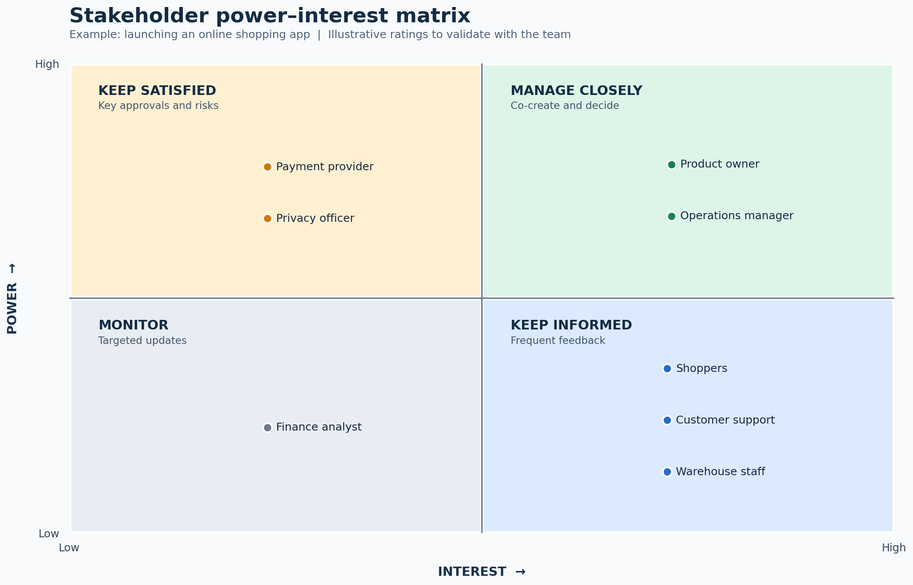

# Stakeholder Analysis

## 1. What is stakeholder analysis?

A **stakeholder** is a person, group, or organization that can influence a change or be affected by it. **Stakeholder analysis** identifies those parties, understands their needs and influence, and decides how to involve them throughout the project.

For a BA, the goal is to obtain the right input when defining and validating requirements. A list of names alone is insufficient: each entry needs a reason for inclusion and an action for engagement.

### Three questions to keep in mind

1. **Who** can affect or is affected by the change?
2. **What** do they need, fear, decide, or know?
3. **How and when** should the team involve them?

## 2. Practical example: an online shopping app

A retailer is launching an app where customers browse products, pay, and track orders. Warehouse staff pack purchases, support handles questions and returns, and managers monitor sales. A third-party provider processes payments.

**BA deliverables for this example:** a stakeholder register, a power–interest matrix, and an engagement plan. The roles and ratings are illustrative; confirm them for a real project.

### Define the project boundary

Write a short scope statement before listing people:

> “Customers will browse products, place orders, pay online, and track fulfilment. Staff will manage orders, stock, support requests, and reporting.”

This example covers the customer journey **and** the operational processes behind it. Include a stakeholder only when you can explain their connection to this scope. Recheck the list if the scope changes.

## 3. Identify the stakeholders

Trace the workflow from browsing to delivery and returns. Look for people who use the solution, perform affected work, approve decisions, supply services, or rely on its data.

| Group | Example stakeholders | Why they matter |
|---|---|---|
| Decision makers | Product owner, operations manager | Set priorities, approve scope, own results |
| Users and affected staff | Shoppers, customer support, warehouse staff | Reveal needs and test workflows |
| Specialists and dependencies | Payment provider, privacy officer | Set integration, contract, or privacy conditions |
| Information consumers | Finance analyst | Uses sales and reconciliation reports |

**Internal/external:** “Internal” means part of the company delivering the online store; “external” means outside that company. A person can be external and highly influential. Record a role or group initially, then identify a representative for workshops and approvals.

### Ways to find missing stakeholders

- Review the process map, organization chart, contracts, integrations, and existing requirements.
- Ask each interviewee: “Who else does this change affect?”
- Walk through exceptions: failed payment, out-of-stock item, return, and refund.
- Check who signs off on requirements, privacy, operations, and launch readiness.

## 4. Analyze each stakeholder

Gather evidence through interviews, observation, process walkthroughs, and project documents. Do not infer requirements solely from job titles.

| Attribute | Question to answer |
|---|---|
| Impact | What changes in this person's work or experience? |
| Need | What outcome or information do they require? |
| Concern | What could prevent their support or successful use? |
| Power | Can they approve, block, fund, or materially alter the change? |
| Interest | How closely will they follow this specific project? |
| Engagement | What input is needed, and at which milestone? |

**Useful interview prompts:** “What is difficult today?” “What would success look like?” “Which exceptions must the system handle?” “What decision can you make?” “Who depends on your work?”

## 5. Use a power–interest matrix

**Power** measures a stakeholder's ability to influence the project. **Interest** measures how much attention they give this change. These are assessments *for this project*, and can change by phase.

A quick rating rule is to use **Low** or **High** based on evidence. For power, check formal approvals, budget, operational authority, and critical dependencies. For interest, check how strongly the stakeholder is affected and how actively they participate. Record uncertainty instead of presenting a guess as fact.

| Power / interest | Engagement approach | Online shopping app examples |
|---|---|---|
| High / high | **Manage closely:** involve in decisions and frequent reviews | Product owner; operations manager |
| High / low | **Keep satisfied:** consult on approvals, constraints, and exceptions | Payment provider; privacy officer |
| Low / high | **Keep informed:** use interviews, prototype reviews, and testing | Shoppers; customer support; warehouse staff |
| Low / low | **Monitor:** provide relevant updates and review if impact grows | Finance analyst in this illustrative scope |

The payment provider's high power assumes its approval or integration is critical to launch. The finance analyst's low interest assumes their reporting needs are limited. **Move either role if discovery shows otherwise.** Low power never means that a stakeholder's requirements can be ignored.

## 6. Build the stakeholder register

The register connects your analysis to practical BA work. The initial example below is intentionally compact; add names, contacts, evidence, and dates in a real project.

| Stakeholder | Type | Main need or concern | Power | Interest | BA action |
|---|---|---|---|---|---|
| Product owner | Internal | Business goals, scope, priorities | High | High | Prioritize requirements and approve decisions |
| Operations manager | Internal | Reliable fulfilment and exception handling | High | High | Map processes and validate operational rules |
| Payment provider | External | Supported payment flows and integration conditions | High* | Low* | Confirm API, settlement, and test obligations |
| Privacy officer | Internal | Appropriate handling of customer data | High* | Low* | Review data flows and privacy requirements |
| Shoppers | External | Easy checkout, order visibility, returns | Low individually | High | Interview and test representative users |
| Customer support | Internal | Order history and tools to resolve issues | Low | High | Observe work and validate support scenarios |
| Warehouse staff | Internal | Accurate picking, packing, and stock updates | Low | High | Walk through fulfilment and test exceptions |
| Finance analyst | Internal | Sales, refund, and reconciliation data | Low* | Low* | Confirm reports and review at milestones |

\* **Illustrative rating:** confirm with the project team. Also distinguish the influence of an **individual shopper** from the collective impact of many shoppers.

## 7. Make an engagement plan

Translate each row into a concrete interaction with an owner and timing. The BA often leads requirements conversations; the project manager or product owner may own broader communications.

| Stakeholder | Interaction | When | Expected result |
|---|---|---|---|
| Product owner | Priority and decision workshop | At scope changes and each planning cycle | Agreed priorities and recorded decisions |
| Operations manager | Process walkthrough | During discovery; repeat before acceptance | Validated fulfilment and exception flows |
| Shoppers | Interviews and prototype usability sessions | Before design decisions and during testing | Evidence of needs and usability issues |
| Customer support and warehouse staff | Scenario reviews and user acceptance testing | During requirements validation and before launch | Confirmed workflows and defects |
| Payment provider and privacy officer | Specialist review | Before design is fixed and before launch | Confirmed constraints and approvals |
| Finance analyst | Report review | During reporting design and acceptance | Agreed fields and reconciliation rules |

For each interaction, record **who will attend, what decision or feedback is needed, when it is due, and where the result is documented**.

## 8. Validate and update the analysis

Review the register with the product owner and operational leads. Ask whether any workflow, approval, integration, user group, or exception is missing. Reassess ratings when scope or authority changes, particularly before major design choices and release.

### Frequent mistakes

| Mistake | Better approach |
|---|---|
| Listing only managers | Include end users, affected staff, and external dependencies |
| Treating power–interest ratings as facts | Record the reason and validate uncertain ratings |
| Ignoring low-power users | Gather their input where they know the work best |
| Using one communication style for everyone | Match interactions to the input and decision needed |
| Creating the matrix once and filing it away | Update it when scope, roles, or project phase changes |

## 9. Reusable template

Copy this table into a project document or spreadsheet:

| Stakeholder / representative | Internal / external | How affected | Need or concern | Power | Interest | Evidence / assumption | Engagement action | Owner | Review date |
|---|---|---|---|---|---|---|---|---|---|
|  |  |  |  |  |  |  |  |  |  |

### Quick exercise

Choose another familiar project, such as an appointment booking app. List six stakeholders, write one need for each, place them in the four matrix quadrants, then specify **one action and one milestone** for each. If a placement cannot be justified, mark it “to validate.”

## References

- [IIBA: Stakeholder Analysis](https://www.iiba.org/knowledgehub/babok-applied/stakeholder-analysis/)
- [IIBA BABOK glossary: Stakeholder list](https://www.iiba.org/career-resources/a-business-analysis-professionals-foundation-for-success/babok/glossary/)
- [PMI: Stakeholder management and the power–interest matrix](https://www.pmi.org/learning/library/stakeholder-management-task-project-success-7736)

*The online shopping app roles, ratings, matrix, and engagement activities are original teaching examples, not facts about an existing project.*
