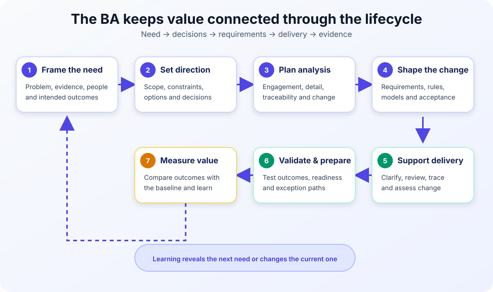

# Who Is a Business Analyst?

A **Business Analyst (BA)** helps an organization understand a need, decide what change is worth making, and confirm that the change delivers value. The BA connects stakeholders who understand the business with the people who design, build, test, operate, or govern the solution.

The International Institute of Business Analysis (IIBA) describes business analysis as enabling change by defining needs and recommending solutions that deliver value to stakeholders. That definition is wider than “writing requirements.” A BA investigates problems, makes decisions clearer, and keeps the original need connected to the delivered result.

Keep three questions in mind throughout this tutorial:

1. **What problem or opportunity are we addressing?**
2. **What must change, and who makes each decision?**
3. **How will we know the change worked?**

> **Note:**
>
> **A simple definition:** a BA helps the team solve the right problem, agree on what the solution must achieve, and validate whether it created the expected value.

## 1. Running example: improving an online shopping service

A retailer sells products through an online store. Customers can place orders, but they often contact support because delivery status is unclear. Warehouse staff sometimes discover stock differences after an order is placed, and refund updates are slow.

A manager proposes: **“We need a new mobile app with live order tracking.”**

That may be a useful option, but it is not yet a confirmed requirement. The BA first needs to understand:

- Which customers and order types experience the problem?
- Where do status updates become late or inaccurate?
- What evidence exists in support contacts, delivery data, cancellations, and refunds?
- Which teams and external providers control each status update?
- What outcome matters: fewer support contacts, more accurate updates, faster refunds, or better customer confidence?
- Could a process change, web improvement, email or SMS notification, integration fix, mobile app, or combination solve the need?

The roles, rules, and measures in this tutorial are **illustrative**. A real retailer must confirm them with customers, staff, delivery providers, decision makers, and its own data.

## 2. What a Business Analyst actually does

The BA does not simply collect requests. The BA turns an unclear situation into a connected set of needs, decisions, requirements, and evidence.

| BA activity | What the BA does | Online shopping example |
|---|---|---|
| Define the need | Clarify the problem, affected people, evidence, impact, and intended outcome | Confirm whether inaccurate status, late updates, or weak communication causes most support contacts |
| Understand the current state | Observe work and map processes, systems, data, rules, and pain points | Trace an order from checkout through picking, dispatch, delivery, cancellation, and refund |
| Engage stakeholders | Identify users, affected staff, decision makers, specialists, and external dependencies | Include shoppers, support, warehouse staff, operations, finance, IT, privacy, and the delivery provider |
| Elicit information | Use interviews, workshops, observation, document review, data analysis, and prototypes | Review support cases, observe order handling, and test status wording with customers |
| Analyze and model | Find causes, gaps, conflicts, dependencies, rules, exceptions, and options | Separate a delayed delivery from a delayed status update; each may need a different response |
| Define requirements | Describe capabilities, information, business rules, qualities, and acceptance conditions | Specify which events change order status, who receives a notification, and what happens when data is unavailable |
| Support decisions | Compare options and tradeoffs, then record the authorized decision and rationale | Compare an integration fix, notifications, and a new app by value, reach, cost, risk, and dependency |
| Validate and evaluate | Check that requirements address the need, support acceptance, and measure outcomes after release | Link status requirements to tests and compare support contacts with the pre-change baseline |

### What the BA may produce

Typical outputs include a problem statement, stakeholder register, process map, business rules, requirements, user stories, acceptance criteria, data definitions, option analysis, decision log, traceability record, and outcome measures.

These outputs are tools, not the goal. A document is useful when it helps someone understand, decide, build, test, operate, or evaluate the change.

### What the BA does not decide alone

The BA supplies analysis and facilitates agreement, but the authorized person owns the decision. In this example:

- The operations manager approves fulfilment rules.
- The privacy specialist confirms customer-data constraints.
- The Product Owner orders Product Backlog items.
- The technical team chooses an implementation design within agreed requirements and constraints.
- The sponsor approves funding or a major scope change.

**BA question:** “Who owns this decision, what evidence do they need, and where will we record the answer?”

## 3. Business Analyst vs Project Manager vs Product Owner

The roles work closely together, and one person may perform more than one role. Their primary focus is still different.

| Role | Main question | Primary focus | Example responsibility |
|---|---|---|---|
| **Business Analyst (BA)** | What need are we addressing, what must change, and how will we validate it? | Needs, stakeholders, processes, requirements, rules, options, and value | Analyze why order updates fail and define the required behavior and acceptance conditions |
| **Project Manager (PM)** | How will we organize and deliver the project successfully? | Plan, people, schedule, budget, dependencies, risks, communication, and governance | Coordinate the delivery plan, resources, provider dependency, risks, and status reporting |
| **Product Owner (PO)** | What should the product team do next to maximize product value? | Product Goal, Product Backlog content and order, and value decisions | Decide whether notification reliability or a new tracking screen has higher backlog priority |

### How they collaborate

Suppose customers receive “shipped” notifications before the delivery provider accepts the parcel:

1. The **BA** maps the status events, confirms the business meaning of “shipped,” and defines normal and exception scenarios.
2. The **PO** decides the priority of correcting that behavior against other product work.
3. The **PM** manages the provider dependency, delivery risk, schedule impact, and coordination.

All three may run workshops, discuss scope, manage risks, and communicate with stakeholders. The purpose of the activity is what distinguishes the roles.

> **Caution:**
>
> **Do not assume the title settles the responsibility.** Scrum defines the Product Owner accountability, but it does not define a separate Business Analyst role. Confirm who can order the backlog, approve business rules, accept scope changes, and authorize funding in the actual organization.

## 4. The BA mindset: problem first, solution later

Stakeholders often express a need as a solution: “Build an app,” “Add a dashboard,” or “Automate the process.” The BA records the idea, then investigates the need behind it.

### Move from request to evidence

Use this sequence for the proposed tracking app:

1. **Hear the request:** “We need a mobile app with live tracking.”
2. **Ask what triggered it:** Customers contact support because they do not trust the order status.
3. **Find evidence:** Review contact reasons, missing events, delivery delays, notification failures, and customer feedback.
4. **Identify causes and constraints:** The provider sends some events late; warehouse and delivery terms differ; not every customer will install an app.
5. **Define the outcome:** Give customers timely, understandable order information and reduce avoidable support contacts.
6. **Compare options:** Improve the existing web page, repair integrations, send proactive notifications, change operational steps, build an app, or combine options.
7. **Test risky assumptions:** Confirm that provider events are reliable enough before promising “live” tracking.

### Worked problem statement

> Customers cannot consistently understand the current location and next step of an order because status events are incomplete, late, or described differently across systems. This increases avoidable support contacts and reduces confidence. The retailer wants timely and understandable updates across supported channels while preserving accurate operational and customer records.

The statement describes the affected people, current problem, impact, and desired outcome without forcing one solution.

**Exception to explore:** What should the customer see when the delivery provider has not sent an update for an agreed period? Hiding uncertainty creates a polished happy path but a poor real service.

Problem-first does not mean analyzing forever. Investigate uncertainties that could cause major rework, risk, exclusion, or loss of value; learn lower-risk details through prototypes and delivery feedback.

## 5. The five PMI-PBA domains

The **PMI Professional in Business Analysis (PMI-PBA)** examination content outline groups business analysis work into five domains. PMI’s current certification page lists the following exam weighting. The percentages describe the exam blueprint, not how every BA must divide project time.

| PMI-PBA domain | Exam weighting | What it means in practice | Shopping example |
|---|---:|---|---|
| **Needs Assessment** | 18% | Define the problem or opportunity, value, goals, stakeholders, and solution scope | Confirm the order-information problem, affected groups, evidence, and desired outcomes |
| **Planning** | 22% | Plan analysis, stakeholder communication, traceability, change, documents, and acceptance | Decide who joins workshops, how requirements are approved, and how changes are tracked |
| **Analysis** | 35% | Elicit, model, verify, validate, prioritize, and recommend requirements and options | Model status events, define rules and exceptions, and compare solution options |
| **Traceability and Monitoring** | 15% | Track requirement sources, relationships, status, changes, issues, and supporting artifacts | Link the customer need to requirements, backlog items, designs, tests, and releases |
| **Evaluation** | 10% | Assess whether the solution meets requirements and produces intended value | Measure status accuracy, notification success, support contacts, and customer feedback |

The domains are not five one-time phases. Planning changes when the context changes. Analysis can reveal a new need. Traceability continues through delivery. Evaluation may begin another improvement cycle.

## 6. What the BA does during each project stage

Organizations use different stage names. The following lifecycle is a practical guide, not a mandatory sequence.



*BA work connects the original need to decisions, delivery evidence, and measured value.*

| Project stage | BA action | Key question | Useful output |
|---|---|---|---|
| **1. Idea and needs assessment** | Study the current state, evidence, impact, stakeholders, and desired value | Is there a real need worth addressing? | Problem statement, baseline, stakeholder map, current-state process |
| **2. Initiation and planning** | Clarify scope, assumptions, constraints, decision rights, and the analysis approach | What is included, who decides, and how will analysis and change work? | Scope model, glossary, BA approach, decision and assumption log |
| **3. Detailed analysis** | Elicit and model requirements, rules, data, qualities, options, and exceptions | What must the change achieve under normal and failure conditions? | Requirements or backlog items, process and data models, business rules, acceptance criteria |
| **4. Build or implementation** | Clarify intent, review emerging work, assess changes, and maintain traceability | Does the proposed design still satisfy the need and constraints? | Clarifications, impact analysis, updated requirements, trace links |
| **5. Test and readiness** | Support acceptance scenarios, User Acceptance Testing (UAT), operational readiness, and gap analysis | Were normal, alternative, exception, and failure paths tested? | Acceptance scenarios, UAT findings, readiness requirements, approvals |
| **6. Launch and evaluation** | Compare results with the baseline, find unintended effects, and recommend improvements | Did the change create value, for whom, and what should change next? | Outcome measures, feedback themes, benefits review, follow-up backlog |

### Trace one need through the lifecycle

```text
Need: reduce avoidable “Where is my order?” contacts
  → Requirement: show the latest confirmed status and update time
  → Rule: never display an unconfirmed provider event as completed
  → Acceptance scenario: a late provider event shows a clear temporary message
  → Measure: support contacts per 1,000 orders and status-error rate
```

If the team builds a tracking screen but its data is inaccurate, the output exists while the intended value remains unmet. Traceability makes that break visible.

## 7. BA responsibilities in Agile and Waterfall projects

The BA’s purpose remains the same: understand needs, support decisions, clarify requirements, and validate value. The timing and packaging of the work change.

| Aspect | Agile or adaptive delivery | Waterfall or predictive delivery |
|---|---|---|
| Analysis timing | Continuous; detail grows shortly before delivery and through feedback | More breadth and detail are analyzed before downstream design, build, and test |
| Requirement format | Backlog items, examples, acceptance criteria, models, and prototypes | Requirement specifications, process and data models, rules, interfaces, and acceptance criteria |
| Stakeholder feedback | Frequent discovery, refinement, reviews, and increment demonstrations | Planned interviews, workshops, formal reviews, phase gates, and sign-offs |
| Change handling | Reorder or revise future work with the PO; analyze impact on goals and released behavior | Assess change against the approved baseline and follow change control |
| Traceability | Lightweight but sufficient links among goals, backlog items, decisions, tests, and releases | Often explicit links among business, stakeholder, solution, design, test, and approval artifacts |

### In an Agile team

The BA supports continuous discovery, refines upcoming work with the PO and team, explores examples and edge cases, defines acceptance criteria, reviews increments with users, and turns feedback into evidence or backlog changes.

**Caution:** Agile does not mean “no analysis” or “no documentation.” Use the smallest useful artifact that protects shared understanding and important decisions.

### In a Waterfall project

The BA usually analyzes more scope, interfaces, data, rules, and exceptions earlier; organizes formal reviews and baselines; maintains detailed traceability; assesses change requests; and supports structured handoffs through build and test.

**Caution:** A signed requirement is not proof that it remains correct. New evidence and defects still need analysis and controlled change.

### In a hybrid environment

Governance and funding may be predictive while delivery is iterative. The BA keeps formal scope or compliance commitments connected to backlog items so that a delivery change does not silently break an approved obligation.

## 8. A completed BA work map

This compact artifact shows how the BA can plan work for the shopping example.

| Need or decision | Evidence | BA action | Result and validation |
|---|---|---|---|
| Why do customers contact support? | Contact reasons and order-status history | Compare contacts with missing, late, or unclear events | Problem statement and baseline, reviewed with support and operations |
| What should each status mean? | Warehouse and provider event definitions | Run a terminology and rule workshop | Status glossary and rules, tested with real orders including delays |
| Which option should be delivered first? | Reach, value, effort, risks, and dependencies | Compare integration, web, notification, and app options | Option analysis and rationale approved by the authorized owner |
| Is the change ready? | Acceptance results and operational readiness | Review normal and exception scenarios | Acceptance findings and open gaps, accepted by the named business approver |
| Did it work? | Baseline and post-release measures | Evaluate outcomes and unintended effects | Benefits review and actions, measured at the agreed review date |

## 9. Common mistakes

| Mistake | Better BA behavior |
|---|---|
| Writing down the first requested solution | Define the need and compare realistic options |
| Speaking only with managers | Include users, operational staff, specialists, and external dependencies |
| Documenting only the happy path | Analyze errors, delays, missing data, permissions, cancellations, and recovery |
| Assuming the BA approves every decision | Record the decision owner and approval route |
| Treating requirements as finished before delivery | Clarify, trace, assess changes, and learn throughout the lifecycle |
| Measuring completed features only | Measure the customer or business outcome and check negative effects |

## 10. Reusable BA change canvas

### BA change canvas

| Field | What to record |
|---|---|
| Need or opportunity | A neutral problem statement supported by initial evidence |
| Stakeholders | Affected users, staff, decision makers, specialists, and dependencies |
| Current-state evidence | Process observations, baseline data, complaints, rules, and known gaps |
| Intended outcome | The behavior, performance, risk, cost, access, or experience that should improve |
| Scope and constraints | What is included, excluded, fixed, regulated, time-bound, or uncertain |
| Options | Credible process, policy, data, integration, and technology choices |
| Requirements and exceptions | Capabilities, information, rules, qualities, interfaces, and failure paths |
| Decisions and owners | Decision, accountable person, date, rationale, and review condition |
| Traceability | Need → requirement → delivery item → test or evidence → release |
| Measures | Baseline, target or direction, data source, review date, and owner |

### Quick checklist

- Can the team explain the need without naming a preferred solution?
- Are important claims supported by evidence or marked as assumptions?
- Have affected users and operational staff contributed?
- Are normal, alternative, exception, and failure paths understood?
- Are decision owners clear for priority, rules, design, scope, and acceptance?
- Does each important requirement connect to an outcome and validation method?
- Is there a plan to measure value after release?

### Practice: turn a request into a BA plan

A retail manager says: **“We need an AI chatbot to reduce order-support calls.”**

1. Write three questions that investigate the problem before discussing the chatbot.
2. Draft a two-sentence problem statement without naming a solution.
3. List four stakeholders, including one customer who might be excluded by a digital-only option.
4. Write one requirement, one exception, and one acceptance scenario.
5. Choose one output measure and one outcome measure.
6. Mark which PMI-PBA domain each activity supports.

## Further reading

- [IIBA: Defining Business Analysis](https://www.iiba.org/knowledgehub/the-business-analysis-standard/2-understanding-business-analysis/2-1-defining-business-analysis/)
- [IIBA: Business Analysis Principles](https://www.iiba.org/knowledgehub/the-business-analysis-standard/3-mindset-for-effective-business-analysis/3-3-business-analysis-principles/)
- [PMI: PMI-PBA certification and current exam domains](https://www.pmi.org/certifications/business-analysis-pba)
- [PMI: PMI-PBA Examination Content Outline](https://www.pmi.org/-/media/pmi/documents/public/pdf/certifications/professional-business-analysis-exam-outline.pdf)
- [Scrum Guides: The 2020 Scrum Guide](https://scrumguides.org/scrum-guide.html)

*The online-shopping scenario, roles, rules, requirements, and measures are original teaching examples. Confirm actual responsibilities, policies, evidence, and success measures in your organization.*
