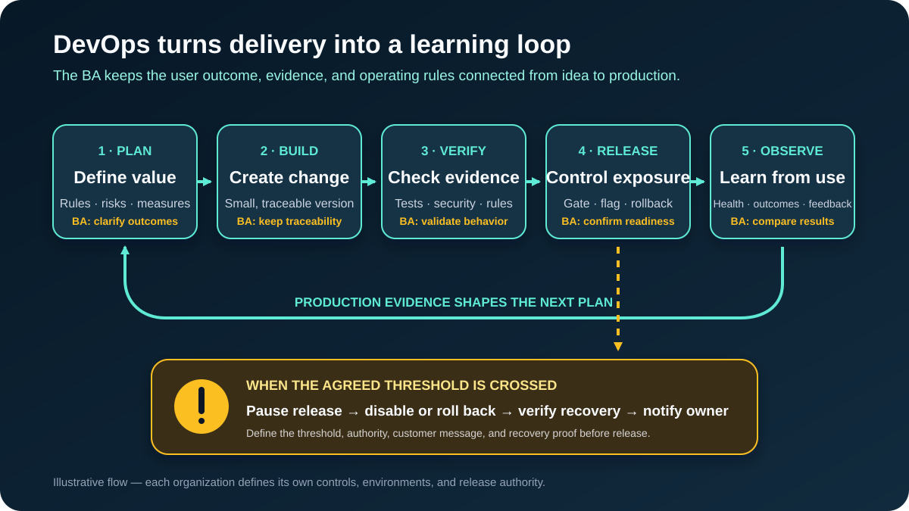

# DevOps for Business Analysts: From Requirement to Production Feedback

**DevOps** combines ways of working, technical practices, and automation so the people who plan, build, deliver, and operate software can provide value together. It is not simply a deployment tool, a job title, or a team that receives finished work at the end.

For a Business Analyst (BA), DevOps connects a requirement to evidence across the whole change lifecycle: What was agreed? Which version was tested? What controls a release? How will the team detect harm? What should happen if the change fails? Did the business outcome improve after release?

This beginner tutorial follows one illustrative feature in an online shopping app: **allow a customer to cancel a paid order before warehouse packing starts**. All rules, timings, and thresholds in the example are teaching assumptions that the real business and technical owners would need to confirm.

## 1. See DevOps as a shared feedback loop

A traditional handoff can look like this: Business writes requirements, Development writes code, Operations deploys it, and Support discovers the problems. Each group sees only part of the outcome.

A DevOps approach shortens that distance. The team plans a small change, builds it, verifies it, releases it with controls, observes production behavior, and feeds the evidence into the next decision.

| Lifecycle step | Cancellation example | BA contribution |
|---|---|---|
| **Plan** | Define when cancellation is allowed | Confirm rules, exceptions, users, outcomes, and risks |
| **Build** | Change the app, order service, and documentation | Keep requirements, decisions, and implementation work traceable |
| **Verify** | Run automated and exploratory checks | Confirm that evidence covers business behavior and exceptions |
| **Release** | Expose the feature to users safely | Confirm readiness criteria, communications, and decision authority |
| **Observe** | Measure errors and completed cancellations | Compare technical health and business outcomes with expectations |
| **Learn** | Fix gaps or change the rule | Turn production evidence into backlog decisions |

**BA question:** What evidence must exist at each step before the change can continue?

## 2. Translate the idea into an operable change

“Customers can cancel orders” describes a feature, but it is not enough for safe delivery or operation. For the running example, suppose stakeholders propose these **illustrative** rules:

- An authenticated customer can request cancellation while the order status is `PAID`.
- Cancellation is not allowed after the status becomes `PACKING`.
- If the order status changes during the request, the customer sees the latest outcome rather than a false success.
- The cancellation decision and source status are recorded for support and audit.
- Operations can disable the feature without waiting for a new software build.

The BA should discover more than the happy path:

| Area | Question to resolve |
|---|---|
| Business rule | Which statuses are eligible, and who owns that list? |
| Concurrency | What happens if packing starts while cancellation is being processed? |
| Payment | Does cancellation initiate a refund, an authorization release, or a separate process? |
| User experience | What confirmation, reason, and next step does the customer see? |
| Operations | Who can disable the feature and under which condition? |
| Evidence | Which event proves that the request succeeded end to end? |
| Support | What information lets an agent explain the outcome without guessing? |

This is where a BA improves DevOps work: the requirement includes **how the change will be tested, released, observed, supported, and recovered**, not only what the screen should do.

## 3. Understand the delivery vocabulary

You do not need to configure a pipeline to discuss it clearly.

| Term | Plain meaning | What the BA should connect to it |
|---|---|---|
| **Version control** | A traceable history of code and configuration changes | Requirement, decision, issue, and exact change version |
| **Continuous Integration (CI)** | Changes are integrated and checked frequently through automated builds and tests | Which acceptance rules can be checked automatically? |
| **Continuous Delivery (CD)** | A validated change is kept ready to release through a repeatable process | What evidence and approval make it releasable? |
| **Continuous Deployment** | Every qualifying change is released automatically | Which controls make automatic release acceptable? |
| **Pipeline** | Automated stages that move and check a change | Triggers, checks, approvals, outputs, and failure handling |
| **Artifact** | A versioned output produced by a build and used for deployment | Which tested artifact is moving between environments? |
| **Environment** | A place where software runs with configuration and data | What differs between development, test, staging, and production? |
| **Deployment** | Installing a version in an environment | Has the software changed, even if users cannot see it yet? |
| **Release** | Making behavior available to intended users | Who gets it, when, and under what conditions? |
| **Feature flag** | A control that turns behavior on or off without rebuilding it | Who controls it, what is the default, and when is it removed? |
| **Rollback** | Restoring a previous safe state or disabling the change | What triggers it, who decides, and how is recovery confirmed? |
| **Observability** | Evidence from logs, metrics, traces, and events that helps explain system behavior | Which user and business questions must production evidence answer? |

**Important distinction:** a merged change is not necessarily deployed, and a deployed change is not necessarily released to customers. Record each state separately.

## 4. Follow the change through environments

Teams use separate environments to reduce risk, but the names and purposes vary.

| Environment | Typical purpose | Cancellation example |
|---|---|---|
| **Development** | Fast work on an incomplete change | Developer checks status handling with test data |
| **Test / QA** | Integrated functional and non-functional testing | QA checks eligible, ineligible, and competing status updates |
| **Staging / pre-production** | Production-like validation before release | Team checks configuration, permissions, monitoring, and support flow |
| **Production** | Real users and business operations | Approved users receive the feature and real outcomes are monitored |

Environment labels do not guarantee equivalence. Test data may be smaller, integrations may be simulated, permissions may differ, and production traffic may expose behavior nobody saw before.

**BA action:** Record relevant differences and the risk they create. For example, if the staging warehouse service is simulated, the team still needs evidence that the production integration handles a status change during cancellation.

Promote the **same versioned artifact** where possible, changing approved environment configuration rather than rebuilding different code for each stage. Ask how the team proves which version and configuration were tested.

## 5. Read a CI/CD pipeline as an evidence chain

A pipeline is not automatically good because it is automated. Read it as a set of questions and evidence.

| Pipeline stage | Example evidence | BA question |
|---|---|---|
| Change proposed | Linked issue, requirement, decision, and reviewed differences | Can we trace why this change exists? |
| Build | Versioned artifact produced successfully | Is this the exact version that later stages use? |
| Automated checks | Unit, integration, security, and business-rule tests | Which agreed behaviors and exceptions are covered? |
| Test deployment | Artifact deployed with known configuration | Does this environment represent the risky integrations? |
| Acceptance evidence | Results for cancellation states and user messages | Who reviews business acceptance, and what remains manual? |
| Release gate | Required checks, approval, and release plan complete | Is this an evidence-based decision or a ceremonial click? |
| Production deployment | Version, time, operator, and result recorded | Can the team identify what changed during an incident? |
| Post-release check | Health and business measures compared with thresholds | How long do we observe before calling the release successful? |

A failed stage should stop or route the change according to an agreed rule. Avoid bypasses that are invisible. If emergency exceptions are allowed, define who authorizes them, what evidence is retained, and when the skipped control is completed later.

## 6. Write acceptance criteria that survive production

Feature acceptance criteria usually describe visible behavior. DevOps-ready criteria also describe operational evidence and failure handling.

For the cancellation feature:

| Type | Illustrative acceptance statement |
|---|---|
| Functional | Given an authenticated customer and an order in `PAID`, when cancellation succeeds, then the app shows a confirmation and the order no longer proceeds to packing |
| Exception | Given an order that changes to `PACKING` before the update completes, then the app does not claim success and shows the latest status and next step |
| Audit | Every cancellation attempt records order ID, previous status, outcome, reason code, version, and timestamp without exposing prohibited data |
| Performance | The cancellation outcome is shown within the response target agreed by Product and Operations under the agreed load profile |
| Release | The feature defaults to off and can be enabled only by the authorized release role |
| Monitoring | A dashboard separates successful, rejected, failed, and timed-out cancellation attempts |
| Recovery | If the agreed failure threshold is crossed, the named owner can disable the feature and confirm normal checkout and warehouse processing |

Do not invent the response target or alert threshold just to make the requirement look complete. Record it as an **open decision** with an owner until the team uses business impact and system evidence to agree it.

## 7. Separate deployment from release

The team can deploy code while controlling when users receive it. Common options include:

| Option | Plain meaning | Useful question |
|---|---|---|
| **All at once** | The new version serves the whole intended audience | Is the impact small and recovery fast enough? |
| **Feature flag** | New behavior is switched on independently of deployment | Who may change the flag, and is the old path still safe? |
| **Canary / gradual exposure** | A small group receives the change before expansion | Which group, measures, duration, and stop threshold apply? |
| **Blue-green** | Traffic moves between two prepared production versions | How will data compatibility and rollback be handled? |

These are options, not universal requirements. The team chooses based on architecture, cost, user impact, regulation, and recovery ability.

For our example, the team proposes a feature flag and gradual exposure. Before release, the BA helps confirm the target users, excluded cases, customer and support communication, observation period, success measures, stop threshold, decision owner, and what “off” does to requests already in progress.

## 8. Observe technical health and business outcomes

“The server is up” does not prove the feature works for customers. Combine technical, user, and business signals.

| Signal | Cancellation example | Why it matters |
|---|---|---|
| Technical health | Error rate, response time, dependency failures | Detect broken or slow requests |
| Functional outcome | Successful, rejected, failed, and timed-out cancellations | Distinguish valid rejection from system failure |
| Business outcome | Orders stopped before packing; avoidable support contacts | Check whether the feature creates intended value |
| Guardrail | Orders incorrectly cancelled or still packed after success | Detect harm hidden by average success rates |
| User feedback | Complaint themes and confusing messages | Find problems telemetry alone cannot explain |

Every alert should have an owner and an expected action. A dashboard nobody reviews is not a control. Agree when the release is considered healthy, when exposure pauses, and when an incident begins.

The BA also checks **semantic accuracy**: if the dashboard calls an attempt “successful,” does that mean the order status changed, downstream warehouse work stopped, and the customer received the result—or only that one API returned `200`?

## 9. Plan rollback and incident behavior before release

Rollback is not always “install the old version.” A database or external message may already have changed. The team may instead disable a feature, apply a forward fix, compensate for completed actions, or combine approaches.

Ask these questions before release:

1. What condition triggers a pause, disable action, rollback, or incident?
2. Who has authority to decide, and who performs the action?
3. What happens to requests already in progress?
4. Is data compatible with the previous application version?
5. How will affected customers and support teams be informed?
6. What evidence proves service and business processing recovered?
7. Which follow-up actions, decisions, and learning are recorded?

For cancellation, disabling the user button may stop new requests but does not resolve a request that already changed an order. The recovery plan must handle partial success and reconcile the order, payment, and warehouse records.

Avoid blame-focused incident reviews. The useful output is evidence about conditions, controls, detection, response, and improvements.

## 10. Completed DevOps-ready Change Brief

Use this artifact before the release plan is finalized.

| Field | Completed example |
|---|---|
| **Change and outcome** | Let authenticated customers stop eligible orders before packing, reducing avoidable packing and support effort |
| **Illustrative business rule** | `PAID` is eligible; `PACKING` is not; status is rechecked during the request |
| **Affected journey and systems** | Order details, cancellation API, order service, payment follow-up, warehouse notification, support view |
| **Traceability** | Requirement, decision log, change request, test evidence, artifact version, and release record are linked |
| **Key exceptions** | Status changes mid-request; dependency timeout; duplicate click; partial downstream update |
| **Pipeline evidence** | Rule tests, integration tests, security checks, staging evidence, and approval gate |
| **Release approach** | Feature flag with gradual exposure; audience and duration are open decisions |
| **Success signals** | Completed eligible cancellations and reduced avoidable support contacts |
| **Guardrails** | No false success, no unauthorized cancellation, no order packed after confirmed success |
| **Stop / recovery** | Authorized owner disables the flag when the agreed threshold is crossed; team reconciles in-progress cases |
| **Communications** | Customer message, Support playbook, Operations notice, incident update owner |
| **Open decisions** | Response target, alert threshold, exposure groups, observation period, retention, refund ownership |

The brief is not a replacement for detailed requirements or an engineering runbook. It makes sure the business outcome and operating model stay connected.

## 11. Measure flow without turning metrics into targets

DORA’s current software-delivery guidance uses five measures. They help a team discuss **throughput and instability** for a service:

| Measure | Plain meaning |
|---|---|
| **Change lead time** | Time from a code commit to successful production deployment |
| **Deployment frequency** | How often changes are deployed |
| **Failed deployment recovery time** | Time to recover from a deployment that needs immediate intervention |
| **Change fail rate** | Share of deployments that need immediate intervention |
| **Deployment rework rate** | Share of unplanned deployments made because of a production incident |

Use them with product, reliability, security, and user-outcome measures. They are team learning signals, not individual performance scores. Faster deployment is not success if cancellation errors, customer harm, or rework increase.

## 12. Reusable DevOps-ready Change Brief

Copy this structure into discovery, refinement, or release planning:

| Field | Your answer |
|---|---|
| Change and intended user/business outcome | |
| Confirmed rules, assumptions, and open decisions | |
| Affected journey, systems, data, and teams | |
| Traceability links and version identifiers | |
| Happy path and key exceptions | |
| Functional and non-functional evidence | |
| Environment differences and test limitations | |
| Pipeline checks and approval gates | |
| Deployment and release approach | |
| Technical, business, and guardrail signals | |
| Alert thresholds, owner, and expected action | |
| Rollback, disable, compensation, and recovery proof | |
| Customer, Support, and Operations communications | |
| Post-release review and learning owner | |

## 13. Practice exercise

Extend the cancellation feature so a customer can cancel **one item in a multi-item order**.

1. Identify two new business-rule questions and two downstream systems that may be affected.
2. Add one pipeline test for a mixed eligible/ineligible order.
3. Describe one environment limitation that could hide a production problem.
4. Choose one business success signal and one harm guardrail.
5. Write a stop condition and explain whether disabling the feature is enough to recover in-progress requests.

If you cannot connect the requirement to evidence before and after release, the change is not yet DevOps-ready.

## Further reading

- [Microsoft Learn: What is DevOps?](https://learn.microsoft.com/en-us/devops/what-is-devops)
- [DORA: Continuous delivery](https://dora.dev/capabilities/continuous-delivery/)
- [DORA: Software delivery performance metrics](https://dora.dev/guides/dora-metrics/)
- [GitHub Docs: Workflows](https://docs.github.com/en/actions/concepts/workflows-and-actions/workflows)
- [Google SRE Book: Monitoring distributed systems](https://sre.google/sre-book/monitoring-distributed-systems/)
